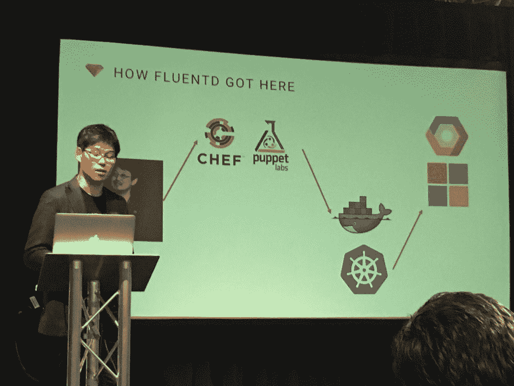

# Monki Gras:开源成功的关键在于包装

> 原文：<https://thenewstack.io/packaging-ecosystems-make-open-source-marketing-matter/>

今年分析公司 [RedMonk](http://redmonk.com/) 为期一天的 [Monki Gras](https://monkigras.com) 聚会的主题是包装。像许多与会者一样，我怀疑我会被关于容器和其他“包装”格式的技术信息淹没。当然，Docker 作为一种解决方案被提及不止一次，但会议的许多发言者对该主题采取了更少的字面意义，提供了一套全面的演示，旨在向观众传授技术和创业技能。

[Kiyoto Tamura](https://www.linkedin.com/in/kiyoto-tamura-80b6528),[Treasure Data](https://www.treasuredata.com/)的营销副总裁做了一个引人入胜的演讲，讲述了如何包装你的开源项目，使其价值能够被其他人理解。因为，真的，如果没有一个强大的社区围绕，一个[开源项目](/tag/open-source/)有什么意义呢？

Tamura 指出“大多数开源产品从未起飞。”他说，这是因为大多数开源开发者没有找到合适的“盒子”和“上下文”来定位他们的品牌并很好地解释它们。然后，他指出高盛公司不仅为投资界接近开源铺平了道路，也为许多行业树立了榜样。

许多公司走开源之路，因为他们认为开源相当于一个自动社区。他说，当然我们大多数人都很忙，但我们必须努力找到合适的桶来放入我们的软件，就像它属于哪个类别的心理地图。

> “这不是开源的问题，而是降低采用和免费的门槛，以及环境的问题。”—田村清人，宝藏数据

当然，这场斗争并不仅限于开源领域。一般来说，当你让一个开发人员描述她或他的 API、SaaS 或任何其他东西时，他们做的第一件事就是谈论它所用的语言。正如 Tamura 将在下面谈到的，这很重要，但你首先要谈的是它提供的解决方案，有什么好处。

只有这样，您才能进入集合了开源营销三个最重要部分的包装:

1.  用户生态系统。
2.  配方和使用案例
3.  分销伙伴关系

“发行版是开源产品的生命线，”他说，这种打包组合就是如何围绕它构建的。

他说这从你的用户和相关的生态系统开始。你想接触哪些语言的用户，你想用哪些语言解决他们的问题？语言往往会成为开源生态系统的第一桶金。

然后，由于你通常没有预算来建立销售甚至营销或技术支持团队，田村说“你要关注相关倡导者的用例及配方，他们会用他们的解决方案为你做营销。”

然后，这些导致了开源营销飞轮(或连续三角形)的第三部分，在那里，一旦你确定了你所在的桶和你如何服务于这个桶的最佳例子，你就开始寻找继续创造你的品牌知名度的分销合作伙伴。

将这三者结合在一起，你就可以开发出包装你的生态系统和开源营销的包装。

## Fluentd:开源营销案例研究

Tamura 提供了一个例子，说明他如何定位和打包宝藏数据公司的客户端 [Fluentd](http://www.fluentd.org/) ，从而将开源数据收集器和统一日志记录层引入到更大的社区中。他把任务分成三步:

1.  学习要做的工作。
2.  提供解决方案。
3.  建立意识。

### 留意需要完成的工作。

他说，要开始“研究哪些工作需要完成，并为之打包你的项目”。然后想想你希望自己如何与众不同。

在 Fluentd 的空间里，日志聚合工具中的领跑者是 [Splunk](https://www.splunk.com/) 。

Tamura 解释说:“Splunk 真的很受欢迎，大多数用户真的使用它，它是如何打包在一起的，但每当他们开始许多新项目，而不是关于商业价值时，启动它对他们来说太昂贵了。”。

回到他上面说的，这是关于提供一些免费的东西，以及获得那些 Github 明星。

此外，他说，在开源领域，文档常常是市场营销的重担。事实上，田村解释说，文档既是产品价值的翻译者，也是包装产品的包装。所以在提供优秀的文档和开源替代方案之间。他们能够找到合适的桶。

现在，Fluentd 将谷歌列为“Splunk 的免费替代品”。

### 留意语言和它们相关的社区

作为 Monki Gras，他调出了 RedMonk 的[编程语言评级](http://redmonk.com/sogrady/2016/07/20/language-rankings-6-16/)。虽然你想成为一名创新者，但你不想围绕一种还没有人使用的语言来构建一个产品——尤其是开源产品。或者一个也许有人在尝试，但周围根本没有社区的地方。因为你想建立你的开源产品来适应一个已经存在的社区——为你的产品建立一个社区是非常罕见的，非常昂贵的，也是非常困难的。

但最终，这是关于在受欢迎程度和相关性之间取得平衡。

“受欢迎程度是需要考虑的，但不是一切，”田村说。“选择您想要的任何语言，但请记住，您选择的语言将决定您的分发策略。”

他指出，你的团队知道你将要投资的语言是多么重要，但是你也必须了解围绕该语言的社区，以便学习如何利用该社区和围绕它的工具。

### 要注意云作为分销渠道的力量

不管你在这个包里放了什么，Tamura 推荐你的开源产品被打包到云中。

> "云是开源的大众发行商."—田村清人，宝藏数据

通过将它打包到云中，您可以摆脱开发人员访问它所必须经历的重重障碍:不需要下载。他说:“让你的项目明显有用，然后把它包装成具体的东西。”。

## 开源营销:寻找合适的故事来讲述

一旦你具备了这三个要素，你就可以做一些聪明但小的事情去接触那个社区。

Tamura 举了 docker 的例子，三年多前，Docker 出版了一份吸引目标读者的六页指南:[“使用 Docker 安装和运行 Memcached 作为服务”](http://www.slideshare.net/julienbarbier42/memcached-as-a-service-using-docker)然后它在 *HackerNews* 上分享了这个免费的指南，它像病毒一样传播开来，剩下的就是开源历史了。

他解释说" Ops 完全懂了，但是 Docker【刚开始的时候 devs 不懂怎么用。] 我 n 六页让开发人员轻松搞定。”

这六页成功地从情感上和功能上解决了要做的工作，使用社区语言，当然，它是在云中提供的。这就是开源营销的 Tamura 秘密，正如一个为 Docker 带来大量用户的小活动所解释的那样。

Docker 是新堆栈的赞助商。

专题图片:田村清人，Monki Gras 2017。

<svg xmlns:xlink="http://www.w3.org/1999/xlink" viewBox="0 0 68 31" version="1.1"><title>Group</title> <desc>Created with Sketch.</desc></svg>