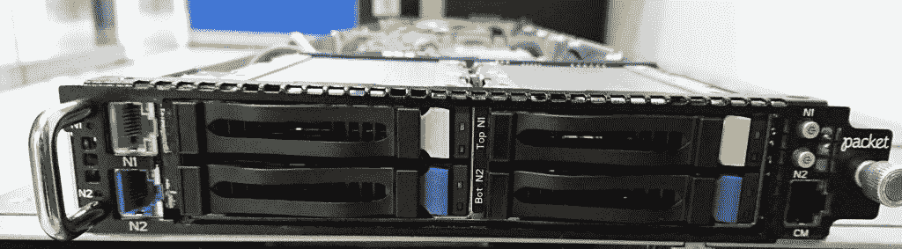

# Packet 的更小、更快、更便宜的裸机服务器

> 原文：<https://thenewstack.io/packets-smaller-faster-and-cheaper-bare-metal-servers/>

裸机服务器和软件提供商 [Packet](https://www.packet.com/) 表示，它正在积极扩展其产品，以包括更小的盒子，满足更严格的按需付费服务器需求，非常适合开发运维测试和迭代。

Packet 的生产工程师[托尼·佩雷斯](https://www.linkedin.com/in/pereztr5/)上周在德国汉堡[集装箱日](https://www.containerdays.io/)的间隙说，Packet 继续混合搭配其服务器和软件配置，以获得更小、更快、最终更具成本效益的服务器机箱。

软件开发人员和系统管理员通常不会花太多时间担心服务器处理器的速度，然而，裸机服务器上的部署需要再考虑一下。注重成本的企业——任何组织都不例外——都不愿意为更大的工作马服务器容量支付过多费用，因为他们可以根据需要按需购买更小、更轻的工作负载。

为此，Packet 推出了其紧凑型 Ps t2.small.x86 裸机服务器。它所谓的“微小而强大”的服务器的配置包括一个 AMD EPYC 3101 处理器，具有四个核心和线程，CPU 速度为 2.1Ghz 和 8GB RAM，两个 10Gbps 网络接口控制器。目标价格为 0.15 美元/小时，将于年底发布。

Packet 还计划在 8 月份为其 c1.small 服务器提供新的服务器升级。它将包括一个英特尔至强 E-2176G(六个内核，3.7Ghz 的时钟速度，32GB RAM 和两个 10Gbps 网卡，价格为 0.45 美元/小时。

谈到 AMD 服务器，佩雷斯说:“我们的想法是在降低成本的同时升级规格。”“AMD 帮助我们解决了这个问题——我们能够为客户提供更好的成本基础，”佩雷斯说。

Packet 的联合创始人兼首席执行官扎卡里·史密斯说，新的小型服务器是为了响应云开发者和“文化趋势”而设计的。“微服务器实际上是关于开发者和云的，”史密斯说。“这让人们知道[虚拟机和微服务]便宜且相对可用，开发 CI/CD 生命周期至关重要，”Smith 说。

Packet 表示，它正在开发更小的裸机服务器，用于更灵活、更具成本效益的工作负载。

Smith 说，在某些情况下，开发人员可能每天使用数千个自动化 CI 流程实例。“对于大型双插槽机箱来说，这既困难又昂贵。还有一种趋势是向更大规模的‘牛’集群发展，这种集群希望将工作负载和功能转移到独立的节点上，”Smith 说。“作为裸机提供商，我们正在投资微服务器以满足这些需求，同时为我们的客户提供硬件级别的隔离和裸机/基础级别的自动化。”

传统上，Packet 的裸机服务器对于具有高容量服务器需求的大型组织(如云提供商)来说更大。但如上所述，该公司现在正在向更小的盒子扩张。佩雷斯说，“我们的服务器已经相当强大了”，例如，96 个内核和 120 GB 的内存。“我们现在也想降低等级，”佩雷斯说。在不久的将来，Packet 计划用基于 ARM 的处理器缩小其服务器的规模，以减轻工作负载。

开源社区也将发挥作用。“我们正在寻求使我们的服务器更通用”，Perez 说，“我们还想更好地利用开源社区，用于我们可能不一定了解的测试和边缘情况。"

数据包是新堆栈的发起者。

<svg xmlns:xlink="http://www.w3.org/1999/xlink" viewBox="0 0 68 31" version="1.1"><title>Group</title> <desc>Created with Sketch.</desc></svg>