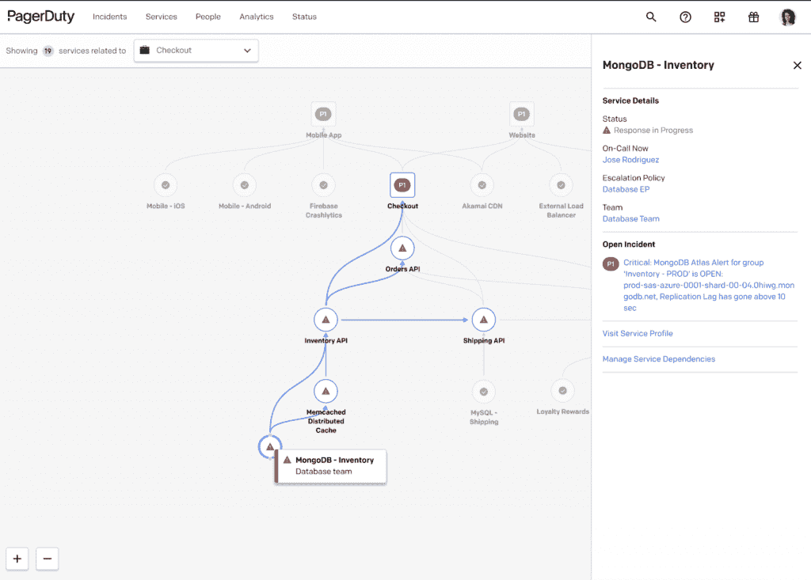
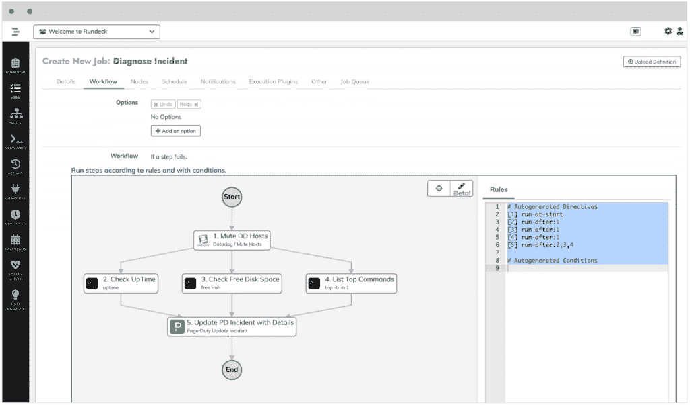

# PagerDuty 通过 Rundeck 自动响应事件

> 原文：<https://thenewstack.io/pagerduty-automates-incident-response-with-rundeck/>

数字运营管理公司 [PagerDuty](https://www.pagerduty.com/?utm_content=inline-mention) 发布了其 [PagerDuty Operations Cloud](https://www.pagerduty.com/newsroom/aws-cloud-operations/) 的新版本，该版本为其平台引入了新的自动化水平，部分原因是该公司[收购了企业开发自动化提供商](https://www.pagerduty.com/newsroom/pagerduty-closes-acquisition-rundeck/) [Rundeck](https://www.rundeck.com/) 。

“这是关于为现代运营企业在尽可能多的地方注入自动化，有些是在没有人类的情况下实时进行，有些是赋予人类权力，然后将其与机器学习相结合，”page duty[的产品副总裁迈克尔·库奇](https://www.linkedin.com/in/cucchi/)说。“这是机器学习来理解正在发生的事情，机器学习和自动化来解决它，然后你必须让人类参与进来，这样你就永远不必打断别人，然后如果你要打断别人，请原谅这个术语，但最不熟练的员工最有权力:让你的第一个响应者成为自动化的最强大的响应者。”

## **传递尽可能多的信息**

最后，Cucchi 说，如果你必须把一个事件上报给一个开发者，确保向他们提供尽可能多的信息。PagerDuty Operations Cloud 通过三种不同的方式实现这一切，根据 PagerDuty 在发布会上的博客帖子[所述，其中两种方式由 Cucchi 收购的 Rundeck 提供支持。](https://www.pagerduty.com/blog/fall-2021-launch/)

首先，PagerDuty 为 [connect everything](https://www.pagerduty.com/blog/fall-2021-launch/#Connect_Everything) 增加了几个特性，无论是人与服务还是组织内的依赖关系。例如，[动态服务图](https://support.pagerduty.com/docs/service-graph)给出了服务健康和应用依赖的快照，以及显示了负责这些服务的团队或个人。当事件发生时，动态服务图使用户能够立即看到发生了什么以及向谁寻求帮助。同样，[全局搜索](https://support.pagerduty.com/docs/search)允许用户从单个位置快速搜索与事件、警报、服务和时间表相对应的属性。

接下来，PagerDuty Operations Cloud 看到了作为 Rundeck 收购的一部分而添加的几个功能，它将其分为后两类[自动化无处不在](https://www.pagerduty.com/blog/fall-2021-launch/#Automate_Everywhere)和[提供灵活性](https://www.pagerduty.com/blog/fall-2021-launch/#Deliver_Flexibility)。自动化以 [Rundeck Actions](https://support.pagerduty.com/docs/rundeck-actions) 和 [Rundeck Cloud](https://www.rundeck.com/rundeck-cloud) 的形式出现，前者将自动诊断和响应带到事件响应的第一线，后者允许工程师创作自助服务自动化流程，而无需部署或管理 Rundeck 集群，而是能够从云中运行，甚至在防火墙后面和虚拟私有云(VPC)内。

“现在，我们试图尽可能地引入自动化，”Cucchi 解释道。“当我们确实需要一个人时，我们希望给他们一整套工具来使用。因此，与其打断开发人员，不如让客户支持人员或第一层帮助台支持人员访问一整套标准化但高性能的自动化例程，以便他们可以运行并完成一些事情，如重新启动集群或翻转集群或翻转负载平衡器，这些事情过去需要一组人来决定，现在您可以将这些低风险的序列构建到人类可以完成的任务中。”

## **降低噪音**

PagerDuty 更新的最后一个领域集中在向响应者提供尽可能多的信息并减少噪音这一方面。Cucchi 举了一个家庭安全摄像机的例子，它是由运动触发的，但放置在被风吹动的灌木丛前面。如果它在每次刮风时都发出警报，它会发出很多错误的警报，但通过机器学习，你可以只在需要发出警报的时候过滤掉那些噪音。[可能起源](https://support.pagerduty.com/docs/probable-origin)例如，为响应者提供一个自动生成的可能起源点列表，以帮助他们更快地解决问题，而自动暂停事件通过使用机器学习来检测历史上自动解决的事件，从而消除噪音。类似地，事件编排通过让团队基于大规模事件条件构建定制逻辑来减少手动事件处理，从而减少噪音。

展望未来，Cucchi 表示，PagerDuty 的重点将是工作流的灵活性，进一步扩展他们在补救自动化方面所做的工作。

“现在的问题是能够为所有不同的人组装跨所有技术的工作流，”Cucchi 说。“我们希望能够建立真正动态的工作流程，以便人们能够针对不同的使用情形，轻松快速地组合我们一直在谈论的这些技术。”

<svg xmlns:xlink="http://www.w3.org/1999/xlink" viewBox="0 0 68 31" version="1.1"><title>Group</title> <desc>Created with Sketch.</desc></svg>