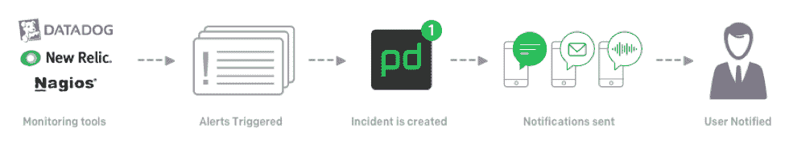

# 为什么 PagerDuty 是一个带有 Atlassian 吉拉软件的 DevOps Hub

> 原文：<https://thenewstack.io/pagerduty-devops-hub-jira-software-atlassian/>

微服务和服务集成改变了我们对信息如何在应用程序之间传递的思考方式。随着服务在企业和云环境中得到更深入的应用，这反过来会影响人们对运营的看法。

凭借在帮助公司主动管理其数据中心和分布式基础设施中的事故和事件以最大限度地减少对客户的影响方面的深厚根基，[page duty](https://www.pagerduty.com/)正在成为这个微服务新世界中自动化连续交付的平台。

使用 API 的服务集成现在是现代企业环境中的标准。这些 API 作为交叉技术(如通知系统和项目管理软件)的标记，以创建新的、更深入集成的 DevOps 中心。

PagerDuty 与 [Atlassian 吉拉软件](https://www.atlassian.com/software/jira)的新集成反映了这些新的 [DevOps](/category/devops/) 中心如何发展，以帮助大型组织过渡到支持基于微服务的应用程序所需的 DevOps 流程和思维模式。

## PagerDuty 的根源

PagerDuty 的起源可以追溯到 2009 年，当时在市场早期，运营人员开始需要一种更加自动化的方式来管理基础设施。亚马逊网络服务(AWS)对大多数开发人员来说是新的，但它代表了一个核心基础设施，可以依赖它来扩展计算、存储和网络。

帮助管理 AWS 和复杂数据中心基础架构的服务不断涌现，但没有中心，也没有管理众多旨在全面监控 IT 环境的 IT 系统的服务。传统平台是不够的。由于缺乏可用的选项，大多数公司都扩展了自己的应用程序，构建了自己的监控环境。

PagerDuty 建立的系统在很多方面都是基于一些人的经验，比如该公司的联合创始人亚历克斯·所罗门(Alex Solomon)，他在 AWS 工作的时候，这家云服务提供商正在为其已经庞大的基础设施建立监控系统。

PagerDuty 开发了一个 SaaS 解决方案，允许 IT 监控工具向 IT 工作人员提供警报，并使在多个团队之间分配随叫随到的职责变得简单。这项服务是 PagerDuty 的核心，现在是成千上万运营人员信赖的平台。

最近，PagerDuty 宣布与来自 Atlassian 的吉拉软件集成。这种伙伴关系展示了 PagerDuty 是如何超越操作进入整个 DevOps 生命周期的。与吉拉软件的集成将整个应用程序生命周期中的 PagerDuty 连接起来，从构建、测试和部署到操作、学习和改进都实现了流程自动化。这种集成尤其有助于大型组织过渡到 DevOps 并保留熟悉的工具和流程，同时加快交付时间并提高整体代码质量。

## 吉拉软件集成

吉拉软件是项目管理的行业标准，也是 DevOps 工具链的重要组成部分。各种规模的组织都采用吉拉软件作为协作工具，以实现应用程序的持续交付。除了为新吉拉软件问题创建页面责任事件之外，这种集成还提供了一些独特的优势:

*   当吉拉软件中出现问题时，就会生成一个页面责任事件，从而帮助相关人员快速解决问题。通过这种集成，可以加快任何问题的解决，从而带来比传统的警报和通知流程更好的业务价值。例如，像构建失败或单元测试失败这样的关键问题将需要立即解决，而不是通过排队的优先化过程。使用吉拉软件查询语言条款，可以自动升级需要立即关注的某些类型的问题，并快速解决这些问题。
*   只需点击一下，就可以从一个寻呼机服务事件创建一个链接的吉拉软件问题。这将事后分析和响应数据直接链接到吉拉任务，将事件响应连接回代码和构建过程。关键数据在 PagerDuty 中捕获，如事件时间表，它跟踪所有行动和处理该问题的人员，并直接反馈给吉拉任务。这种集成有助于避免问题的重复出现，因为可以使用捕获的信息修复有问题的系统。
*   当这种信息沿着 DevOps 管道被捕获时，它为负责应用程序的开发人员提供了有关问题的所有信息和上下文，帮助他们更快地修复问题并将其投入生产。

在高层次上，该模型在具有复杂系统的大型企业中具有良好的伸缩性。DevOps 接收来自许多监控系统和这些复杂系统的其他组件的大量信号。PagerDuty 提取所有信号，去除噪音或不相关的信号，并在吉拉软件中将它们压缩成更具可操作性的问题。这有助于提高大型组织的 DevOps 生产率，帮助他们转变为敏捷组织。

机器学习应用于此，以识别模式，然后与自动化一起使用，以大幅提高 DevOps 效率。借助 PagerDuty 和吉拉软件，甚至更大的组织也可以采用 DevOps，并在整个应用交付生命周期中提高敏捷性。

<svg xmlns:xlink="http://www.w3.org/1999/xlink" viewBox="0 0 68 31" version="1.1"><title>Group</title> <desc>Created with Sketch.</desc></svg>