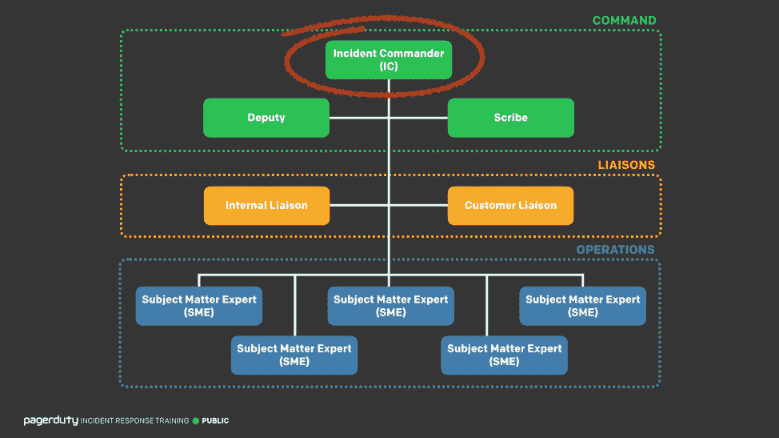
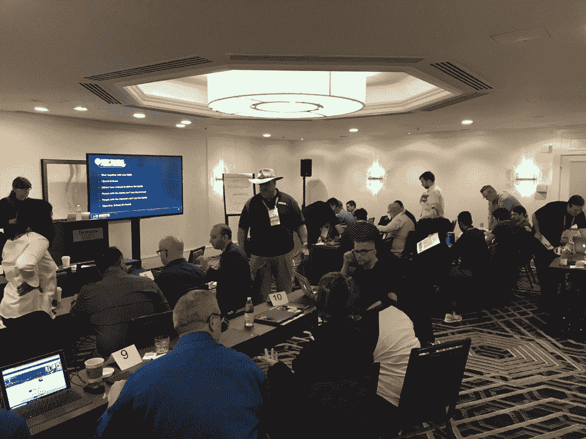

# PagerDuty 开源其事件响应最佳实践

> 原文：<https://thenewstack.io/pagerduty-open-sources-its-incident-response-best-practices/>

这篇文章是由[page duty](https://www.pagerduty.com/)发起的关于传播事故响应知识的系列文章的一部分。

 [里奇·亚当斯

Rich Adams 是 PagerDuty 的安全和事故响应高级工程师。在加入 PagerDuty 之前，他从事过广泛的系统工作，从为 Gracenote 和 Sony 开发音乐应用程序，到为航空业开发行李系统。尽管他坚持说如果你的包丢失了，那也不(完全)是他的错。](https://www.pagerduty.com/) 

如果一队护理人员出现在你家，但不知道他们的设备是如何工作的，或者不得不查找如何设置静脉滴注，你可能会非常沮丧。如果你试图找出如何有效地应对 IT 事件期间的*事件，你的客户同样可能会感到不安。*

值得庆幸的是，由于他们接受了广泛的培训，应急响应人员通常准备充分，能够在各种情况下保持冷静，并像一台润滑良好的机器一样一起工作。我们 IT 响应人员可以使用应急响应人员展示的相同技能来帮助改进 IT 事件响应，也就是说，通过确保我们的培训流程同样严格，以便我们能够冷静、清醒地处理事件。

许多技术组织已经有了这样的流程，但是很少有人公开分享。在 [PagerDuty](https://www.pagerduty.com/) ，我们决定采取不同的方法:我们[开源我们的整个事件响应文档](https://response.pagerduty.com/)和最佳实践指南，以及我们的培训材料和安全响应流程。

任何人都可以使用我们指南中的信息，无论他们是否是寻呼机用户。该指南是关于组织如何响应事件的，而不管他们使用什么产品，因此我们重点关注事件响应的原则和技术，而不是如何在工具中执行特定操作。

## 分享是关怀:共同学习和成长

从小型创业公司到大型企业，每个组织都经历过事故。我们无法回避这样一个事实，随着系统变得越来越复杂，它们也将不可避免地以越来越复杂和不可理解的方式失败。

使用我们的开源指南的一个好处是，你可以跳过我们在 PagerDuty 经历的一些尴尬的成长烦恼。例如，我们了解到，在最终决定之前，获得事件中涉及的每个人的共识是非常重要的，这样，就不会有人事后说:“我就知道这样不行。”

为了解决这个问题，我们问小组，“有强烈的反对意见吗？”我们有目的地提出这个问题，特别是询问不同意见。这个问题可以让我们在事件中快速取得进展，并解决事后诸葛亮的问题，因为没有异议意味着每个人都同意这个决定。像这样的教训通常来之不易，但有了我们的开源指南，其他人可以从我们的错误中学习，跳过我们经历的成长烦恼。

## 事故响应角色和培训指南

在 PagerDuty，我们的事件响应流程基于[事件指挥系统(ICS)](https://en.wikipedia.org/wiki/Incident_Command_System) 。ICS 开发于 20 世纪 70 年代，是地方、州和联邦应急人员在重大事件中使用的国家模型，从应对炸弹威胁到在自然灾害期间动员团队。

然而，请注意，虽然我们的流程基于 ICS，但我们根据自己的需求对其进行了大量修改，因为一些对应急响应人员有意义的事情对我们来说没有意义，除此之外，我们主要删除了没有意义的角色，并添加了有意义的新角色。

PagerDuty 的事故响应角色

我们流程的主要重点是事故指挥官的角色。作为任何事件响应流程中的领导者，事件指挥官协调响应方之间的所有沟通，确保事情朝着解决的方向发展。虽然每个事件都是不同的(希望你不会一遍又一遍地遇到同样的问题)，但每次响应的 ***流程*** 都是相同的。事故指挥官不是技术专家，而是如何有效应对的专家，他们依靠技术专家提供相关系统的信息。

我们的[培训指南](https://response.pagerduty.com/training/courses/incident_response/)涵盖了想成为事故指挥官的人的所有主要技术和最佳实践。我们谈论许多不同的话题，从如何通过使用清晰的语言而不是充满缩写的简洁语言来确保人们有效沟通，到如何处理困难的情况，例如当一名高管加入回应并开始试图发号施令时(我们称之为“[高管突袭](https://www.pagerduty.com/blog/best-practices-for-enterprise-incident-response/)”)。

## **事件响应流程:熟能生巧**

我们可以提供尽可能多的指南，但任何成功的事件响应流程的关键是实践。你希望这是例行公事。就像紧急救援人员如何在电话或灾难中训练数小时以优化他们的响应一样，你的团队练习响应过程越多，当事故发生时，每个人都会越放松和冷静。

我们的指南包括你可以练习的各种方法，无论是每周有目的地破坏你的系统，作为失败星期五练习的一部分，还是玩一个游戏，继续说，没人会爆炸。视频游戏是我个人最喜欢的，因为虽然它看起来不是练习事件响应的好方法，但它实际上是在更放松的环境中练习事件指挥官技能的好方法。额外收获:如果你和一群人一起玩，会很有趣，而且你们可以建立一种自然的融洽关系，这在真实事件中会很有用。

在 PagerDuty Summit 2018 事件响应培训中播放“保持通话，没有人会爆炸”

这些技能在各种不同的设置和环境中也很有用——例如，我个人曾用同样的技能来帮助初为人父母的人，因为它们惊人地有很多重叠。

所有组织都有不同的运作方式。所有人都可以互相学习。考虑到这一点，我们 PagerDuty 决定最好与全世界分享我们的事件响应流程，这样我们都可以学习和成长。通过分享我们的知识，我们不仅为他人提供了改进流程的机会，还为我们提供了直接反馈，这样我们也可以改进自己的流程。

好奇想了解更多？[查看所有文件](https://response.pagerduty.com)。

通过 Pixabay 的特征图像。

<svg xmlns:xlink="http://www.w3.org/1999/xlink" viewBox="0 0 68 31" version="1.1"><title>Group</title> <desc>Created with Sketch.</desc></svg>