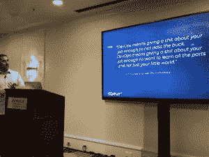
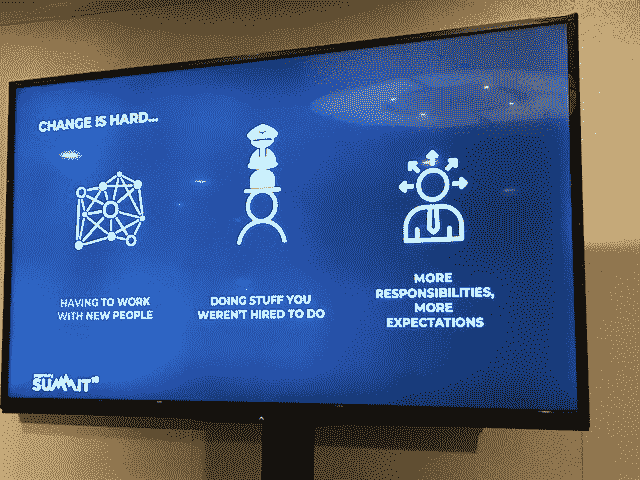

# PagerDuty 的 3 年 DevOps 文化之旅

> 原文：<https://thenewstack.io/pagerdutys-3-year-journey-to-devops-culture/>

“如果你只看后视镜，你就不能向前开，”T2 传呼机公司产品开发高级副总裁蒂姆·阿曼德普尔说。  他在最近的[三藩市 page duty 峰会](https://www.pagerduty.com/summit/)上的讲话分享了 page duty 的 DevOps 之旅，他们一路走来学到了什么，你可以从他们的经历中学到什么。

蒂姆·阿曼德普尔，PagerDuty 公司 SVP 产品开发部

在当今速度不断加快的商业市场中，公司需要同时降低风险。  这需要向持续交付(CD)转变，这就是 DevOps 的用武之地。

2015 年，PagerDuty 开始转向今天享有的 DevOps 文化。公司有经验教训可以与他人分享。他说，要知道这是一个漫长的过程，你必须全力以赴。  这不是半途而废的事。"如果你没有 150%的把握，就不要费心了."

在一个地方行得通的，在另一个地方可能行不通。这不是放之四海而皆准的方法，但每个人都可以从寻呼机工作经历中吸取教训。

“停滞和停滞很少成功，”他说。为了充分发挥 DevOps 的价值，需要进行组织变革。  人才有限；如果你没有利用你所拥有的天赋，你将会失败。

“多年来，我们不得不在产品开发和运营方面进行重大投资和变革，”他说。他不只是在谈论技术。

当然，DevOps 工具是需要的，他说，但不是最重要的。  这是关于人，以及让团队工作。  DevOps 是马拉松，Armandpour 说。  把它当作一种新的心态。  不要纠结于头衔或者小事。如果你不朝着 DevOps 前进，你就会在今天的经济中停滞不前。

## 文化变迁

对于 PagerDuty 来说，有两个主要的概念变化是其 DevOps 文化成功的核心。他说。这两次转变为公司一路走来所做的其他事情提供了一个平台。

首先，PagerDuty 转向将其内部基础设施视为一种产品。  大约在同一时间，it 转向了客户驱动的思维模式。每个人都在提供一种产品。阿曼德普尔说，无论客户是外部的还是内部的，他们都在寻找价值。

当经理们开始关注新的“一切都是产品”的思维模式时，他们的组织决策和关注点发生了变化。  “这是一个游戏规则的改变者，”他说。

第二个决定是改变对员工的期望。  在打破各自为政的状态，转而采取团队第一的心态时，他们决定所有人，包括首席执行官在内，都要随叫随到。这意味着围绕员工应该了解的内容创建新的定义。

他说，大量的交叉培训是必要的，但最终，这给全体员工带来了人性和同理心。  让每个人都充分意识到自己的产品，它是如何工作的，以及当它出现故障时该怎么做。现在，做一个人的第一次随叫随到被庆祝为一种通过仪式。

这种变化最大的一个结果就是决策权被分散了。

阿曼德普尔说:“最接近行动的人是最好的决策者。”。

“信任是基础，”他说。这也意味着管理层必须确保每个人都得到正确的信息，这样他们才能在正确的时间做出正确的决定。

## 创造团队第一的心态

学习很难。文化转变需要在整个组织中得到支持。他说，沟通、信任、同理心和  敏捷都有助于让向 DevOps 的转变变得更容易，因为现在一切都与团队有关。

变化的期望

对于管理层来说，重点是如何做。我们如何让我们的员工发挥更大的杠杆作用？  知道大家都想要人才，我们如何提供一个让我们的人才愿意留下来的工作环境？

领导者需要关注打破孤岛的人性一面，包括解释个人获得了什么。**他说:“我们告诉他们，这不是让你在工作中做得更少，而是帮助我们的组织提升到另一个高度，实现我们的全部潜力。”**

 **> “DevOps 意味着对你的工作给予足够的重视，而不是推卸责任。DevOps 的意思是对你的工作给予足够的重视，想要学习所有的艺术，而不仅仅是你的小世界。” — John Vincent，开发工程师，ReminderMedia

他指出，过度沟通是不可能的。  “开发者越理解概念就做得越好，‘为什么’很重要。”

开发人员现在必须了解基础设施和完整的堆栈，以及底层是什么。仅仅当司机已经不行了。

他们不得不接受运行自己的代码。

与此同时，运营必须使事情自动化、简单、安全。  这意味着从处理票证的思维模式转变为授权他人完成工作的思维模式。他说，这种改变是艰难的，但也是至关重要的，因此运营团队没有陷入工作保留模式，也没有固守旧模式。

你对经理和个人的期望都必须改变，a 说，“你的工作不再是一天处理 10 张罚单，让 100 名工程师更好地工作。”

知道我们都在一起真的很有帮助。

## 做什么打算

从 PagerDuty 过渡到 DevOps 需要预算关注的三个主要方面是损耗、培训和最初轮班期间的可靠性下降。  阿曼德普尔相应地为每一个人编列了预算。

管理团队知道，这种转变需要重组整个公司的员工心态。他说，对很多最终通过自我选拔出来的人来说，最大的绊脚石是必须随叫随到。  不是每个人都能随波逐流。  指望一些人自己挑选出来，预算减员。

对于全力以赴的公司，他建议做好裁员 10-15%的计划。PagerDuty 有 10%的员工决定离开，而不是进行文化变革。他说，最好是祝福他们，然后送他们上路。

第二个主要部分是为可靠性下降做预算。他说:  要预料到一开始会有很多东西坏掉。  做好准备。Armandpour 将学习曲线融入了他们的期望和预算中。

最后一个重大变化是大幅增加了他们的培训预算。  由于公司打破了各自为政的局面，要求所有人随叫随到，所有团队成员都需要交叉培训。  那需要一段时间。他们增加了管理和领导力培训，这样他们的主管和经理就有能力指导他们的员工完成转变。

持续的敏捷培训每季度举行一次。PagerDuty 现在已经为敏捷培训定制了他们自己的课程和每年大约 40，000 美元的预算。  另一项培训投资是行为面试辅导，因为 DevOps 文化不仅仅是技术知识。

目前，每个工程师每年可以获得 3000 美元来申请他们想要的任何培训。他们确实需要证明他们的培训将如何帮助公司，但除此之外，他们可以自由地学习他们想学的东西。

这些投资确保他们的员工得到交叉培训并跟上最新的变化，这提高了员工的满意度，并有助于 PagerDuty 不断被评为最佳工作场所之一。

PagerDuty 是新栈的赞助商。

通过 Pixabay 的特征图像。

<svg xmlns:xlink="http://www.w3.org/1999/xlink" viewBox="0 0 68 31" version="1.1"><title>Group</title> <desc>Created with Sketch.</desc></svg>**