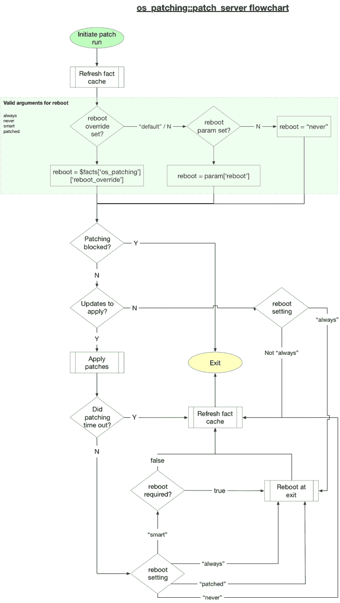
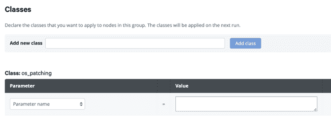
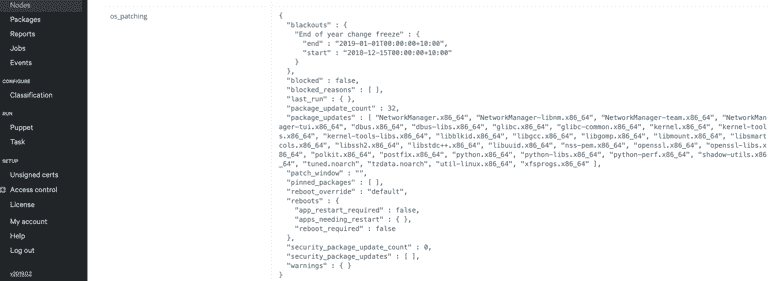
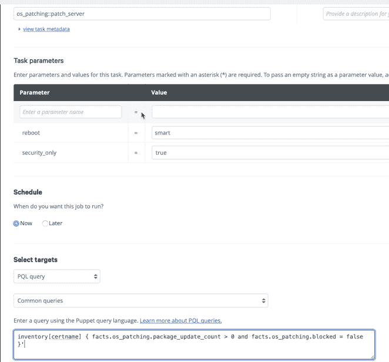

# 针对 Windows 和 Linux 的无痛自动补丁

> 原文：<https://thenewstack.io/painless-automated-patching-for-windows-and-linux/>

打补丁一直是 IT 的一大痛点。手动修补系统是劳动密集型的，并且容易出错。很少存在集中的信息，这使得停机时间的协调很困难。雪上加霜的是，各种操作系统之间的补丁程序千差万别。

对于修补的含义也有许多不同的解释，但就本文而言，我们将使用的定义是:“对计算机软件应用更改，目的是解决功能或安全缺陷，提高可用性、可靠性或性能。”

**我们要讨论的:**一种利用特别的手动任务编排的方法，例如使用[螺栓](http://puppet.com/bolt)，一致且自信地为大规模系统打补丁。通过消除手动工作节省的时间越多，您就可以有更多的时间专注于下一个伟大的项目。

## 通过修补解决漏洞

 [托尼·格林

Tony 担任 UNIX 系统管理员已经超过 25 年了，在那个时候，服务器不是宠物，它们更像是孩子。他的目标一直是自动淘汰自己，而 Puppet 就是他用来实现这一目标的工具。Tony 曾在金融、电信和媒体行业工作，帮助开发人员、工具和服务。他现在在澳大利亚悉尼领导武士刀 1 的 DevOps 实践，一个木偶合伙人。](https://www.linkedin.com/in/tgreen4/) 

修补解决的最大问题之一是处理可能给组织、网络和用户带来风险的安全漏洞。然而，这些漏洞可能很难管理和修复。跟踪受影响的服务需要手动操作、专业工具、定制工具开发或三者的结合。

对任何易受攻击的服务和服务器应用补丁也是一项挑战，需要大量的手动工作。IT 团队集中控制修补流程是很常见的。这可能很有效，但是会出现更多的挑战。由于网络服务繁忙且随需应变，IT 需要确定补丁程序的优先级，并找到应用补丁程序的最佳时间。

自助服务选项解决了其中一些问题，但也带来了其他问题。培训、访问控制和标准的实施是自助服务解决方案可能遇到的困难。

即使在修补完成后，IT 部门也需要验证所有修补作业是否成功，并确保报告系统更新为新状态。他们还必须确保所有利益相关方能够及时准确地访问服务器的补丁状态。

直到最近，还没有工具能够满足智能、有用的自动化补丁管理的所有期望和要求。

## 构建合适的工具

Puppet 已经提供了创建强大的补丁部署和报告工具所需的大部分框架。有了 Puppet，我们可以轻松地[集中数据](https://docs.puppet.com/puppetdb/)，同时[保持数据准确](https://glennsarti.github.io/blog/puppet-ruby-facts/)。它还提供了基于角色的访问控制( [RBAC](https://puppet.com/products/capabilities/role-based-access-control-rbac) )系统和在节点上触发特定任务的能力。此外，可以通过一个 [API](https://puppet.com/docs/pe/latest/api_index.html) 和一个 [web 控制台](https://puppet.com/docs/pe/latest/console_accessing.html)来控制 Puppet。

需要一个模块来满足以下要求:

*   通过自定义事实将服务器上的补丁状态报告回 PuppetDB
*   如果可能，报告哪些更新与安全相关
*   将服务器分配给修补程序窗口组，以便于调度
*   为服务器设置中断时间，防止任何修补活动
*   必要时触发修补后重启
*   在预定义的服务器组上执行修补作业，这些作业还必须:
    *   清理包缓存
    *   将应用的修补程序限制为与安全相关的修补程序
    *   为 OS 程序包命令提供覆盖参数
    *   从命令行、控制台或通过 API 触发修补任务
    *   控制谁可以执行补丁运行
*   在每个单独的节点上存储规范的修补状态数据。

最后一个要求是最重要的。节点修补状态的真实来源需要存储在每个单独的节点上，以便在必要时可以从节点重建所有修补信息。

Puppet os_patching 模块满足了这些要求。这个模块现在可以在 Linux (RedHat、Debian 和 SUSE)上完全运行。版本 0.11.0 中增加了对 Windows 的支持。对其他操作系统的支持目前正在开发中。

要启用该模块，只需在每个节点上声明 os_patching 模块。这将设置一个计划任务来刷新修补程序信息，并允许访问必要的任务来执行修补。

## 管理服务器事实

定制事实提供了 os_patching 模块的主干。这些事实有些是由计划的作业生成的，有些是由 os_patching 类本身生成的。所有这些值都被缓存，以防止服务器负载影响性能。该模块每小时刷新一次所有值，这个时间间隔可以通过配置更改。

收集了几类事实。

状态事实存储每个节点的当前状态，用于回答以下关键问题:

*   有补丁可以应用吗？
*   准备应用多少补丁？
*   它们与安全相关吗？
*   节点需要重启吗？
*   是否有任何应用程序或服务需要重启？
*   目前可以打补丁吗？

控制事实配置修补流程和作业的执行。他们回答了以下问题:

*   是否定义了任何中断窗口？
*   节点是否分配给修补窗口？
*   此节点是否覆盖了重新启动参数？

状态和控制事实共同提供了审核节点和控制补丁自动化所需的所有信息。

可以通过将各个节点分配给 patch_window(如“第 1 组”或“第 4 周”)来对它们进行分组可以定义中断窗口来冻结更改或防止修补单个节点。

使用这些事实，可以编写如下查询:

```
puppet task run os_patching::patch_server  --
query='nodes[certname] {
facts.os_patching.patch_window = "Week3" and
facts.os_patching.package_update_count &gt; 0 and
facts.os_patching.blocked = false }'  

```

此任务修补分配给修补窗口“Week3”的所有节点，这些节点未被阻止，并且已准备好应用修补程序。

## 附加配置设置

其他选项提供了对修补任务的进一步定制:

*   patch_window:用于标记服务器组
*   blackout_windows:阻止更新的日期和时间
*   security_only:仅允许更新 security_package_updates 软件包和依赖项
*   reboot_override:覆盖任务的重新启动标志
*   dpkg _ options/yum _ options:dpkg 或 yum 的附加选项字符串。

## 管理和控制重启

几乎在所有情况下，打补丁都需要重新启动任何已打补丁的库或文件所涉及的所有服务和应用程序。这可以简单到重启单个应用程序，也可以复杂到要求服务器完全重启。os_patching 模块接受配置选项来控制这种行为。

“重新启动”参数接受以下值:

*   始终:无论任务状态或成功与否，始终触发重新启动
*   从不:从不触发重启
*   修补:如果应用了任何修补程序，则触发重新启动
*   智能:使用特定于操作系统的工具来确定修补后是否需要重新启动。这通常只是在内核或核心库更新时触发重启

“os_patching.reboot_override”事实可用于在粒度级别上定制行为。这允许修补作业只重新启动服务器的子集。



此流程图显示了 os_patching 模块根据配置和可用事实做出的决策。

## 报告和输出

os_patching 模块的所有任务输出都可以通过命令行、控制台或 API 看到。

报告字段包括以下内容:

*   pinned_packages:在 OS 层锁定或锁定的任何包版本
*   调试:修补命令的完整输出
*   开始时间/结束时间:描述任务开始和结束时间的时间戳
*   重新启动:使用的重新启动参数
*   packages_updated:受影响的软件包列表
*   安全性:使用的安全性参数
*   job_id:在 RedHat 服务器上，yum 作业 id
*   消息:任务提供的任何附加状态信息。

## 入门指南

要开始使用 os_patching 模块，请按照下列步骤操作:

*   将 mod " albatrossflavor-OS _ patching "，" 0.11.0 "添加到 Puppetfile 并部署控制库
*   使用 os_patching 模块对要修补的节点进行分类:
    1.  在修补配置文件中包含操作系统修补
    2.  使用 PE 控制台:
*   在这些节点上运行木偶。您应该会看到以下变化:
    1.  将安装文件/usr/local/bin/OS _ patching _ fact _ generation . sh:(在 Windows 上为 c:\ program data \ OS _ patching \ OS _ patching _ fact _ generation . PS1)
    2.  Cron 作业将被设置为每小时运行一次脚本(使用 fqdn_rand)并在重新启动时运行
    3.  将创建目录/var/cache/os_patching
    4.  /usr/local/bin/OS _ patching _ fact _ generation . sh 将运行并填充/var/cache/os_patching
    5.  一个新的事实(操作系统补丁)将可用
*   查看您分类的节点上 os_patching 事实的内容:
    1.  facter -p 操作系统修补
    2.  puppet-任务运行 facter _ task fact = OS _ patching–节点 centos.example.com
    3.  使用控制台查看事实:
*   在这些节点上运行补丁程序:
    1.  puppet 任务运行 OS _ patching::patch _ server–query = ' nodes[certname]{ facts . OS _ patching . package _ update _ count > 0 and facts . OS _ patching . blocked = false } '
    2.  通过控制台运行任务:

## 自动化手动任务可以让您有更多时间专注于工作

自动化工具的可访问性，如[木偶](http://puppet.com)和[螺栓](http://puppet.com/bolt)也为那些原本要手动添加补丁的人腾出了时间。这份关于大规模修补 Linux 系统的指南只是工程师和开发人员停止从事令人窒息的手工工作，并在自动化和流程上进行创新以节省宝贵时间的众多方法之一。

我们该如何利用这些潜在的新发现的时间呢？嗯，这取决于我们。在我们达到这一点之前，让我们继续一起自动化和创新，一次一个伟大的模块。

## 感谢这些贡献者

没有以下个人的贡献，os_patching 模块就不会存在:

我们要特别感谢 Yasmin Rajabi 和她的团队在 Tasks 和 Puppet Bolt 上的出色工作。

<svg xmlns:xlink="http://www.w3.org/1999/xlink" viewBox="0 0 68 31" version="1.1"><title>Group</title> <desc>Created with Sketch.</desc></svg>