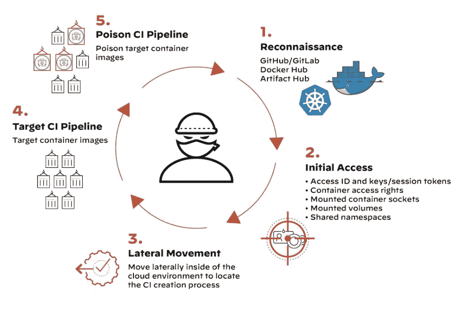

# Palo Alto Networks 单面板提供保护伞式安全性

> 原文：<https://thenewstack.io/palo-alto-networks-single-panel-provides-umbrella-security/>

帕洛阿尔托网络公司表面上成为第一家提供开发团队所需的一整套安全工具和平台的安全提供商，去年它[收购了](https://www.paloaltonetworks.com/company/press/2021/palo-alto-networks-completes-acquisition-of-bridgecrew) [Bridgecrew](https://bridgecrew.io/) 。今天，在 [Prisma Cloud](https://www.paloaltonetworks.com/cloud-security?utm_content=inline-mention) 和 Bridgecrew 中，Prisma Cloud 发布了一个名为 Prisma Supply Chain Security 的主要版本，该版本旨在覆盖从开发到部署的整个 DevOps 领域。

除了为 Palo Alto Networks 的 Prisma 云安全产品提供集成了 Bridgecrew 的完整左移安全功能之外，供应链安全还通过一个控制台提供所有这些功能。开发人员和运营团队成员共享访问和控制权限，以检查和纠正应用程序代码所有阶段的安全性。

“在这个版本中，一切都在一个保护伞之下:基础设施和应用安全，包括您整个交付管道的安全，”Palo Alto Networks 高级总监兼首席架构师 Barak Schoster Goihman 告诉新堆栈。

## 向左移动

Bridgecrew 在此版本之前以及 Palo Alto Networks 收购该公司之前提供的左移方面是供应链网络的一个主要方面。基于开源的 Chekov，它可以作为代码来分析和管理基础设施，Bridgecrew 的功能扩展到自动化策略控制。开发人员可以在供应链安全框架内利用这一功能，帮助确保来自开源的带有漏洞的代码不会集成到应用程序中。供应链安全旨在以自动化的方式审查代码，开发人员可以在创建代码时立即使用，以确保库不违反策略(因此，Bridecrew 工具的 IaC 组件)。这种能力可以帮助开发人员节省时间，并避免因不得不重做未通过生产管道安全检查的代码而带来的麻烦。

[企业战略集团(ESG)](https://www.esg-global.com/) 的分析师 [Melinda Marks](https://www.linkedin.com/in/melindamarks22) 告诉 New Stack 说:“开发人员可能会在没有意识到的情况下引入错误配置，当安全团队在运行时发现这个问题时，他们将不得不在其他工作中优先考虑这个问题，然后他们将不得不回去为开发人员讨论返工项目。”。“相反，使用 BridgeCrew，开发人员可以自己测试和修复。因为他们有能力修理东西，所以工作效率更高。”

左移功能还有助于减少漏洞，这些漏洞在软件部署后会成为毁灭性攻击的入口。“从一开始就确保交付管道的安全可以让你免受攻击，就像我们在网络安全管理软件产品攻击中看到的那样，不可信的代码被推送到生产中，”Goihman 说。

## 行动安全

除了 Bridgecrew IaC 功能，供应链安全还结合了适用于运营层面安全的安全功能，如 Prisma Cloud 的[云安全态势管理(CSPM)解决方案](https://www.paloaltonetworks.com/prisma/cloud/cloud-security-posture-management)所提供的功能。“例如，Bridgecrew 和 Prisma Cloud 之间有着非常好的联系，”Marks 说。

供应链安全的映射功能用于提供图形界面，旨在打破开发人员、运营和安全团队之间的孤岛。有了它，那些有权访问的人能够了解应用程序、基础架构、网络和 CI/CD 安全性。单一控制台显示从开发到部署的所有文件、资源和代码管道组件。根据 Palo Alto Networks 的文档，该系统自动识别应用程序或供应链中易受攻击的区域，同时可视化提供了对应用程序状态的快速查看，并提供了帮助[威胁建模](https://owasp.org/www-community/Threat_Modeling)的可视化。

该公司提供的 Prisma 供应链安全的其他功能包括:
●自动发现:使用现有的云代码安全扫描器提取代码资产并建模。
●图形可视化:提供关键应用程序和基础设施资产依赖关系的清单，以了解整个攻击面的弱点。
●供应链代码修复:易受攻击的依赖关系或错误配置的 IaC 资源可以使用单个整合的拉式请求进行补救。
●代码库扫描:识别并修复应用代码中开源包的漏洞。
●分支保护规则:扩展策略即代码以强化 VCS 和 CI/CD 配置(通过 Checkov)来帮助防止代码篡改攻击。

“供应链安全带你通过软件供应链的开发生命周期、CI/CD 和所有其他组件和过程的每一步，”Goihman 说。“这是理解威胁表面并关注安全措施的第一步。”

<svg xmlns:xlink="http://www.w3.org/1999/xlink" viewBox="0 0 68 31" version="1.1"><title>Group</title> <desc>Created with Sketch.</desc></svg>