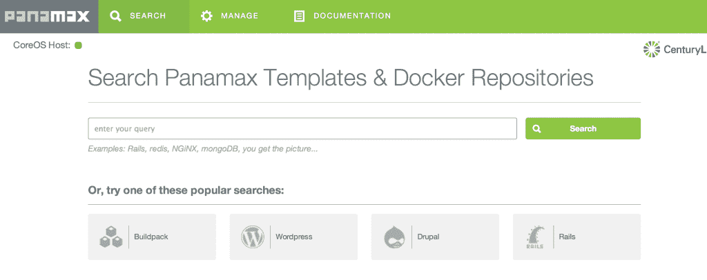
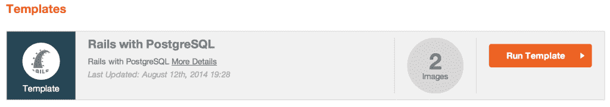
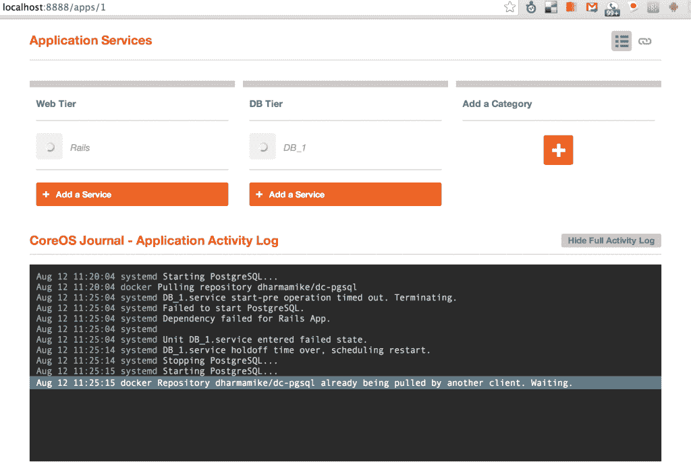
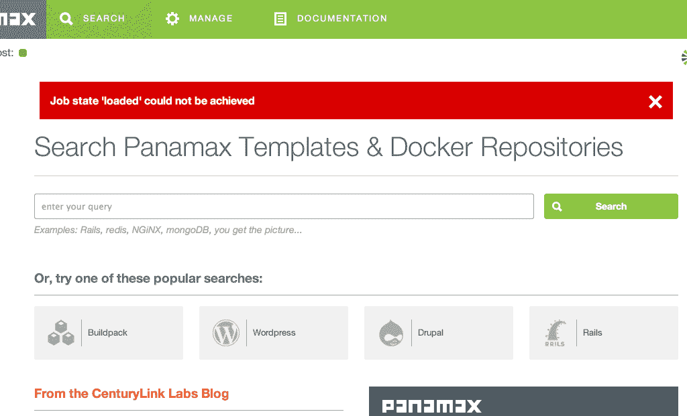
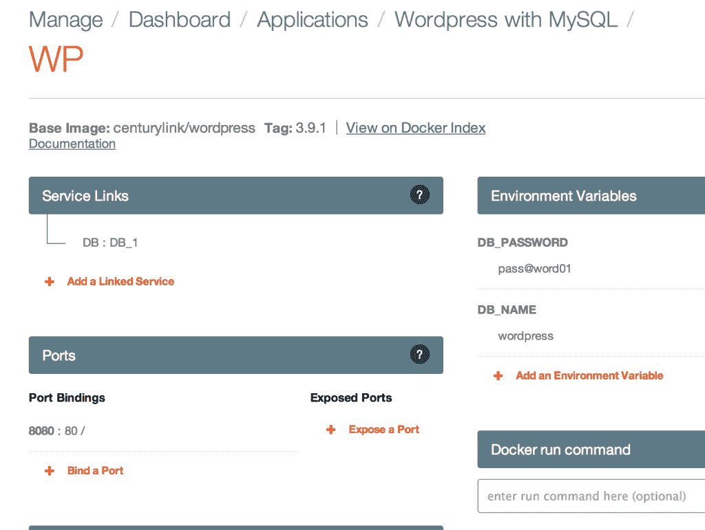

# Panamax，一个用于应用程序开发的简单 Docker 用户界面

> 原文：<https://thenewstack.io/panamax-a-simple-docker-ui-for-app-dev/>

我总是支持本地人，所以我很高兴看到 CenturyLink Labs 本周在波特兰总部推出 Panamax。Panamax 是另一个 Docker 管理工具，与类似于 [Kubernetes](https://github.com/GoogleCloudPlatform/kubernetes) (来自谷歌)和 [Mesos](http://mesos.apache.org/) 的工具以及类似于[船厂](https://github.com/shipyard/shipyard)和 [Docker-UI](https://github.com/crosbymichael/dockerui) 的开源工具站在一起。与许多其他工具不同，Panamax 似乎工作得很好(尽管有一些错误)，并且有一个经过深思熟虑的漂亮的 UI 组件。

Panamax 与 Docker 密切相关，不像 Mesos 这样的工具，它们是通用的容器管理器。它抽象了用户在分布式集群中使用多个容器构建复杂应用程序时必须管理的复杂性。运行 Docker 系统的新操作系统 CoreOS 内置于 Panamax 中。除了 CoreOS，Panamax 还利用了 Fleet 这一调度和编排系统。

Panamax 技术代表了应用程序开发的一种新思路，推动了微服务的概念，这一概念已成为一个热门话题。首席执行官卢卡斯·卡尔森向我们解释说，轻松地将松散耦合的应用程序片段组合在一起，可以降低应用程序开发过程的复杂性。这个问题源于在整个应用程序开发过程中安装新技术。移除不同的部分也同样复杂。容器是一种连接不同服务的方式，这些服务可以在应用程序本身中重新构建，而不需要根据需要构建和解构的麻烦和时间。

> 在这方面，Paanamax 不是 PaaS。相反，它更像是构建云服务的安装程序。容器是新流程的机制。

从历史上看，构建利用集群容器网络的应用程序需要各种新技术，每种技术都有自己的学习曲线。正如首席执行官 Lucas Carlson 所写，这些服务可能包括 fig、etcd、systemd、fleet、kubernetes、mesos、ambassadors、discoverd、consul、constant、serf、registrator、skydns、libswarm 以及越来越多的其他服务。

这是一个显示出难以置信的前景的工具，特别是对于 Docker 的新用户，因为它几乎提供了本地机器上 PaaS 的简单性。虽然它有很大的潜力，但一些 bug 会让 Docker 新用户感到沮丧。但总的来说，我相信 CenturyLink 团队已经为用户建立了一些有价值的东西，这些东西只会随着时间的推移而成熟。

## Docker 的漂亮用户界面和容器通信的标准

如果您已经从命令行使用了 Docker，您将立即认识到 Panamax 指导您创建应用程序(多进程容器)的步骤。而且，我相信 Panamax 对于不熟悉码头和集装箱运输的用户来说会很直观。首先，Panamax 允许您快速搜索 Docker 存储库和 Panamax 模板存储库。

[](https://thenewstack.io/wp-content/uploads/2014/08/Screen-Shot-2014-08-12-at-12.49.19-PM.png)

如果您找到了一个应用程序(例如 Rails)，那么您只需单击一下就可以启动这两个进程，并通过单击“Run template”按钮在 Panamax UI 中查看每个容器的日志文件。您会注意到 Panamax 指出模板包含两个图像:Rails 应用程序图像和 Rails 连接的 Postgresql 容器。

[](https://thenewstack.io/wp-content/uploads/2014/08/Screen-Shot-2014-08-12-at-12.55.34-PM.png)

Panamax 模板以 GitHub 存储库的形式存储在 CenturyLink 所谓的开源应用程序库中。这些  模板(多进程容器规范文件)用于构建和提供应用程序(定义为互连服务)。例如，WordPress 是一个需要 PHP 前端(web 层)和 MySQL 数据库的应用程序。Panamax 模板规定了这两个过程，以及在运行时应如何配置容器，以便两个过程可以相互对话。例如，对于 WordPress，Panamax 模板精确地指定了 web 层如何与数据库对话:WordPress 希望数据库在哪个端口上，以及在连接到数据库时使用哪个凭证。如果您更改了正在运行的模板，您可以将其存储为另一个模板以创建您自己的模板。

## 独立的 Docker 安装

Panamax 为您安装新的 Docker 主机。这意味着您将在您的开发系统上管理两套 Docker 映像。您仍然可以在 Panamax 系统中使用常规命令行工具，命令如下:

```
$  panamax ssh
<b>core@panamax-vm</b><span class="s1"><b>  ~  $</b></span> docker ps
CONTAINER ID            IMAGE                                          COMMAND                        CREATED                    STATUS                     PORTS                                NAMES
f0f3de719edc            centurylink/panamax-ui:latest      /bin/sh  -c  'bundle e   6 minutes ago       Up 6 minutes        0.0.0.0:3000-&gt;3000/tcp    PMX_UI 
561e00e46d64        google/cadvisor:0.1.0            /usr/bin/cadvisor      6 minutes ago       Up 6 minutes        0.0.0.0:49153-&gt;8080/tcp   PMX_CADVISOR,PMX_UI/CADVISOR   
29cccb9f8851        centurylink/panamax-api:latest   /bin/sh -c 'bundle  e     6  minutes ago           Up  6  minutes            0.0.0.0:3001-&gt;3000/tcp      PMX_API,PMX_UI/PMX_API 

```

在 CoreOS 上运行时，我能够在内部确定正确的主机交换机(“docker-H UNIX:///var/run/docker . sock PS”)，但遗憾的是，这在主机外部是不可用的，这意味着您当前不能从本地终端外部运行相同的命令。例如，您必须在 CoreOS 主机中才能对第二个 Docker 实例使用命令行工具。如果您在 Docker 命令行工具的基础上构建了工作流程，您将无法轻松地将其迁移到 Panamax 管理的映像中。

## Docker 的潜在问题仍然影响着 Panamax

我在 Docker 中看到的一个问题是，在第一个命令完成之前，多次运行像“pull”(从中央存储库中检索基本映像)这样的命令会花费很长时间，这可能会造成混乱。Docker 会感到困惑，报告一个错误，并可能无法完成命令。有时这甚至需要重启 Docker 主机；在我的例子中,“boot2docker restart”完成了这个任务，但是需要我重新启动所有正在运行的容器。这是一个[公认的问题](https://github.com/docker/docker/issues/3115)，但这是巴拿马型系统无法为您解决的问题，并且在已经复杂的系统上又增加了一层复杂性。

【T2

我预计现在使用 Panamax 的大部分压力将来自于与底层的基本 Docker 系统的交互。现在 Docker 的变化速度非常快(尽管最近发布的 Docker 1.0 可能会最终缓解这些问题)。panamax 会通过在 Panamax 中构建组件来修复或隐藏这些问题(从而搞乱 Panamax 本身)来应对 Docker 的损坏部分吗？或者，Panamax 的某些部分会因为 Docker 内部的错误而出现故障吗？

## 无法达到作业状态“已加载”

我创建的第一个应用程序是示例 Rails 应用程序。这个模板包括两个服务，一个 Rails 应用程序和一个 Postgres 数据库。Panamax 会自动链接这两个应用程序。正如我在另一篇文章中描述的那样，这实际上是一项棘手的任务。Panamax 使这一过程无缝衔接，允许您连接集装箱。虽然它没有像宣传的那样起作用，但当 Panamax 团队解决了这些问题后，我希望许多人会被 Panamax 所吸引，因为所提出的方法是一种连接流程的简单方法，不会给你带来术语和复杂步骤的负担。出于同样的原因，我怀疑应用程序框架(如 Rails 应用程序)将提供如何使您的应用程序在 Panamax 中运行的说明。

在等待 Rails 应用程序之后，我注意到 Rails 组件从未通过 spinner ("loading "？)阶段。数据库容器似乎开始得相当好，但是 Rails 从来没有走过“拉容器”的阶段。我试图删除应用程序，然后重新启动它，但是始终无法启动 Rails 应用程序。然后我试着启动一个 WordPress 应用程序，看起来启动正常，但是当我试着检查它们的时候，Panamax 已经完全死机了，我在 localhost:8888 上看不到任何东西。命令行中的一个快速的“panamax up”完全重启了主机，但我始终无法理解为什么整个系统会崩溃。令人高兴的是，重启 Panamax 重新启动了我之前运行的容器集。

【T2

巴拿马团队的航运值得称赞，尤其是像巴拿马现在这样功能强大又美观的东西。但是，我希望他们能添加应用程序错误的链接，或者链接到研究和故障排除的地方。基于 web 的 UI 工具的真正强大之处在于，一个错误可以作为探索和故障排除的起点，而命令行工具很少这样做。如果这个错误消息有一个链接或潜台词，建议在哪里搜索更多的信息，这将是非常有用的。如果 CenturyLink 希望人们加入 GitHub 问题或公共 Panamax 论坛，他们有机会控制这种对话。

虽然有 Rails Panamax 模板是件好事，但我不确定如何在容器中安装我自己的应用程序。 [Panamax Rails 模板](https://github.com/CenturyLinkLabs/panamax-public-templates/blob/master/rails_with_postgresql.pmx)没有具体说明如何做到这一点，我不确定 Panamax 是否有关于正确做法的指南。在这个问题上似乎没有达成普遍共识，这可能会导致混淆，并在 Docker 和 Panamax 社区中产生多种解决方法。[除了说“要灵活”](https://github.com/CenturyLinkLabs/panamax-ui/wiki/Panamax-Public-Templates)如果能看到 Panamax 站出来说:“在 Panamax 中安装应用程序时，将它们放在名为 XYX 的卷中，并使用像 ABC 这样的环境变量，那就太好了。”Ruby on Rails 因[坚持认为约定优于配置](https://en.wikipedia.org/wiki/Convention_over_configuration)而掀起了波澜，我认为 Docker 社区需要鼓起勇气，开始说“这就是如何做到的！”

## 本地端口路由不是自动的

Panamax 不会自动将 CoreOS 主机系统的端口映射到您的本地主机设置。这意味着如果没有一些额外的手动配置，你就不能访问 Docker 中运行的应用程序。我想这是 Panamax 团队的首要任务。然而，根据 CenturyLink 提供的文档,配置端口路由是一个简单的过程，而且工作起来很有魅力。比如重启 Panamax 后，它会自动重启 WordPress 应用。然后，我回顾了 web 层的端口绑定。

[](https://thenewstack.io/wp-content/uploads/2014/08/Screen-Shot-2014-08-12-at-12.32.37-PM.png)

然后，我简单地运行 VBoxManage 命令来映射本地端口，如下所示:

```
$  VboxManage controlvm panamax-vm natpf1 rule1,tcp,,8997,,8080

```

这样，我可以看到 WordPress 通过 Panamax 在 Docker 中运行，作为一个独立的容器，由 http://localhost:8997 上自己的数据库支持。

> 这是令人敬畏和强大的，你不能得到比这更简单的安装 WordPress。

## 解决部署问题

Panamax 允许您快速启动和管理多进程容器。但是，it 部门没有关于将这些映像迁移到生产 docker 主机上的意见或流程。由于这个工具来自 CenturyLink，他们提供了这样一个托管环境，我想很快就会有办法做到这一点。

## Panamax，强大的 Docker UI

尽管有一些缺陷，Panamax 是高度可用的，也是一种享受。Docker 以前只对非常专业的人群开放，但 Panamax 通过允许探索 Docker 图像和容器，将 Docker 带到了一个新的用户群体。同样重要的是，Panamax 为用户带来了乐趣。通过将复杂性抽象化，CenturyLink 为 Docker 用户打开了一个充满可能性的新世界。自己试一试。

<svg xmlns:xlink="http://www.w3.org/1999/xlink" viewBox="0 0 68 31" version="1.1"><title>Group</title> <desc>Created with Sketch.</desc></svg>