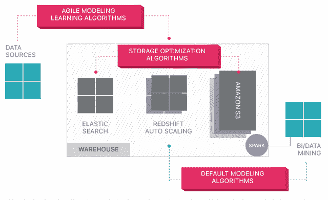

# Panoply:缩短数据实现商业价值的时间

> 原文：<https://thenewstack.io/panoply-shrinking-datas-time-to-business-value/>

商业智能和数据管理会占用公司一部分时间，再加上成本，会给初创公司和小公司带来巨大障碍。

以色列初创公司 [Panoply](http://www.panoply.io/) 的智能数据仓库提供自动化的自助式数据管理，使 BI 团队不再需要依赖 IT 来快速获得答案。

其基于云的数据仓库使用自然语言处理和机器学习来自动化调优和查询优化，同时在[亚马逊红移](https://aws.amazon.com/redshift/)的基础上自动化弹性存储和 CPU 扩展。

首席执行官 Yaniv Leven 将其描述为无服务器和无 ETL——旨在处理耗时的基础设施管理和数据准备任务。

“基本上，我们说我们使[红移无服务器](https://blog.panoply.io/panoply-redshift-serverless-since-2015)，因为红移的核心需要大量的管理，”福音传道部主任[杰森·哈里斯](https://www.linkedin.com/in/jasonrharris/)说。

[https://www.youtube.com/embed/lWvNICe3MKw?feature=oembed](https://www.youtube.com/embed/lWvNICe3MKw?feature=oembed)

视频

金伯利-克拉克全渠道分析负责人 [Helena Carre](https://www.linkedin.com/in/helena-carre-2880951/) 坚持认为，使用 Panoply 和可视化工具 [Tableau](https://www.tableau.com/) 在两年内为公司节省了 25 万美元并且每周花费 8 小时准备一份地区零售报告。

但 Panoply 的价值对于没有专门数据团队的小公司来说可能更大。

Justin Mulvaney 是纽约一家初创公司[spatial](https://spacious.com/)的唯一数据分析师，该公司提供闲置建筑的工作空间，比如白天不营业的餐馆，他讲述了[如何计算如何将收入](https://blog.panoply.io/spacious-panoply)分配给不同的合作伙伴过去是如何耗费高管时间的。

它消除了公司每个团队数小时的数据导出和手动文件检查。现在每个团队都上传数据，用一点 SQL，他说他可以在几分钟内运行收入数字。

## 自助分析

该公司于 2015 年由 [Roi Avinoam](https://github.com/avinoamr) 和 [Yaniv Leven](https://www.linkedin.com/in/yanivleven/) 在特拉维夫创立，于 2017 年 2 月悄然推出，并于去年 11 月宣布[全面上市](https://blog.panoply.io/panoply-moves-to-general-availability-on-the-worlds-first-smart-cloud-data-warehouse)。它的总部在旧金山，研发仍在以色列。该公司已经突破了 100 家客户的大关，并设定了在年底前拥有 500 家客户的目标。它已经筹集了 1430 万美元。

[Panoply 使用户能够通过具有 150 个数据源的 API 摄取数 Pb 的数据](https://panoply.io/integrations/)，包括数据库、社交媒体和 CRM 系统。它使用自然语言处理进行数据建模，并使用机器学习在亚马逊 S3 上进行连续索引和存储优化。它集成了多个 BI 工具，如 Tableau、 [Qlik](https://www.qlik.com/us) 和 [Metabase](https://www.metabase.com/) 。

它致力于让商业用户轻松进行数据分析。

“我们的优势是中小型企业，他们有强烈的数据需求，但没有专门的数据团队，”Harris 说，并补充说其 73%的客户来自非 IT 角色，如业务分析师和数据分析师。

它为用户处理接收、数据管理和提取。

It 吹捧:

*   **零管理** —无需等待 it 部门交付数据。
*   **自动化 ETL** —数据在流入时被聚合。它会自动发现数据类型和数据结构，并根据数据集的变化进行调整。
*   **更快的查询** —机器学习算法检测缓慢的查询，并通过数据缓存提高性能。
*   **通用数据支持** —支持结构化和半结构化数据。它可以识别 CSV、JSON、XML 等数据格式和许多日志格式，并将嵌套结构展平到具有一对多关系的不同表中。
*   **SQL** —就用 SQL。转换数据不需要编程语言。
*   **完全弹性** — Panoply 可以自动扩展、分配工作负载、执行无缝存储和性能优化，包括元数据和查询执行。
*   **企业级隐私和安全性** —安全的多步身份验证和访问控制，以及针对传输中和磁盘上数据的工业级加密。

“无论是扩展、节点选择、维护、监控、备份，我们都能处理，”他说。“如果有人想编写查询，但不知道如何编写高效的 SQL 字符串，我们可以帮助他。”

[https://www.youtube.com/embed/7p_KyL9j4-w?feature=oembed](https://www.youtube.com/embed/7p_KyL9j4-w?feature=oembed)

视频

亚马逊在去年 12 月的 AWS re:Invent 2017 上宣布了 [Aurora 无服务器](https://aws.amazon.com/rds/aurora/serverless/)，然而 Harris 将其主要竞争对手列为[雪花](https://thenewstack.io/bob-muglia-takes-the-wraps-off-snowflake-data-warehouse-service/)。它还与竞争对手[潜望镜数据](https://thenewstack.io/periscope-data-answering-big-datas-big-small-questions/)和[缝合](https://thenewstack.io/stitch-sews-together-third-party-backend-services-mongodb/)有合作关系。哈里斯说，与 Stitch 和 Chartio 的合作已经产生了自动化云数据栈，只需三次点击就可以启动仓库，引入数据，并在几分钟内实现可视化。

他认为 Panoply 的优势在于可预测的价格、易用性和速度。

在 Tableau 进行的测试中，它发现使用红移-全景-Tableau 比只使用红移和 Tableau 的渲染可视化性能提高了 10 倍。

Panoply 旨在根据用户的使用模式自动优化，无需人工干预。数据查询越频繁，平台对数据的理解就越深入，就可以利用机器智能来提高性能。

它在学习过程中应用分布和排序键设置、压缩、查询和视图具体化优化。

“我们自动物化视图，所以如果我们看到客户一遍又一遍地运行相同的查询，我们会把它写到内存中，而不是每次都去磁盘，”Harris 说。

它使用缓存的结果和物化视图，根据用户统计数据(如查询的使用情况、运行时间和频率)来确定应该物化或缓存哪些查询或视图。

<svg xmlns:xlink="http://www.w3.org/1999/xlink" viewBox="0 0 68 31" version="1.1"><title>Group</title> <desc>Created with Sketch.</desc></svg>