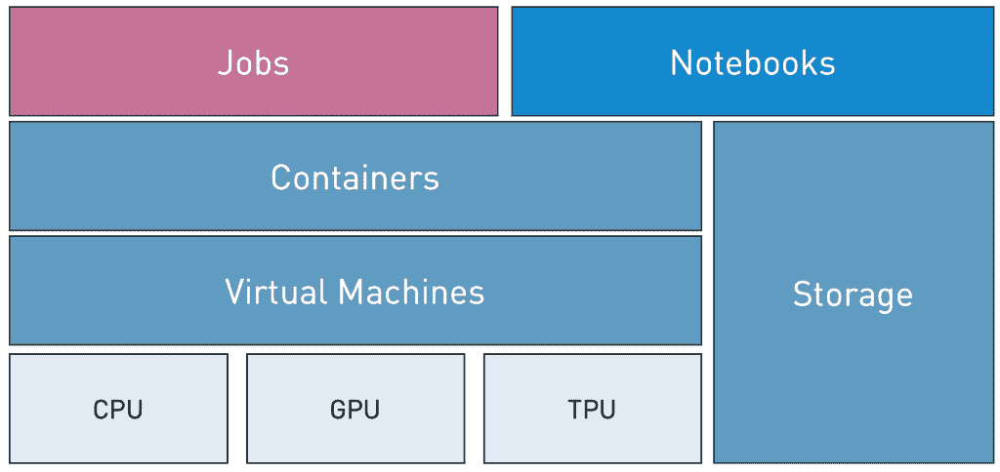
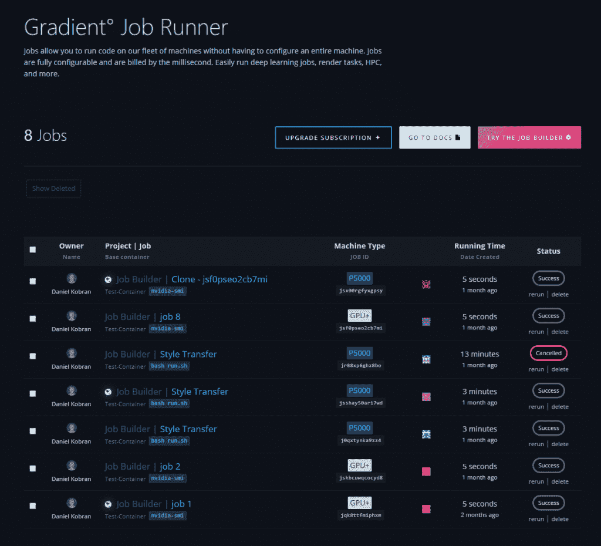
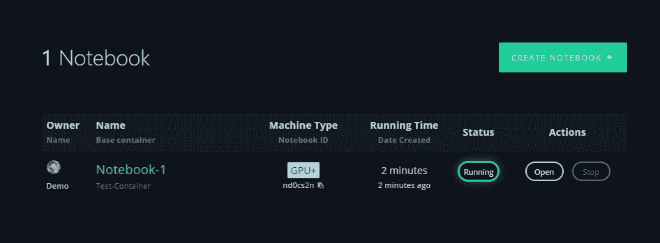

# 纸空间梯度:机器学习的现代 PaaS

> 原文：<https://thenewstack.io/paperspace-gradient-a-modern-paas-for-machine-learning/>

本文是我们探索基于云的机器学习服务系列的一部分。在介绍了 [Azure ML Services](/how-the-azure-ml-streamlines-cloud-based-machine-learning/) 、 [Google Cloud ML Engine](https://thenewstack.io/google-cloud-ml-engine-train-and-deploy-machine-learning-models/) 、 [Amazon SageMaker](https://thenewstack.io/train-deploy-machine-learning-models-with-amazon-sagemaker/) 和 [IBM Watson Studio Cloud](/build-machine-learning-models-with-ibm-watson-studio-cloud/) 之后，我们将进一步了解 Paperspace Gradient。

ML 和 AI 的兴起促使云计算行业引入了一个新的平台即服务(PaaS)产品细分市场。新的基于 ML 的平台从 Heroku 和 Engine Yard 等原始 PaaS 供应商那里获得了一些最佳功能，并将其与机器学习的关键用例及场景相结合。其结果是一个易于使用的、自助式的 PaaS，能够运行 ML 培训作业，并为模型部署提供一个可扩展的托管环境。

在传统的 PaaS 中，开发人员在将代码部署到生产中之前，在本地机器上编写和测试代码。PaaS 的输入是打包成 zip 文件或 Docker 映像的代码，可以自动进行配置和管理。在将构建过程的每个迭代作为版本化的工件推入 PaaS 之前，对其进行独立的测试。

ML PaaS 遵循与传统 PaaS 环境相同的工作流程。开发人员和数据科学家在本地机器上编写 Python 或 R 代码，用较小的数据集进行测试。相同的代码与大型数据集一起被移动到云中，以启动训练作业。这些工作利用了基于高端 CPU 和 GPU 的强大基础设施。开发人员通常使用不同的超参数集多次运行训练作业，直到他们确信模型的准确性。完全训练好的冻结模型被部署在相同的 PaaS 或不同的环境中进行推理。

[Paperspace Gradient](https://www.paperspace.com/gradient) 是一个当代平台，旨在将传统 PaaS 的简单性和灵活性引入云中构建机器学习模型。Paperspace 还提供了一个名为 as Core 的产品，可以向喜欢对基础设施进行额外控制的客户公开由 NVIDIA GPUs 和 Google TPUs 支持的原始虚拟机。

Paperspace Gradient 构建在核心之上，作为一个抽象层，隐藏了配置和管理虚拟机所涉及的复杂性。这种 PaaS 服务依靠 Docker 和 NVIDIA 容器来简化 ML 模型的生命周期管理。

让我们探讨一下图纸空间渐变的组成部分。

概括来说，Gradient 有三个基本要素:工作、笔记本和存储。作业是平台的主力，而笔记本通过提供工具支持充当 IDE。作业和笔记本使用存储层来存储和检索数据集、模型和其他相关工件。PaaS 的这些组件可以通过门户、CLI 或 API 进行访问。

## 乔布斯

简单地说，Paperspace 中的作业是一个 Docker 容器，其中包含 shell 脚本或 Python 代码形式的可执行代码。作业被安排在一台或多台由 GPU 或 TPU 驱动的机器上。

当开发人员使用 CLI 或门户将代码提交给 job runner 时，Gradient 会提取代码，对其进行压缩，然后创建 Docker 映像。也可以在提交作业时提及机器类型。如果在诸如 Docker Hub 之类的注册表中有可用的容器图像，则 Gradient 可以指向该图像的位置以及提取该图像所需的凭证。对于涉及管道的复杂工作流，用户可以在通过注册中心将 Docker 图像提交给 Gradient 之前，在本地构建和测试 Docker 图像。

如果有带源代码的 Github repo，Gradient 可以在构建 Docker 映像之前动态克隆它。本地源代码目录、Docker 映像和 Github 存储库的选择为开发人员和 DevOps 团队提供了灵活性。

一旦作业被作业运行器启动，门户就可以显示代码发出的指标。以{"chart": " <identifier>，" y": <value>，" x": <value>}格式写入 stdout 的日志由门户获取以进行可视化。CLI 还可以将日志流式传输到本地控制台。</value></value></identifier>

梯度 PaaS 最好的特性之一是能够访问容器暴露的 IP 地址和端口。每个作业都获得一个公共地址以及映射到相关容器的特定端口。这个功能在访问 TensorBoard 或 NVIDIA DIGITS 等工具暴露的 web UI 时非常有帮助。基本的推理可以通过在容器中包含一个简单的 Flask 或 Django 应用程序来完成，当一个作业运行时可以访问这个容器。

作业可以访问/storage 中可用的存储位置，以持久存储经过训练的模型、评估指标或任何其他需要在同一作业的不同迭代中持久存储的工件。

## 笔记本电脑

Paperspace Gradient 可用于快速启动 Jupyter 笔记本电脑，无需调配和配置虚拟机。

和乔布斯一样，笔记本也是通过 Docker 容器打包推出的。Paperspace 有多个预配置的容器映像，由各种深度学习和机器学习框架以及 Jupyter 笔记本组成。

笔记本容器可以在由 GPU 支持的虚拟机上启动。每个笔记本会话最多可持续 12 个小时，之后会自动停止。笔记本电脑生成的工件可以永久保存在其他笔记本电脑或作业可用的共享存储中。

与自定义作业容器的概念类似，开发人员可以构建自定义笔记本容器并上传到 Docker Hub，Gradient 可以访问这些容器来实例化自定义笔记本环境。这有助于管理开发人员和数据科学家使用的高度定制的框架配置。

## 储存；储备

Gradient 包括三种类型的存储，可在运行作业或笔记本容器的上下文中使用。这三种存储类型是持久存储、工件存储和工作空间存储。每种存储类型都有不同的用途，用于 ML 模型的实验和评估的不同阶段。

持久存储由文件系统支持，非常适合存储图像、数据集和模型检查点等数据。它是一个指定的存储位置，您可以在作业过程中读取和写入文件。

在 CLI 和 web 界面中运行作业后，将收集工件存储并使其可用。笔记本和作业使用这个位置来存储代码生成的任何工件。

工作空间存储通常从启动作业的本地目录导入。该目录的内容被压缩并上传到作业实际运行的容器中。它是在作业运行期间存在的临时存储位置。

Paperspace 将 MNIST 和可可等流行数据集放在一个只读目录中，该目录安装在 */datasets 中。*所有的作业和笔记本都可以访问存储在这个位置的数据集。

Paperspace 为现代 ML PaaS 的设计树立了一个很好的榜样。这一切都将为公共云平台供应商带来激烈的竞争，这些供应商正忙着将自己重新定位为 ML 开发和部署的首选平台。

<svg xmlns:xlink="http://www.w3.org/1999/xlink" viewBox="0 0 68 31" version="1.1"><title>Group</title> <desc>Created with Sketch.</desc></svg>