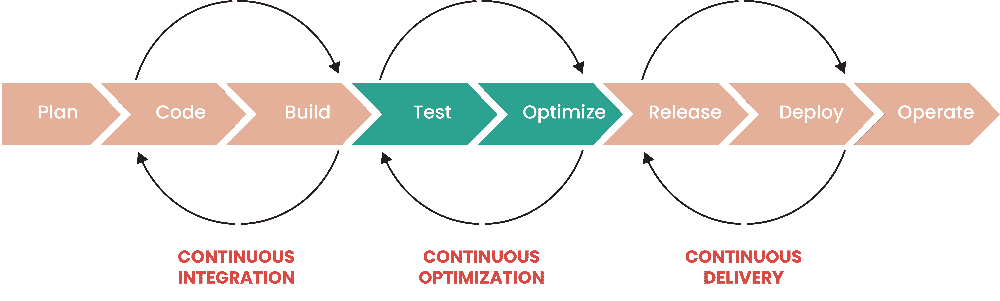

# 虚拟机和 Kubernetes 的相似之处

> 原文：<https://thenewstack.io/parallels-of-vms-and-kubernetes/>

“历史不会重演，但却常常押韵。”

谁会引用马克·吐温的话来开始一篇科技博客？

事实证明，科技史也同样押韵。

在这种情况下，我特别指的是应用程序基础架构以及我整个职业生涯中一直存在的创新和浪费循环。

## 虚拟循环

【T2

在我的记忆中，基础设施速度一直是竞争优势的领先指标。对于成功的组织来说，IT(尤其是 IT 快速高效地部署和管理基础架构的能力)是一个关键因素。虽然“软件正在吞噬世界”是真的，但事实证明软件不能自己运行。

 [欧文·达里娅

欧文是 StormForge 的首席销售工程师。在担任构建和领导基础架构团队的角色后，Erwin 已经过渡到供应商方面，在 Tintri 和 Juniper Networks 等公司的销售、营销和产品角色中服务并取得成功。](https://www.linkedin.com/in/erwindaria/) 

对速度的不懈追求催生了交付基础设施方面的一些最伟大的技术创新。可以预见的是，速度的每一次繁荣都是一次压力测试，可以迅速发现任何 IT 组织中的弱点，并为下一轮创新提供灵感。

我们只需要看看最近的历史就可以找到例子。

虽然虚拟化已经以某种形式存在了近 60 年，但直到 2000 年代初虚拟机才首次出现在企业中，而且不到十年，它们就彻底改变了人们对基础架构交付和管理的期望。

到 21 世纪后期，虚拟服务器的快速供应提高了基础架构团队的效率，但也导致了一系列新现象。特别是蔓延，即容易调配资源导致严重浪费的趋势，以及过度调配，即在共享环境中过量使用资源，以确保关键应用程序不会损失性能或正常运行时间。

为了应对这些新挑战，2000 年代末出现了一波监控、警报和分析技术。

不幸的是，对于许多前云组织来说，这种模式中唯一真正的安全网是对环境规模的物理限制。

在某个时候，您的基础架构变得“满满的”，这促使团队减少浪费。

*接着是…**云“*

公共云揭开了企业数据中心的众所周知的盖子，成倍地扩大了其对资源的访问，但也增加了浪费的可能性。

十年前的虚拟服务器环境可能有数千个虚拟机分布在少数几个地理位置，而组织转向公共云和 Kubernetes 后，可以很快看到更多的虚拟机托管分布在几个提供商和/或地理位置的数万个容器。

一个人在跳入，或者在某些情况下被推入云池的深水区后，只要踩水就可以了。双关语。

在软件驱动型经济中优先考虑速度，并且没有成熟的可观察性和资源优化功能，许多向云迁移的组织认为无序蔓延、过度配置和成本上升只是竞争的代价。

重要的是，向云的转变也是许多组织的转折点。浪费在云中被放大，许多组织现在说[减少云浪费是首要任务](https://www.stormforge.io/survey-report/cloud-waste-survey-findings/)。

那么作为 IT 专业人员，我们如何同时优先考虑速度、质量、性能和成本控制呢？

## 堆积如山的数据，却没有人去理解它

早些时候，我描述了提高速度的创新，这是发现组织运营框架中弱点的快速方法。我还描述了技术是如何应对和解决这些挑战的，以及这种繁荣/崩溃/修复的循环是如何长期存在的。

也就是说，有理由相信这个周期会有所不同。

新的运营模式和机器学习等成熟技术有望理解复杂性，帮助人类做出更好的决策，并使理解和管理资本和运营成本变得更容易。

从 FinOps(跨职能利益相关方合作使用流程和工具来理解和管理成本的运营模式)到 AIOps(使用人工智能/机器学习来解析日志数据和预测不利事件，甚至在不利事件发生前减轻风险的概念)，很明显，未来十年将会发生比过去二十年更多的变化。

但是许多组织还没有准备好采用这些新的方法和技术。我们经常面临将传统应用程序迁移到云的巨大压力，同时还要管理已经完成迁移的应用程序的日益增长的复杂性和成本，因此必须找到一种方法来缓解压力，而不必等待 FinOps 或 AIOps 的承诺。

## 一个应用优化水晶球？

最近的历史已经让我们看到了这种向机器学习驱动的解决方案的转变。例如，存储市场中的硬件基础设施供应商一直在实施 ML 来预测即将发生的组件故障，甚至预测十年的资源限制。这个众所周知的“存储基础架构水晶球”实际上贬低了存储管理员在许多组织中的作用。

随着组织转向使用 Kubernetes，在确保应用程序(又名:Unicorn)的可用性和性能的同时，防止浪费和控制成本的一种方法显然是在 CI/CD 等软件开发和交付模型中实现 ML 驱动的测试和优化。

这种方法创造了一个“应用程序优化水晶球”，既能对已经部署的应用程序中效率低下的问题提出修复建议，又能作为一个质量关口，确保任何新的部署都符合企业的意图。

Kubernetes 充满了复杂性，并且不缺乏可观察性挑战，是应用 ML 的理想场所。

事实上，将巨大的挑战与市场范围的技能短缺结合起来，在没有 ML 的情况下大规模部署 Kubernetes 是某种灾难的处方。

因此，当我们试图打破繁荣/中断/修复的节奏时，Kubernetes——一个没有韵律的词——代表了结束这一循环的合适里程碑。

如果您有兴趣了解更多关于 Kubernetes 在规模上面临的挑战，以及 ML 在打破这一循环中的作用，我们即将于 6 月 17 日举行的[网络研讨会将包括关于这一主题的更多细节。](https://www.stormforge.io/event/parallels-vms-k8s/?utm_medium=paid&utm_source=tns)

<svg xmlns:xlink="http://www.w3.org/1999/xlink" viewBox="0 0 68 31" version="1.1"><title>Group</title> <desc>Created with Sketch.</desc></svg>