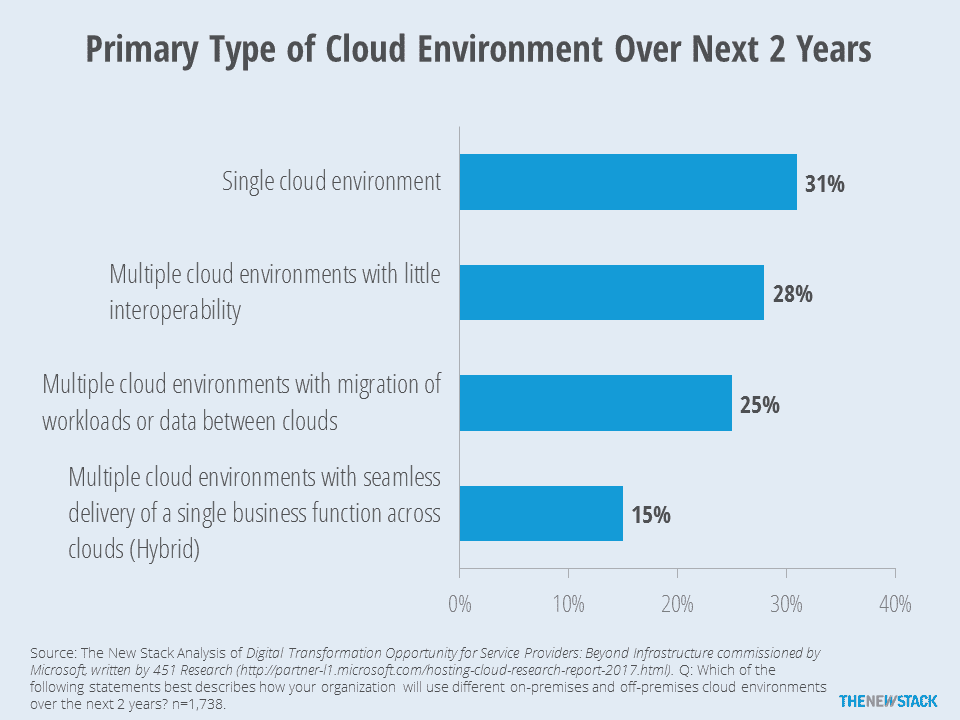
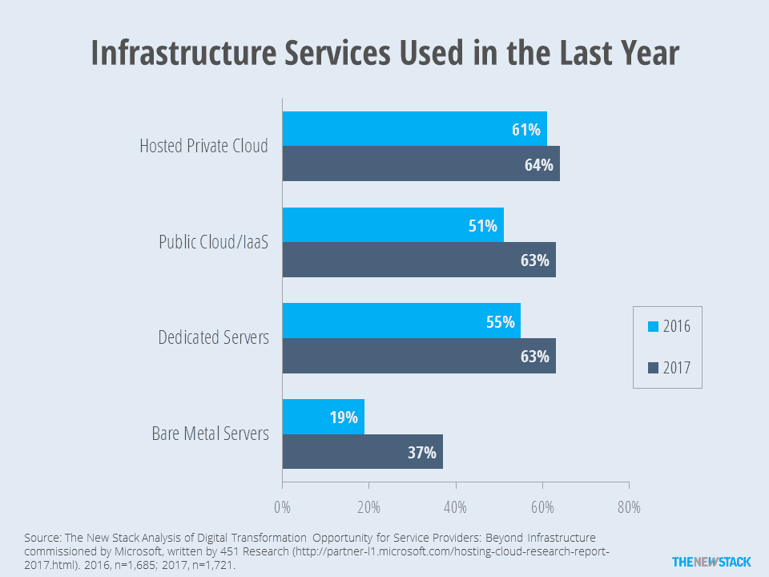
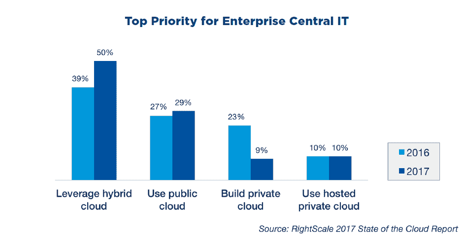

# 奇偶校验:宣布私有云死亡为时尚早

> 原文：<https://thenewstack.io/parity-check-announcements-private-clouds-death-premature/>

私有云没有死，混合云是一个容易混淆的名词，多云是真实存在的。

在 2016 年下半年，我们看到几项调查(例如，来自 RightScale 和 [InteropITX](http://reg.interop.com/inlv17-stateofcloud) )表明“混合”和公共云的采用正在以“私有云”为代价取得进展事实证明，企业仍在私有云中运行工作负载，并将继续这样做。然而，私有云将受到影响，因为许多公司没有计划进行重大的新资本投资来支持内部基础架构。

市场对“混合云”定义的困惑掩盖了云采用的动态。大多数有远见的观察者区分了多云和混合云。使用私有云和公共云是多云，因为企业同时使用多个云。我们喜欢[卡尔·雷曼](https://www.linkedin.com/in/carllehmann/)和 [451 Research](https://451research.com/) 对混合云的定义，它指的是单一业务功能跨多个云交付的情况。因此，当 RightScale 报告 67%的人使用混合云时，这应该被称为多云，因为它是基于同时回答他们“使用公共云”和“使用私有云”的受访者

在其他研究中，我们认为对“混合云”的偏好实际上是指允许云爆发或将应用程序迁移到不同的云以节省资金的多云架构。

只有 15%的云用户实际上会使用“混合”，即使用多个云来交付特定的业务功能。

451 Research 和微软在 2017 年初进行的一项调查表明，只有 15%的人预计主要使用这种更强大的混合云定义。另有 53%的人计划使用多种云。然而，在这一群体中，超过一半的人甚至不希望能够在其云之间迁移工作负载。

我们还注意到，一些显示“私有云”大幅下降的研究涉及未来云发展的偏好，而不是当前管理的工作负载的实际百分比。451 Research 和微软实际上已经提供了一个公开可用报告的金矿，这些报告基于过去几年的大型全球(超过 1，700 名受访者)样本。

使用他们的数据，我们发现托管私有云的采用率实际上从 2016 年的 61%增加到了 2017 年的 64%。当然，IaaS 的使用率增长更快，从 51%增长到 63%。

专用服务器和裸机服务器的采用都有很大的提高。受访者还被问及他们对基本虚拟主机的使用情况，这并没有太大的变化。在这种情况下，裸机是一种直接在硬件上运行的专用服务器。一般来说，它们更难配置，但更容易快速配置。

前面提到的 InteropITX 报告发现，从 2014 年到 2016 年，私有云的采用率有所下降。但是，这是基于一个将虚拟化与私有云混为一谈的问题。在这份报告中， [Joe Emison](https://twitter.com/JoeEmison) 指出，“2016 年似乎标志着 IT 专业人员可以将一组虚拟机描述为“在做云”的最后一个时间点。这可能有些夸张。相反，我们看到了一种趋势，即内部数据中心被描述为混合云的私有组件。

警告:RightScale 的样本过度代表了公共云用户。他们对“混合云”的定义已经过时。

大多数组织已经开始将其基础架构整合到虚拟化环境和私有云。因此，在 2017 年 RightScale 调查中，自 2016 年调查以来，专注于构建(新)私有云的企业 IT 受访者比例从 23%降至 9%，而将私有云与公共云结合使用的受访者比例从 39%升至 50%。

## 分析

*   在短期内，我们看到对基于硬件或软件的超融合基础设施的需求受到限制，这些基础设施可以构建托管在企业数据中心的下一代私有云。虽然向公共云的迁移将会继续，但工作负载向公共云的迁移是一个缓慢的过程，一些应用程序实际上会移回内部数据中心。
*   现在，在持续集成和部署系统中使用容器使得做出迁移工作负载的决策变得更加容易。应用程序的可移植性支持采用多种云，通常使用“提升并转移”的方法。然而，技术集成问题，包括持久存储和安全性，抑制了许多应用程序的迁移。
*   真正的混合云意味着跨多个云交付单一业务功能。在这些情况下，基础设施服务运行在不同的云上，需要集成。混合云对基础设施服务互操作性的需求是 Kubernetes 集群联盟特别兴趣小组获得关注的原因之一。这一点，加上推广 Cloud Foundry 的[开放服务代理 API](https://www.openservicebrokerapi.org/) 的努力，意味着应用程序的组件不太可能阻止或减缓工作负载的迁移。

Cloud Foundry 是新堆栈的赞助商。

经由 PublicDomainPictures.net 的特征图像。

<svg xmlns:xlink="http://www.w3.org/1999/xlink" viewBox="0 0 68 31" version="1.1"><title>Group</title> <desc>Created with Sketch.</desc></svg>