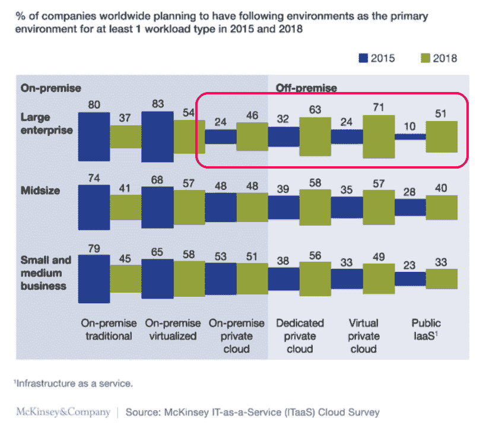

# 奇偶校验:当心公共云潮流

> 原文：<https://thenewstack.io/parity-check-beware-public-cloud-bandwagon/>

与一些其他出版物不同，我们并没有将麦肯锡最近发布的 *[ITaaS 云调查](http://www.mckinsey.com/industries/high-tech/our-insights/IT-as-a-service-From-build-to-consume)* 结果解读为对公共云的大力支持。不，数据根本没有显示这一点。相反，数据显示，大型企业一直在追赶。

为了确定一家公司的云迁移进展如何，麦肯锡询问了 800 多名首席信息官和高级 IT 管理人员，是否至少有一个企业工作负载主要在特定的云层面上运行。对于大型企业来说，2015 年只有 24%的企业使用虚拟私有云，但这一比例在 2018 年飙升至 71%。公共云也是如此，大型企业的使用率从 2015 年的 10%上升到 2018 年的 51%。

从 24 岁到 71 岁和从 10 岁到 51 岁的巨大跳跃，并不表明数字化转型正在进行。相反，这意味着这些大企业正在赶上小公司已经达到的技术和经济现实。
****

企业可能有数百甚至数千个工作负载。然而，仅仅因为一家公司主要在公共云中运行一种类型的工作负载，并不一定会迁移其他类型的工作负载。Judith Hurwitz、Marcia Kaufman、Fern Halper、Daniel Kirsch *合著的《混合云中的工作负载类型一书是关于这个主题的一个很好的信息来源。*

记住，2018 年还有一年半。虽然麦肯锡调查的参与者预计他们的一些工作负载将迁移到公共云，但这是否真的会发生仍有待确定。

那么这对前沿开发者来说意味着什么呢？这家初创公司专注于无服务器基础设施？这是对现实的检验。你的市场正在飞速发展。传统市场正在萎缩。然而，企业 IT 是恐龙和冰川。在接下来的一两年里，迈出你的第一步，但是不要期望马上就能卖出去。

通过 Wikimedia Commons[获得的专题图片](https://commons.wikimedia.org/wiki/File:Rex_Napoleon_2011_Bandwagon_1.JPG)

<svg xmlns:xlink="http://www.w3.org/1999/xlink" viewBox="0 0 68 31" version="1.1"><title>Group</title> <desc>Created with Sketch.</desc></svg>