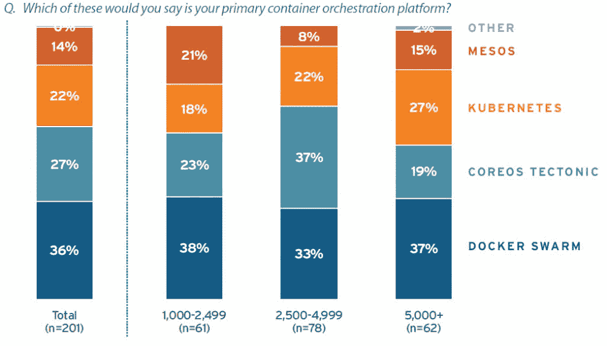

# 奇偶校验:研究表明容器编排上升

> 原文：<https://thenewstack.io/parity-check-bright-grey-container-prediction/>

代表 [CoreOS](https://coreos.com/) 进行的 [451 Research](https://451research.com/) 最近的一篇研究论文指出，像 [Kubernetes](/category/kubernetes/) 和 Docker Swarm 这样的容器编排工具已经开始像容器本身一样部署在生产中。

虽然该报告的顶级结论与其他行业调查一致，但深入挖掘数据会引发新的问题，这是常有的事。容器的未来依然光明，尽管容器编排和混合云的具体方向更像是一个大杂烩。

本周在旧金山举行的 CoreOS Fest 用户大会上，CoreOS [公布了调查结果](https://coreos.com/blog/coreos-brings-freedom-to-cloud)。

与许多供应商发布的白皮书相比，我们真正重视这份报告对原始研究的依赖。该研究主要基于 2017 年春季对 201 名 IT 决策者的调查，这些决策者表示他们的企业使用容器。在这一群体中，52%的人在生产中使用容器。非常重要的是，CoreOS/451 报告确实准确地描述了实际的容器采用水平，即使它与 451 自己的 2017 年"[企业之声](https://451research.com/services/customer-insight/voice-of-the-enterprise)"对 300 名企业级受访者的调查形成对比。今年早些时候发布的调查发现，只有 27%的人在生产中使用容器——几乎是这篇新论文中看到的水平的一半。

> TNS 刚刚完成了一项针对 Kubernetes 的新调查。结果即将公布。

但是 52%的容器采用数字接近 2016 年春季新堆栈的[容器协调调查](https://thenewstack.io/tns-research-present-state-container-orchestration/)中的 56%采用率。的确，这两项调查都存在基于参与者自我选择的偏见，New Stack (TNS)受访者更有可能是早期采用者，451 名受访者倾向于高管。

也就是说，有趣的是，451 名受访者中有 79%的人在使用容器编排软件。大约 52%用于生产，17%用于试验或用于测试/开发。

再读一遍。我们在这里等。

按公司规模划分的主要容器编排平台(来源:451 Research)

这些显著的数字表明，生产容器的使用几乎与生产容器编排的使用相同。这并不意味着在生产中使用容器的每个人都在使用容器编排软件，*但最有可能的是*。

对于容器编排的高级别，有三种可能的解释:

1.  容器和容器编排正成为同义词，尤其是在没有技术实践经验的高级 IT 主管中。
2.  也许大多数容器用户实际上也使用容器编排。在我们即将公布的调查中，45%的受访者使用了 Swarm 或 Kubernetes 等编排平台，另有 12%的受访者使用了容器即服务产品。
3.  即使有人说他们将一项技术用于生产应用程序，也不意味着这是他们的主要方法。事实上，许多用户继续同时使用配置管理、PaaS 和手动部署方法。

人们不仅可能将容器编排器与其他工具结合使用，还可能测试多种类型的容器编排软件。

这项调查并没有提供更多关于采用哪些容器编排工具的信息。尽管它发现几乎 75%的人在使用 Kubernetes，但这些人中的许多人也在使用 Mesos、Swarm 和其他工具。此外，75%的人说他们使用 Kubernetes，这意味着基本上每个使用容器编排工具的人都安装了 Kubernetes。

Kubernetes 由谷歌创建，是一个由[云本地计算基金会](https://www.cncf.io/)管理的开源容器编制器。

虽然我们知道 Kubernetes 是最受欢迎的工具，但这个数字太高了。当被问及他们的主要编排平台是什么时，Docker Swarm 比 Kubernetes 更常被提及(36%比 22%)。

更令人困惑的是，CoreOS structural——Kubernetes 的商业发行版——被 27%的人引用。如果我们将 CoreOS 的数据与 Kubernetes 的其他回答相加，则等于 57 %,这反映了去年进行的其他调查中看到的偏好水平。

这是否意味着 CoreOS 控制了 Kubernetes 市场的半壁江山？大概不会。我们不得不问，但也许该公司为调查向 451 提供了其客户名单。其他基于 Kubernetes 的平台，像红帽的 [OpenShift](https://www.openshift.com/) 没有被问到。*(编者注:[451 的 Jay Lyman](https://twitter.com/ripcitylyman) 确认调查样本来自一个独立团体，丝毫没有受到 CoreOS 的影响。)*

云本地计算基金会(Cloud Native Computing Foundation)和 T2 的 CoreOS 和 T4 的 Red Hat 都是新堆栈的赞助商。

亚历克斯·威廉姆斯拍摄于 CoreOS Fest 的特写图片。

<svg xmlns:xlink="http://www.w3.org/1999/xlink" viewBox="0 0 68 31" version="1.1"><title>Group</title> <desc>Created with Sketch.</desc></svg>