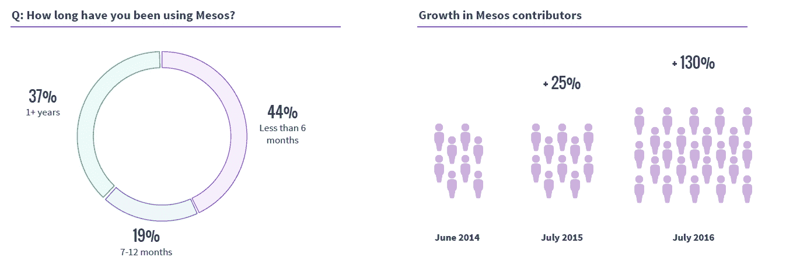
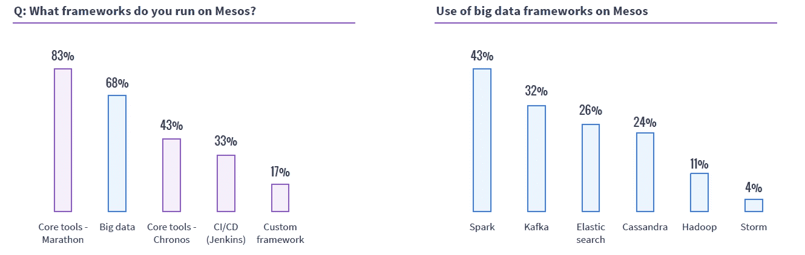
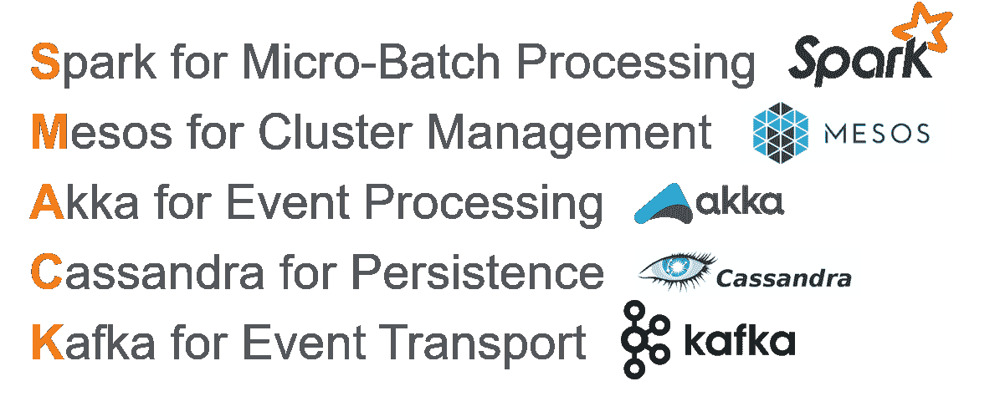
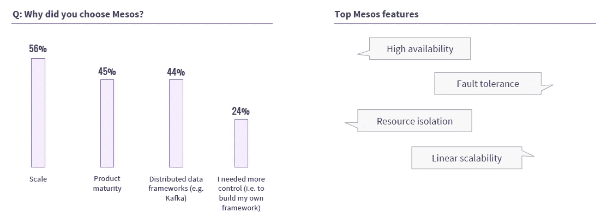

# 奇偶校验:我们需要 Mesos 提供的所有可伸缩性吗？

> 原文：<https://thenewstack.io/parity-check-buzz-swarm-spark-mesosmarathon-users-context/>

规模的重要性可能被高估了，因为当前的容器部署仍然相对较小。

不可否认的是，随着 meetup 活动的增加，许多供应商都在计划基于它的解决方案。Docker 的原生 [Swarmkit](https://github.com/docker/swarmkit) 继续吸引着大批对简单使用容器感兴趣的人。在其他容器编排方法中，处理规模的能力是 Mesos 和 Marathon 结合的名片。

Apache Mesos 的创建者创建了 Mesosphere，接着又创建了 [DC/OS](https://dcos.io/) ，自去年 4 月以来，已经有了企业版和开源版。DC/OS 正在向 Mesos 社区推销容器管理，与大规模部署相比，Mesos 社区更经常将它与大数据框架结合使用。

我们上次写这些工具的相对采用水平是在 7 月的[。最近几天，OpenStack Foundation 发布了一项用户调查](https://thenewstack.io/parity-check-container-reality-check/)[表明 Kubernetes 是社区中的首选，许多电信公司和服务提供商都在使用它。上周，Mesosphere 发布了一份关于另一个社区的报告，是关于 Apache Mesos 用户的。](https://www.openstack.org/user-survey/survey-2016/landing?BackURL=/user-survey/survey-2016/)

当只看容器管理产品的采用时，该研究的偏见是不可否认的。这份报告显示，38%的受访者正在更广泛的部署中使用或试用中间层支持的[DC/操作系统](https://dcos.io/)，相比之下，Kubernetes 和 Docker Swarm 的这一比例分别为 19%和 15%。许多受访者正在同时使用或考虑多种容器编排工具。最大的*慎之又慎*是，除了通过 Apache 的 Mesos 邮件列表征求 Apache Mesos 贡献者的回复之外，调查还发送给了 Mesosphere 的所有客户和潜在客户列表。

我们相信仍然有有价值的见解可以发现，因为该公司的许多前景是确定的，因为他们已经使用 Mesos。

在过去两年中，Mesos 贡献者增加了一倍多，但很难确定是什么推动了这一增长。这可能是因为开发人员正蜂拥至其编排容器的能力，或者可能是大数据开发人员的原因。另一个假设是，DC/操作系统本身的使用正在推动社区参与。在接受调查的人中，63%的人使用 Mesos 不到一年。在那些使用它不到六个月的人中，89%是通过 DC/操作系统接触到它的。

Mesos 贡献者正在增加。许多调查参与者都是通过 DC/OS 而不是 Apache 项目接触到 Mesos 的。

在接受调查的 Mesos 用户中，62%在生产中使用容器。我们不知道其中有多少人使用了容器，然后决定使用 DC 操作系统。然而，我们确实知道容器的使用水平比在更广泛的 IT 人群中看到的要高得多。包括那些没有生产用途的，85%在 Mesos 上运行“容器-微服务架构”工作负载。

Spark 等流行的大数据框架正在 Mesos 之上部署。Spark 是 Mesos 项目的副产品。

来源:Tamás Ujj 在大数据宇宙的演讲。

受访者平均在 Mesos 上运行三个或更多的框架。最常见的是马拉松，有 83%的人参加。难怪 DC/操作系统[现在包含了内置的调度功能](https://thenewstack.io/mesospheres-data-center-operating-system-now-includes-scheduler-orchestrator/)。68%的受访者将部署数据服务的框架部署在 Mesos 之上。在这些大数据框架中，Spark 是最常部署的，其次是 Kafka、Elasticsearch 和 Cassandra。

许多人一起使用多种数据框架，这支持了一种新的 SMACK 栈正在流行的假设。Mesos 支持多种框架，包括 Kubernetes，这为选择容器管理平台提供了灵活性。当然，当使用 DC 操作系统部署时，可能会引入更多的“观点”。仅从容器编排引擎来看，一位牧场主[的博客帖子](http://rancher.com/comparing-rancher-orchestration-engine-options/)声称，与 Kubernetes 相比，使用 Mesos 更容易部署非容器化的应用程序。

Mesos 最大的卖点是经过规模化测试。事实上，56%的受访者认为规模是选择 Mesos 的首要原因。然而，重要的是要认识到，许多用户实际上并不需要这样的规模。事实上，在使用 Mesos 超过六个月的受访者中，只有四分之一的人在一个集群中运行超过 100 台机器，只有 4%的人运行超过 1000 台机器。虽然较大的公司和使用 Mesos 时间较长的公司的集群规模较大，但这一统计数据令人担忧。一些 Kubernetes 的拥护者说，大多数公司不需要 Twitter 那样的规模。如果他们是对的，那么 DC 操作系统就失去了一个优势。

75%的人认为高可用性是 Mesos 的顶级特性之一，63%的人认为 Mesos 具有 63%的容错能力。

## 未来研究的问题

*   人们想使用多容器编排系统吗？他们会同时使用 Mesos 和 Kubernetes 吗？
*   Mesosphere 能够将 Mesos 用户转化为 DC/OS 客户吗？
*   对大数据用例的大量接触是否为 Mesos 以及随之而来的 Mesosphere 提供了优势？

Docker 和 [Mesosphere](https://d2iq.com/) 是新堆栈的赞助商。

特征图像:Apache 软件基金会

<svg xmlns:xlink="http://www.w3.org/1999/xlink" viewBox="0 0 68 31" version="1.1"><title>Group</title> <desc>Created with Sketch.</desc></svg>