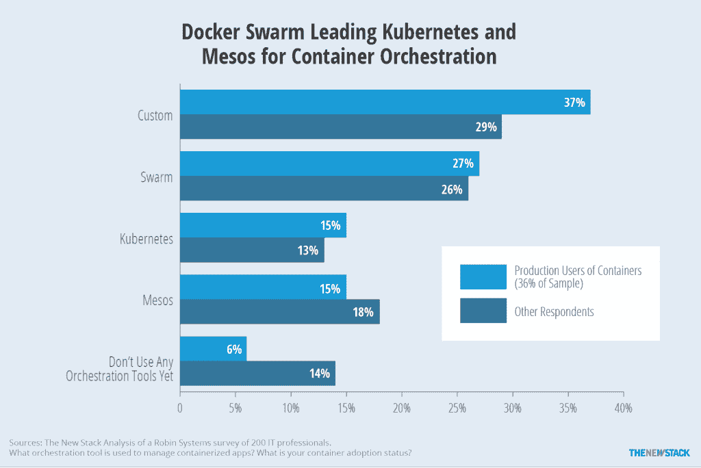
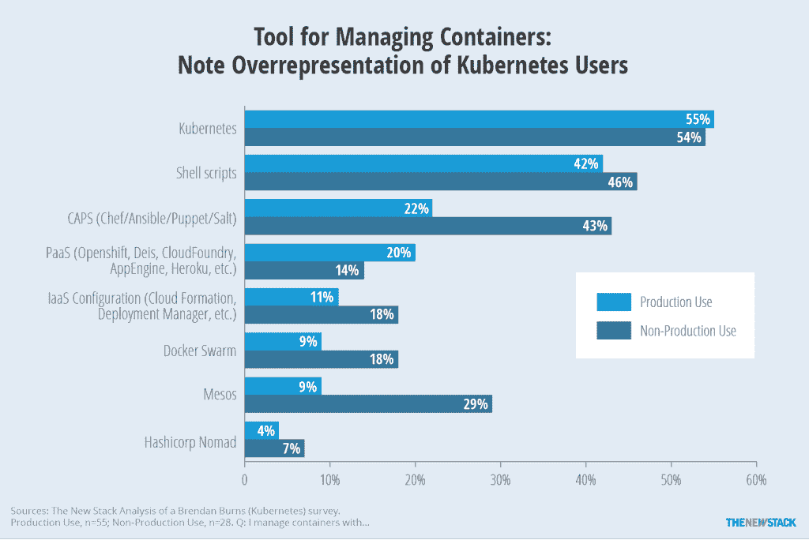
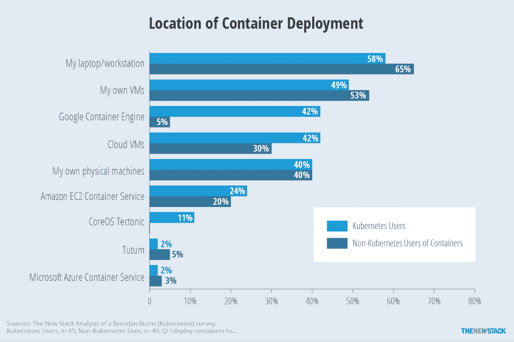

# 奇偶校验:容器编排实际上意味着什么？

> 原文：<https://thenewstack.io/parity-check-container-orchestration-mean/>

你知道什么是容器编排吗？我已经阅读了几天，似乎没有人口普查的定义。然而，在那些实际使用或评估容器技术的人中，编排变得非常重要。尽管已经有很多关于编排工具如 Docker Swarm 和 Kubernetes 的文章，但是真正的最终用户对它们的采用却知之甚少。我们所知道的是，在缺乏成熟市场的情况下，自制、定制的解决方案最常被用于管理容器。

Ruxit 的调查结果显示，技术成熟度、协调和监控是集装箱化基础设施的主要障碍。在标准方面的努力会有所帮助，但对产品能够或应该提供什么的困惑正在制造混乱。正如我们之前在中所写的[，大量的 IT 专家在过去一年中评估了容器，来自 New Relic 和 Datadog 等公司的](https://thenewstack.io/parity-check-no-one-really-grasped-uses-docker-containers/)[监控工具](https://thenewstack.io/popular-docker-depends-ask/)提供了关于容器使用增加并进入生产的具体例子。

在实验室或有限的基础上使用容器已经证明了它们是有益的。容器的早期采用者开始在容器上运行生产工作负载。现在，企业正面临着新的挑战，将容器集成到他们的软件开发生命周期(SLDC)中，并管理容器化应用程序使用的底层基础设施。因此，毫不奇怪，对最近的 SDxCentral 作出回应的观众比任何其他与容器相关的功能更经常地提到对编排的需求。

不幸的是，对于一个编排产品的作用，人们几乎没有一致的看法。是否仅限于服务发现、集群管理和配置管理？Kubernetes，Docker Swarm 和 Mesos 有可比性吗？PaaS 产品(如 OpenShift、Deis、CloudFoundry)或配置管理工具(如 Chef、Ansible 和 Puppet)适合哪里？在行业努力回答这些问题之前，解释市场份额将是困难的。

> 面对如此多的问题，新堆栈创建了一个简短的[调查](https://www.surveymonkey.com/r/tns2016-b)来获得您的答案。它是匿名的，结果将公开，所以[现在就参与](https://www.surveymonkey.com/r/tns2016-b)。

在生产中编排容器时，用户更有可能使用定制的工具，而不是独立的工具。

Robin Systems 的一项调查狭义地定义了编排工具，受访者只能提供他们正在使用或计划使用的一种工具的名称。在容器的实际生产用户中，37%的人说他们使用定制的解决方案来管理容器。在这些情况下，很可能使用外壳脚本和定制代码来集成功能。Docker Swarm 被 27%的生产用户使用，而 Kubernetes 被 15%的用户使用。

ClusterHQ 报告称，一半的受访者正在使用或计划使用 Docker Swarm，这一比例可能很高，因为该调查是在产品发布后不久进行的。然而，该研究确实将 Swarm、Kubernetes 和 Mesos 列为前三名，Ansible、Puppet、Chef 和 Cloud Foundry 都获得了令人尊敬的引用水平。Ruxit 调查也公布了类似的结果。

就我们所知，上述研究中的答案选择相当有限。Kubernetes/Google 的 Brendan Burns 回答了一个更好的调查问题。他已经开始对集装箱用户进行每月一次的在线调查。我们对[的结果](http://blog.kubernetes.io/2016/02/state-of-container-world-january-2016.html)有所保留，因为尽管调查对任何人开放，但它是由 Kubernetes 的创始人通过他的个人网络发布的。在 119 名受访者中，结果偏向生产用户(50%)，其中 55%的人使用 Kubernetes 管理容器。然而，即使有这种偏见，调查结果表明在使用或考虑的编排产品的广泛多样性。

shell 脚本的使用表明了高水平的自主解决方案。

在 Kubernetes 之外，我们发现 42%的生产受访者正在使用 shell 脚本来管理容器，这与 Robins Systems 调查中看到的大部分“自定义”响应相匹配。然而，虽然 43%的非生产用例使用配置管理(Chef/Ansible/Puppet/Salt)工具来管理容器，但是一旦它们进入生产环境，使用配置管理工具的可能性几乎只有一半。这表明，即使有了 Docker 的支持，许多人发现他们现有的配置管理工具是不够的。

Docker Swarm 和 Mesos 的生产和非生产使用水平之间的下降也很明显。然而，由于这项调查是由 Docker 的“竞争对手”进行的，因此与引用的其他调查相比，不要过多解读其在 Kubernetes 和 Mesos 之下的排名下降，这一点很重要。深入研究这些数字，我们注意到不使用 Kubernetes 的人群中使用群体的比例更高。此外，使用 Mesos 管理容器的 14 人中有 10 人也使用 Kubernetes。

或许 Brendan 的调查最有价值的用途是比较 Kubernetes 用户和其他用户。毫不奇怪，调查中 42%的 Kubernetes 用户使用谷歌的容器引擎，而其他人只有 5%。然而，甚至有 24%的 Kubernetes 用户将容器部署到其 EC2 容器服务中，这表明了 AWS 的实力。许多部署到笔记本电脑或工作站的人在部署到虚拟机的同时也在这样做。最后，[二月](https://docs.google.com/forms/d/13yxxBqb5igUhwrrnDExLzZPjREiCnSs-AH-y4SSZ-5c/viewform)更新版的调查包含了更多的容器部署选择和变化。

虽然受调查分布方式的影响，Kubernetes 和 Google 容器引擎部署之间的关系是重要的。

Docker 和 New Relic 是新堆栈的赞助商。

特色图片:via [Flickr](https://www.flickr.com/photos/usarmyband/4282105680/in/photolist-7woUQh-5TxKzo-bvtUkj-zNbadY-7woVhC-7wk77g-7woVmW-7woV6u-7woUVL-7woVcb-dThzfq-aWZ5ue-aWYWma-aWYUFe-44LXRP-3brKoy-8FXWuT-aWYxtZ-aWYA8M-aWYyU2-aWYD7X-aWYEvv-aWYBk8-6BJuez-eQ5rW1-eQ5jxN-ysLi1W-qSBYah-xrtFfw-4WLobp-eQ5kSQ-7k6Kmu-4ovnvU-bGW2Pv-5VWp8M-bu2exj-nGapzX-bu2eqh-HWjDm-brEvAc-aQE9tx-4ABYyq-4tqFJj-eQ5q4m-eQ5nNq-xJLf32-cmzAfQ-6LQzGb-cmzz7w-5XfhRh) ，美国陆军合唱团和管弦乐队，指挥是杜安·沃尔夫，男高音是戴维·丹尼尔斯。图片来源:SSG·克里斯·布拉纳根

<svg xmlns:xlink="http://www.w3.org/1999/xlink" viewBox="0 0 68 31" version="1.1"><title>Group</title> <desc>Created with Sketch.</desc></svg>