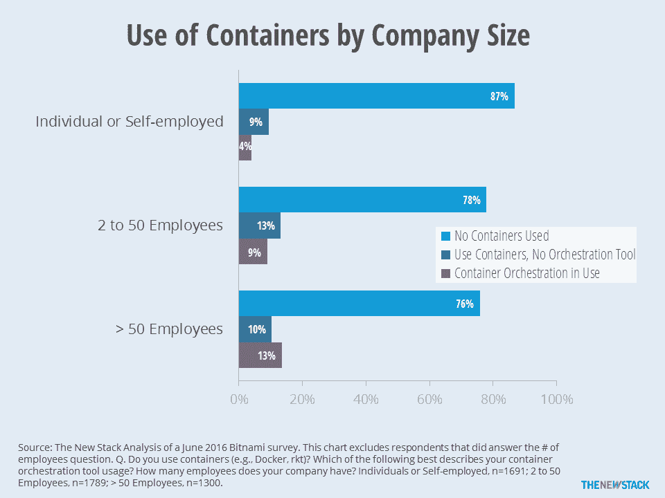
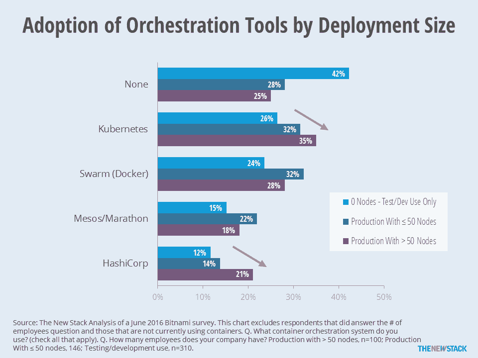
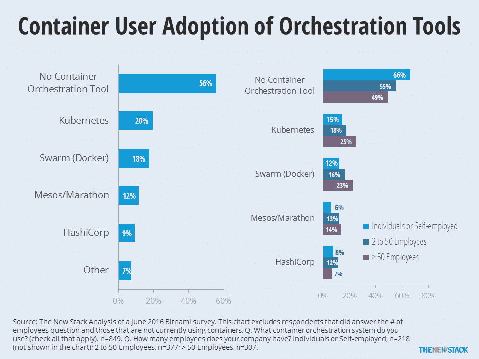
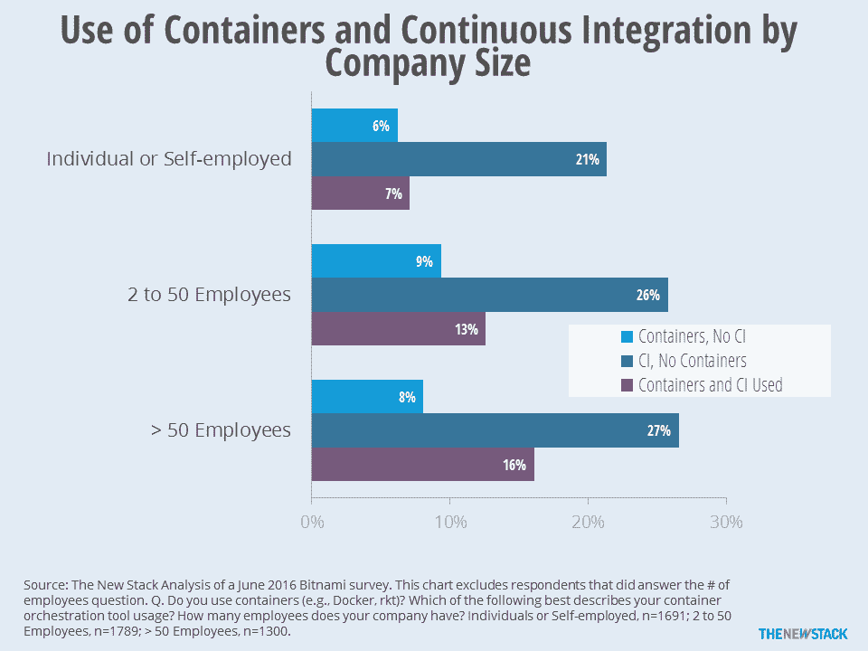

# 奇偶校验:容器的采用停滞了吗？

> 原文：<https://thenewstack.io/parity-check-container-reality-check/>

我正忙着通过显微镜观察，分析哪些生产容器用户、他们的编排工具以及他们的部署规模。兴奋之余，我意识到容器的采用可能已经停滞了。

2016 年 2 月，我们[在几项调查中报告了](https://thenewstack.io/parity-check-no-one-really-grasped-uses-docker-containers/)，显示集装箱的采用有所增加，我们推测生产使用将会增加。这仍然是正确的，但似乎许多组织正处于停滞状态，等待采用容器，看看第一波生产容器的使用效果如何。

如果“后来的大多数”只需要听到基于生产使用的好评，那么使用容器的公司的百分比可能会很快增加。事实上，我们认为集成到现代开发/部署管道中的大规模部署的数量正在接近那个临界点，但还没有达到。

Bitnami 调查显示，24%的大型企业已经采用了集装箱。在使用容器的公司中，大约一半使用编排工具。

但只看企业 IT 专业人员小组的调查(与包括自雇顾问在内的自选样本相反)，使用水平在过去六到九个月几乎没有变化。

在 2015 年第三季度，451 项研究报告了 22%使用容器，另外 10%进行试验项目。相比之下，上个月的云铸造[调查](https://www.cloudfoundry.org/learn/2016-container-report/)显示，超过 100 名员工的公司中有 22%使用容器。

> “行动”不是大量吸收新的容器用户，而是将小的实现转换成大的实现。

所以，即使我们把所有试验项目排除在比较之外，那也是停滞。进入我们最近从 [Bitnami](https://bitnami.com/) 评估的新调查，它被发送到公司的邮件列表。只要看看 1300 名来自员工超过 50 人的公司的受访者，我们就发现使用率高达 24%。本文的其余部分提供了 Bitnami 研究的更多见解。

“行动”不是大量吸收新的容器用户，而是将小的实现转换成大的实现。随着生产中管理容器的节点或机器数量的增加，对容器编排工具的需求也在增加。下图表明，即使在容器的生产用户中，也有超过四分之一的人依赖手动方式来管理容器。随着部署规模的扩大，Kubernetes 和 HashiCorp 是使用量增长最快的工具。

Kubernetes 在大型企业以及有许多运行容器的机器的部署中表现良好。事实上，随着公司规模的增加，他们使用编排工具的可能性也在增加。也就是说，到目前为止，超过 50 名员工的企业中有 49%的受访者表示他们使用容器，但不使用编排工具。

较大的公司更可能使用 Kubernetes、Docker 和 Mesos/Marathon 进行编排。

部署规模和公司规模只是等式的一部分。大型企业有其独特的需求。 [Vipin Chamakkala](https://twitter.com/v1p1n) 在他的 Workbench 博客中很好地描述了这些需求。虽然本文中的图表支持他的分析，但我认为他没有包括非 Kubernetes 的竞争产品，这是对他们的伤害。

拥有多人开发团队的企业也更有可能使用持续集成系统。50 多名员工的公司中只有 8%同时使用容器和持续集成(CI)。从更长远的角度来看，只有 4%的受访者说他们的公司同时使用容器和任何一种 CI 系统。

在更多的公司携手使用这些技术之前，我们不希望 [DevOps](/category/devops/) 和[微服务](/category/microservices/)趋势的全部好处得以实现。在此之前，我们将继续关注容器部署的规模以及如何管理它们。

使用 CI 的公司为将容器投入生产做了更好的准备。

我们将在未来几周内写更多关于 Bitnami 调查和 CI 数据的内容。同时，请阅读 Fintan Ryan 对[调查](http://redmonk.com/fryan/2016/06/21/container-trends-plans-orchestration-and-ci-a-dataset-from-bitnami/)的分析，以及他对使用新遗迹数据的容器采用的看法。此外，我们期待看到 Datadog 继续根据公司的主机数量对容器采用情况进行分析。

[Bitnami](https://bitnami.com/) 、 [Cloud Foundry](https://www.cloudfoundry.org/) 和 [New Relic](https://newrelic.com/) 是新栈的赞助商。

来自 Pixabay 的特征图像。

<svg xmlns:xlink="http://www.w3.org/1999/xlink" viewBox="0 0 68 31" version="1.1"><title>Group</title> <desc>Created with Sketch.</desc></svg>