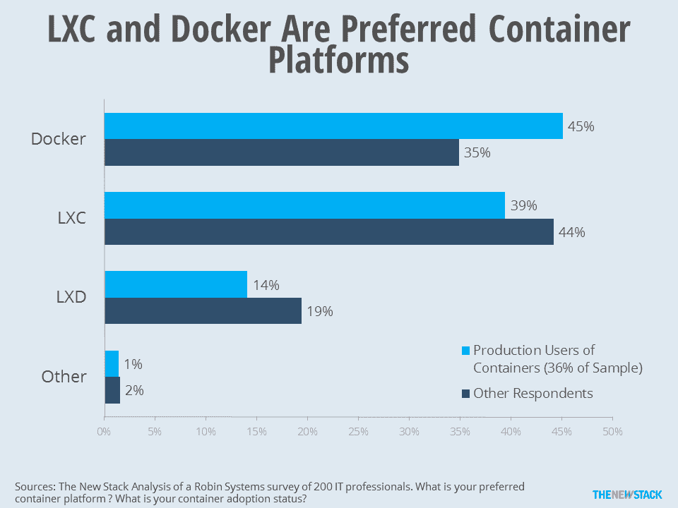

# 奇偶校验:码头工人的优势受到其他集装箱的挑战

> 原文：<https://thenewstack.io/parity-check-docker-dominance-challenged-containers/>

一年前，Docker 在很多人心目中等同于“容器”。然而，最近的新调查表明，随着更多用户选择 LXC，更多种类的容器正在被部署。

在去年 6 月公布的一项总部和 DevOps.com 调查中，当被问及他们使用或计划使用哪种类型的集装箱时，92%的人说是“Docker”，而 32%的人说是 T2 LXC，21%的人提到了 CoreOS 的 rkt。虽然同样在去年发布的来自 [Ruxit](https://ruxit.com/docker/#dockerreport_exec-summary) 的调查结果显示，Docker 的支持率有所下降(Docker 的支持率为 78%，LXC 为 24%，rkt 为 16%)，但整体趋势也显示了 Docker 的优势。

快进到 12 月，罗宾系统公司最近的一项调查似乎与其他调查相矛盾。它表示，LXC 是 43%的 It 专业人士首选的容器平台，39%的人表示他们更喜欢 Docker，18%的人选择 LXD。

调查之间的差异提出了一个问题，为什么？

“偏好”、“使用”和“计划使用”之间的区别是显著的。当与刚开始使用一项技术的人交谈时，他们可能会基于品牌认知度而不是技术优势来提供答案。由于 Ruxit 和 ClusterHQ 调查是在 Docker 炒作的高峰期进行的，很可能许多人计划部分评估 Docker，因为这是他们唯一知道的技术名称。

在未来，我们将有兴趣知道在生产中实际使用 Docker、LXC 和其他软件的百分比是多少。

在集装箱的实际用户中，45%的人喜欢 Docker，39%的人喜欢 LXC。

虽然他们问的是偏好而不是用途，但我们使用 Robin Systems 调查来关注容器的生产用户，发现 45%的人更喜欢 Docker，超过了 39%的人认为 LXC 是首选平台。与包含计划使用的数字相比，这意味着实际使用容器的人越多，他们就越有可能说 Docker 是他们的首选格式。

仍然值得注意的是， [LXC 和它的下一代 LXD 姐妹](https://linuxcontainers.org/)将是 61%的 It 专业人士的首选容器平台。如果公司没有被锁定使用 Docker 的核心技术，那么他们可能使用另一种技术是合理的。因此，计划用途和首选集装箱平台之间的差距表明有机会挑战 Docker 的先发优势。

此外，由于其他供应商提供非 Docker 解决方案，用户可能会在容器提供商之间进行选择。在这个世界中，LXC 和 Docker 的比较优势将会在供应商社区中被讨论，并且他们的客户将会听到争论。因此，尽管 CoreOS 可能致力于支持 runC 的格式，但它也提供 rkt 容器，这是有道理的。

Docker 是新堆栈的赞助商。

通过 Pixabay 的特征图像。

<svg xmlns:xlink="http://www.w3.org/1999/xlink" viewBox="0 0 68 31" version="1.1"><title>Group</title> <desc>Created with Sketch.</desc></svg>