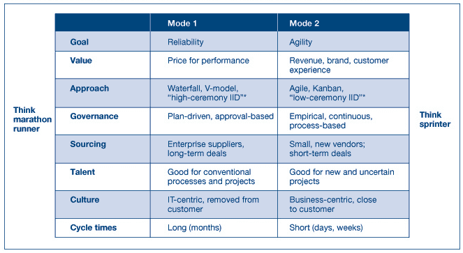
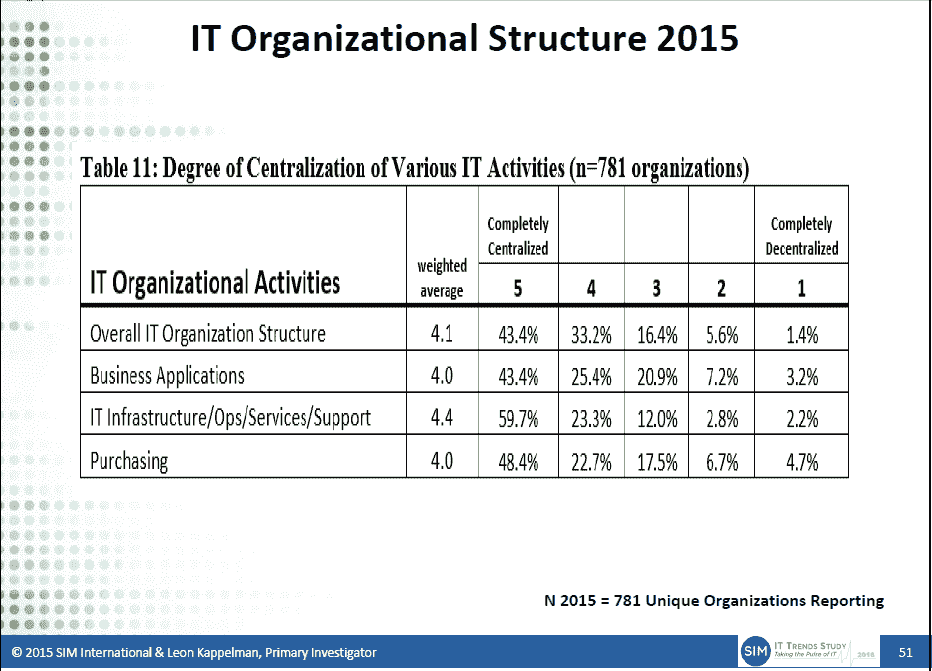

# 奇偶校验:不要害怕你的影子，还没有

> 原文：<https://thenewstack.io/parity-check-dont-afraid-shadow-yet/>

阴影不再生长。业务部门对 IT 支出的控制不是大问题，至少目前不是。

这些都是有争议的说法，但 Gartner 2016 年 CIO 议程调查报告称，83%的 IT 支出由企业的 IT 组织控制，高于 2015 年的 79%和 2012 年的 62%。

如果影子 it 支出正在下降，为什么 Gartner 分析师 [Kurt Potter](http://www.gartner.com/analyst/8390) 在他的 *[CIO 对业务部门 IT 战略](http://www.gartner.com//it/content/3221500/3221518/march_cio_naratives_for_business_kpotter.pdf)* 的陈述中说应该增加？他的答案是，业务线支出(lob)理应推动数字化转型。然而，这整个论点在一定程度上与 Gartner 的双峰 IT 愿景相矛盾，该愿景将双支出模式描述为刺激技术创新的一种方式。

## **影子 IT 支出在下降吗？**

影子 it 有许多不同的名称，但它通常描述 IT 部门不参与的业务部门在技术上的支出。流氓 IT 可能是一个更好的术语，因为它特指未经授权的支出。如果一个业务部门的预算支付一台计算机，但 it 部门支持它，那么它不是影子支出。在营销技术上的支出正在飙升，但这并不意味着首席信息官们没有参与这些采购。

> 到 2020 年，有数字化业务愿望的大型企业的所有 IT 支出的一半将发生在业务部门级别。

Gartner 的数据基于一项调查，并不反映 IT 支出的真实记录。来自 IT 财务部门或像 [Apptio](http://www.apptio.com) 这样的软件的真实支出数字会提供更准确的结果，但很少公开。几年前，咨询公司 [CEB](https://www.gartner.com/smarterwithgartner/) 使用自下而上的预算分析表明，虽然首席信息官们认为他们控制了 80%的 IT 支出，但实际上，这一数字接近 60%。去年，思科发现了类似的差距。他们调查的首席信息官估计他们的组织中有 51 个云服务在运行，但思科的网络流量分析显示这个数字是 730。

IDC 的全球半年度 IT 支出指南:业务线着眼于 1)由 IT 部门资助的项目和 2)由 IT 部门以外的技术购买者资助的项目。由于他们的大部分研究都是收费的，我们无法判断支出是否有所下降。然而，他们确实报告了 2015 年由业务线控制的企业 IT 支出的百分比取决于公司的位置:

*   美国和加拿大:**58.2%**
*   欧洲、中东和非洲(EMEA):**38.1%**
*   亚太地区:**29.3%**
*   拉丁美洲:**25.5%**

首席信息官有可能获得了对企业 It 支出的更多控制权。如果是这种情况，那么流氓软件和云购买可能已经下降。另一种可能性是，这些合同已经转移到 IT 部门进行持续管理和支持。在这种情况下，业务线直接从 SaaS 订阅或云服务购买。在这种情况下，首席信息官和公司的其他部门也会通过将有限的活动整合到共享服务交付模式中来寻找可以节约成本和提高绩效的领域。

业务线 IT 支出下降的另一个解释是，首席信息官可能不像几年前那样关注影子 IT。换句话说，由于科技媒体上关于影子 IT 的文章越来越少，首席信息官们不太可能注意到这一点，也不太可能在过去一年里进行过一次反思性的支出审计。因此，他们可能忘记了业务部门的一些支出。最后，由于 BYOD 趋势，公司可能已经减少了业务部门在购买移动设备上的支出。

## **为什么影子 IT 仍然是一个相关的主题**

Potter 的演讲称，到 2020 年，有数字化商业愿望的大型企业的所有 IT 支出的一半将发生在业务部门层面。数字业务是一个模糊的术语，但首席信息官会否认这是他们未来战略的一部分，这是值得怀疑的。话虽如此，他的断言是正确的，即当业务部门为此买单时，他们会更加敏捷地努力创新。

根据 SIM International 的 2015 年 IT 趋势研究，当被要求对他们最关心的问题进行排名时，IT 管理在 IT 敏捷性/灵活性(从 2014 年的第 13 位上升到 2015 年的第 7 位)和创新(从第 8 位上升到第 4 位)方面有了显著的提升。然而，IT 管理人员继续表示，IT 和/或业务的一致性仍然是最关心的问题，有 42%的人提到了这一点。

请注意，IT 交付服务的敏捷性和业务部门自身的敏捷性是有区别的。同样，用技术模式创新和用数字商业策略创新也是有区别的。新堆栈计划在未来调查这些差异，但值得注意的是，Gartner 的 it 交付的[双峰模型](http://www.gartner.com/it-glossary/bimodal)侧重于技术创新。

在 Gartner 看来，模式 1 侧重于稳定性，模式 2 侧重于速度和创新。模式 1 类似于 Forrester 的 [IT MOOSE management](http://whatis.techtarget.com/definition/IT-MOOSE-management-maintain-and-operate-the-organization-systems-and-equipment) 术语，描述了保持 IT 部门运行所需的非自由支配费用。驼鹿代表*维护*和*操作*机构、*系统*和*设备*。有时，云原生解决方案和 DevOps 流程可能被视为模式 2 的形式，但这是有争议的。迪翁·欣奇克利夫写了一篇关于双峰言论反弹的连贯回顾和分析。

IT 的结构和交付方式肯定会影响敏捷性和创新能力。衡量这一点很困难。然而，仅仅因为我们认为云计算已经从根本上改变了它的结构，并不意味着它就是这样。

未来，我们将着眼于真实的数据，了解 IT 团队是如何重组的，以及谁在决定技术支出。

60%的 IT 基础架构/运营/服务完全集中控制。

思科是新堆栈的赞助商。

通过 Pixabay 的特征图像。

<svg xmlns:xlink="http://www.w3.org/1999/xlink" viewBox="0 0 68 31" version="1.1"><title>Group</title> <desc>Created with Sketch.</desc></svg>