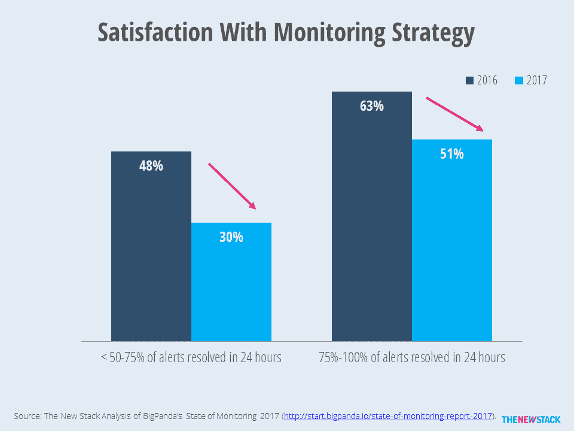

# 奇偶校验:对监控的期望已经改变

> 原文：<https://thenewstack.io/parity-check-expectations-around-monitoring-changed/>

在过去的一年中，我们看到了关于如何衡量 IT 监控成功的期望发生了巨大的变化。随着越来越多的人认为监控对公司的成功至关重要，快速修复警报原因的能力变得不那么重要了。关于监控和敏捷性的 IT 决策必然会受到影响。

在过去的几年里，权威人士告诉我们 [IT 监控](/category/monitoring/)不再仅仅是正常运行。正如我们[之前报道的](https://thenewstack.io/monitoring-reset-containers/) *，*对监控有两个新的期望:1)工具应该有助于提高性能(包括 IT 和业务)以及 2)来自多个系统的数据应该被整合以提供一个整体的画面。

> 监控满意度和 MTTR 之间的相关性显著降低。

监控软件公司 [BigPanda](https://bigpanda.io/) 最近发布了第二份年度[监控状态](http://start.bigpanda.io/state-of-monitoring-report-2017)报告，该报告提供了数据和一些答案。它基于 1500 多名 It 专业人士的反馈。在对比 2017 年和 2016 年的报告时，我们发现很多东西都没有改变。IT 部门最关心的是安全性和停机时间。最大的 IT 监控挑战是服务中断的快速补救、获得购买监控工具的资金以及减少生成的不重要警报的数量。有趣的是，即使是最重要的关键绩效指标(KPI)也是一样的，客户满意度为 73%，其次是服务水平协议(SLA)合规性、事故量和[平均维修时间](http://blog.fosketts.net/2011/07/06/defining-failure-mttr-mttf-mtbf/) (MTTR)。

调查结果中的变化与什么让人们对他们的监控策略感到满意以及他们如何定义敏捷性有关。

越来越多的人认为战略监控流程对他们的组织很重要，从 2016 年的 80%上升到 2017 年的 85%。然而，对他们的流程“非常”满意的百分比相对保持不变，仍为 13%。如果你“有些”满意的回答包括在内，那么 54%的人是快乐的。

该报告称，“监控策略满意度和补救能力之间存在明显的相关性。”我们不能否认这是事实，但自去年以来，这种相关性已经明显减弱。与去年一样，在无法在 24 小时内解决大多数警报的公司中，只有十分之三的公司对其组织的战略感到满意。

显然，如果您不能充分解决问题，那么您的 IT 运营方法就有问题。然而，那些在一天内解决警报的人越来越不满意。在 24 小时内解决 50-75%警报的人中，对监控策略满意的比例从 2016 年的 48%下降到 2017 年的 30%。在能够在一天内解决 75%以上警报的公司中，满意率从 63%下降到 51%。

能够快速解决问题的 IT 专业人员的监控满意度有所下降。

因此，尽管监控比以往任何时候都更具战略性，但解决服务中断的简单能力并不意味着监控过程是成功的。也许这是因为敏捷的既定目标现在变得越来越难以实现。根据调查，警报数量继续增加。虽然降低警报噪音是一项挑战，但这种增加是由一个不小的现象造成的。软件开发的速度加快了。代码部署更有可能每天或每周进行。基础设施的变化不太可能是罕见的事件。

来源:大熊猫

尽管快速修复问题不再像过去那样具有战略意义，但需要监控的事件数量却在增加。因此，许多 IT 专家不再相信他们的组织是敏捷的。在表示他们的组织拥有战略监控流程的受访者中，认为他们敏捷的比例从 2016 年的 89%下降到 2017 年的 65%。很可能随着开发速度的增加，对敏捷性的期望也增加了。不仅开发人员需要敏捷，IT 运营团队和业务部门也需要敏捷。

当前的监控方法无法满足变得更加敏捷的需求。

很多很多监控厂商说他们可以让你更敏捷。他们声称，使用[机器学习](/category/machine-learning/)和人工智能的创新可以减少警报噪音，加快问题的解决。将分析集成到仪表板中可以让高管更加敏捷。

这些都是有价值的努力。随着 IT 专业人员超越定制监控解决方案，这些产品正在被评估和购买。它们是否被广泛采用取决于这些产品是否真的让组织变得更加敏捷。看着将于今年五月在波特兰举行的 [Monitorama](http://monitorama.com/) 开源监控软件大会的众多赞助商，我们期待着听到他们对这个问题的看法。

由 Joaquim Alves Gaspar [通过维基百科](https://en.wikipedia.org/wiki/File:Polistes_May_2013-2.jpg)制作的专题图片。

<svg xmlns:xlink="http://www.w3.org/1999/xlink" viewBox="0 0 68 31" version="1.1"><title>Group</title> <desc>Created with Sketch.</desc></svg>