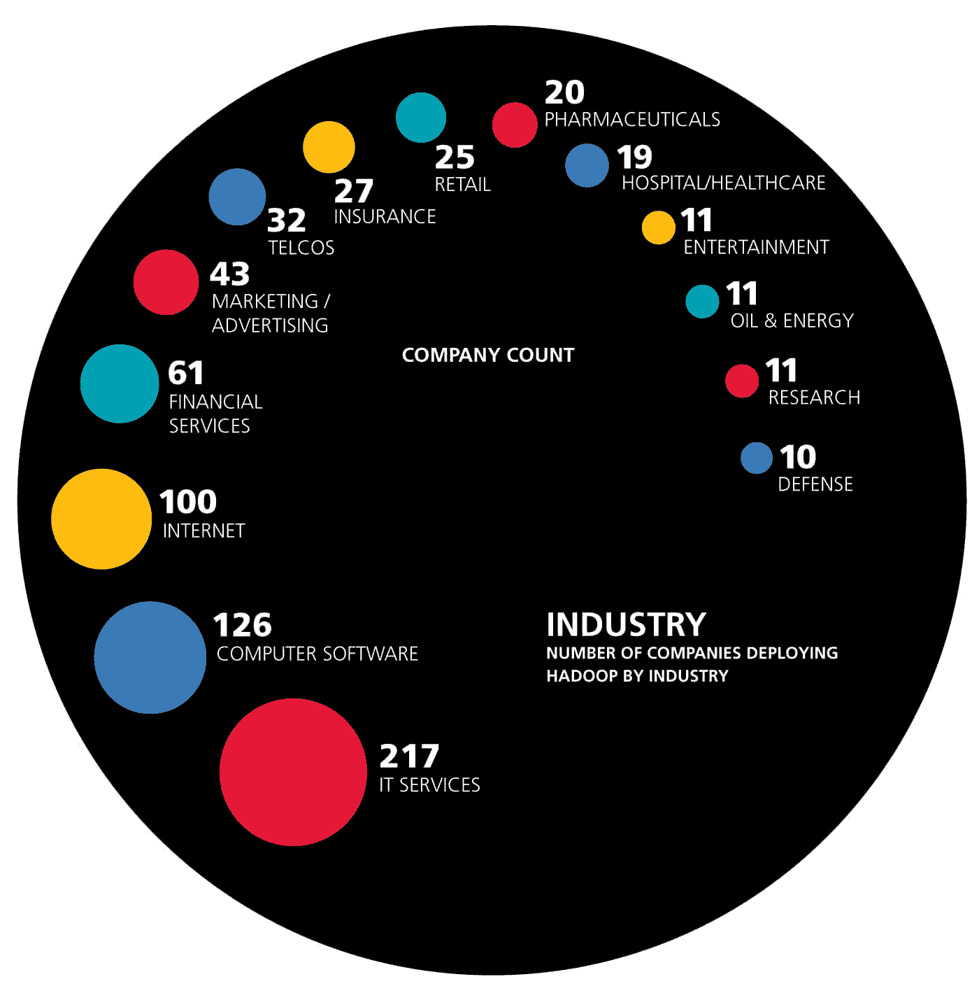

# 奇偶校验:为什么这么多调查对象来自 IT 厂商？

> 原文：<https://thenewstack.io/parity-check-many-survey-respondents-vendors/>

奇偶校验是 TNS 分析师的专栏文章

[Lawrence Hecht](https://thenewstack.io/author/lawrence-hecht/)

他研究了 IT 行业的各种调查和研究，以提炼更深刻的真理，揭穿没有根据的假设。

每周都会发布另一项关于这种或那种技术趋势的调查。想要一种可靠的方法来区分小麦和谷壳吗？查看研究样本。

采访错误的人的研究可能是有偏见的。例如，如果主题是数据库，Oracle 员工可能会给你一个公司倾向。另一个常见的问题是询问人们他们没有资格谈论的话题。你知道有多少企业高管可以讨论 AWS 与 OpenStack 的技术优势？

由于担心污染样本，我传统上从自己的调查中筛选 IT 供应商。然而，电信和软件公司是新堆栈涵盖的许多基础设施技术的买家和卖家。在审查数据后，我们发现行业垂直可能不是确定代表性样本的最佳方式。

如果调查是关于一个特定的市场，那么希望相关公司的员工至少会因为他们对这个主题的兴趣而尝试参与。他们很可能对这个主题有很多了解，在决定思想领袖的观点时会很有用。然而，除非他们是相关技术的实际消费者，否则 IT 公司员工预测市场走向的能力有限。因此，下一个显而易见的问题是谁是买家，他们中有多少人在科技公司工作？

在最近的 [OpenStack 用户调查](https://t.co/FO6WLdokyQ)中，68%的受访者在信息技术公司工作，另外 14%在电信行业工作。乍一看，我认为“哇，像米兰蒂斯和 HPE 这样的 OpenStack 支柱的员工肯定太多了。”

虽然这可能是真的，但 OpenStack 的实际消费者通常是服务提供商和 IT 供应商，他们已经将该技术融入到他们的产品中。在这方面，试图用一个样本来代表更大经济体中广泛的行业组合是愚蠢的。

新的堆栈既写了应用程序开发人员，也写了它的操作方面，但是现在，让我们把重点放在面向开发人员的产品上。有多少人，他们在哪里工作？根据新堆栈对 LinkedIn 数据的分析，31%的开发人员为不被视为科技公司的企业工作。在我们收集的[数据](https://docs.google.com/spreadsheets/d/1jGPNhcNKnO45UdUDCe9u6VrV1G58lgBCln2qdEIWU9I/edit?pref=2&pli=1#gid=1907227925)中，如果一家公司被归类为以下任何一类，则该公司被视为科技公司:

*   信息技术和服务
*   计算机软件
*   电脑游戏
*   计算机硬件
*   计算机连网
*   互联网
*   电信
*   无线的。

来自 [Evans Data](http://www.evansdata.com/) 的 2013 年调查支持新的堆栈计算。在其报告中，三分之一的开发人员在普通公司内部工作，而大多数人受雇于独立软件供应商(ISV)、增值经销商(var)或顾问。

对于 it 服务提供商或开发人员使用的技术，大部分调查样本来自 IT 公司可能是可取的。然而，这并不意味着我们应该为调查抽样或其他方法建立一个新的、许可的规范。

今年春天，奥赖利[发表了](https://www.oreilly.com/ideas/the-big-data-market)一份关于 Hadoop 采用情况的报告，指出科技公司代表了 66%的成熟用户。这些数据是基于由[蜘蛛书](http://spiderbook.com/)完成的对数十亿公开可用文件的自动分析，该蜘蛛书已经被[需求库](https://www.demandbase.com/)收购。在这种情况下，我怀疑三分之二的 Hadoop 使用是在 IT 内部，因为大多数行业都需要分析。相反，it 供应商更有可能在案例研究和合作公告中被提及。只是想一想。

按行业划分的最成熟的 Hadoop 用户。来源:蜘蛛书

特色图片:[街头艺术](http://joabj.com/Photos/2015/1501-SA-Bushwick-Cats.html)，纽约市。

<svg xmlns:xlink="http://www.w3.org/1999/xlink" viewBox="0 0 68 31" version="1.1"><title>Group</title> <desc>Created with Sketch.</desc></svg>