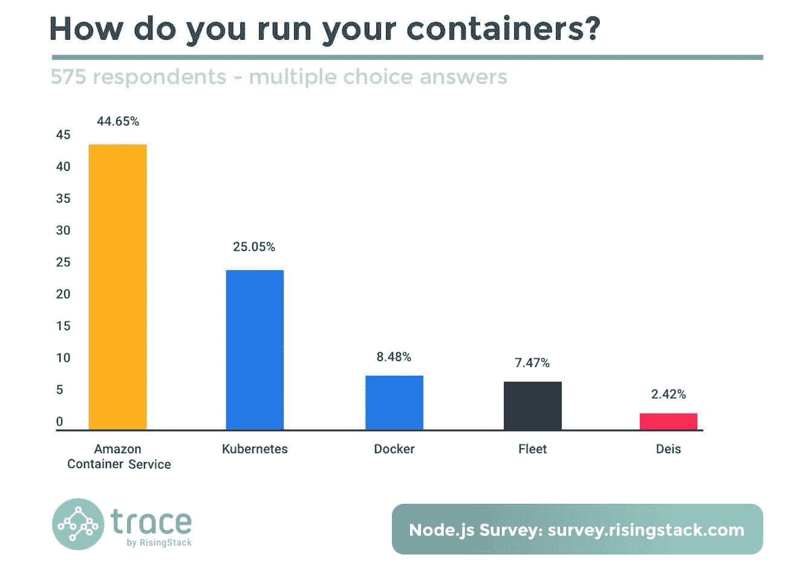
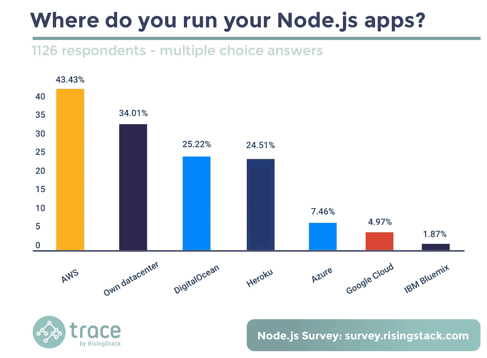
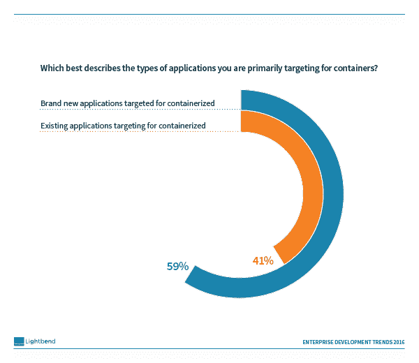
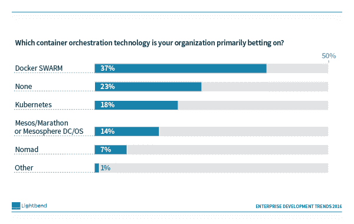

# 奇偶校验:Node.js、JVM 和 Docker Swarm 的惊人结果

> 原文：<https://thenewstack.io/parity-check-node-js-jvm-containers/>

Node.js 和 JVM 开发人员部署容器的方式与其他人不同。或者至少这是你看到两项新的 1000 多名受访者调查的结果后会想到的。一项调查显示，只有 5%的 Node.js 开发者使用 Docker 来“运行”容器，尽管这个群体中的大多数人显然使用 Docker 格式的容器。一项 [Lightbend](https://www.lightbend.com/) 调查显示 Scala 开发者押注 Docker Swarm 进行编排。这两项研究都表明，AWS 是在公共云中部署容器的首选。开发人员可能对 Docker 和 Amazon 容器服务有偏见，但随着容器进入生产 IT 运营，DevOps 将在选择技术方面有很大的发言权。随着组织思维从一般技术转移到具体产品——Docker 到 Docker 云，Kubernetes 到 CoreOS architectural，Mesos/Marathon 到 meso sphere DC/OS——调查可能会描绘出一幅不同的画面。

根据 RisingStack 对 Node.js 开发者的一项新的[调查](https://blog.risingstack.com/node-js-developer-survey-results-2016/)，51%的人使用 Docker 技术，这比 2016 年 1 月 Node.js 基金会[调查](https://nodejs.org/en/blog/announcements/nodejs-foundation-survey/)报告的 45%略有上升。这些数字看起来很高，但是我们知道，总的来说，开发者一直是容器先锋。需要注意的是,“使用”Docker 可能意味着有人在玩它，而不一定是在生产应用程序中使用它。在使用容器技术(Docker)或 VM (VirtualBox、AWS AMIs 或 VMware)的受访者中，45%使用亚马逊容器服务，25%使用 Kubernetes，8%使用 Docker。纵观整个样本，这意味着 29%的 Node.js 开发人员使用 ECS，16%的 Kubernetes 和 5%的 Docker。

在调查的全部样本中，AWS ECS 的使用率为 29%。Docker 的低使用率与 Node.js 开发人员所说的如何“使用”或部署容器有关，而不是他们是否使用 Docker 格式的容器。

DigitalOcean 和 Heroku(Salesforce.com)都有四分之一的受访者在其基础设施上运行 Node.js 应用。这些提供商在开发者中传统上很强大，但不确定是否大多数受访者的应用程序实际上都在这些云上。

我们对上述统计数据表示怀疑，特别是因为许多“容器用户”可能在非生产和测试环境中。也就是说，这些数据让我们有了一些感悟:

*   **Docker technology 不是 Docker，Inc .**node . js 一半的开发者都在用“Docker”。大多数人可能使用 Docker 格式的容器，但不一定使用 Docker 来部署他们的容器。因此，虽然一些开发人员可能会向 Docker，Inc .支付支持费用，但在本次调查的容器用户中，只有十分之一在使用其 Docker Swarm、Docker Cloud 或 Docker Datacenter 服务。
*   **亚马逊集装箱服务** **有可能占据主导地位。**我们之前[已经确定](https://thenewstack.io/aws-focused-container-use/)AWS 上的大多数容器使用都没有利用它的容器服务。RisingStack 的数据直接反驳了这一发现。如果可以选择的话，很多调查对象可能会说他们在 AWS 上使用虚拟机来运行容器。鉴于它的首要地位，如果用户认为 Kubernetes 和 Docker 是底层技术，而不是他们自己的平台，AWS 可以对容器市场提出要求。
*   **开发者** **来自火星，IT Ops 来自金星**。在今年春天的一项调查中，我们发现开发人员和运营团队在如何使用 manage containers 方面存在显著差异。DigitalOcean 和 Heroku(Salesforce.com)在开发者中传统上很强，但它们在谷歌、微软和 IBM 产品上的突出地位与其他市场研究报告中的显著不同。

## Lightbends 的 JVM 调查

Lightbend [的前身是 Typesafe，它调查了超过 2151 名使用 JVM 语言的开发者。尽管一些受访者使用 Groovy 和 Clojure，但大约四分之三的人使用 Scala 编写的产品应用程序，几乎一半的人使用基于 Java 的应用程序。研究发现，在使用容器和微服务方面，Scala 开发者比 Java 开发者更高级。其关于微服务的发现有力地支持了我们在](https://info.lightbend.com/COLL-20XX-Enterprise-Development-Trends-2016-Report_RES-LP.html)*[为绿地之外的容器重新架构](https://thenewstack.io/beyond-greenfield-rearchitecting-containers/)中所写的结论。*尽管对集装箱管理的偏好与之前报告的趋势一致，但 Lightbend 的研究似乎过度代表了 AWS 和 Docker 的优势。

证实了先前的发现，JVM 开发人员正专注于容器化新的而不是遗留的应用程序。

Lightbend 调查证实了最近 Bitnami 调查的结果，该调查表明 1)集中于容器化新应用程序，以及 2)微服务成熟度越高的开发人员越有可能使用容器。从上面的图表中可以看出，59%的 JVM 开发人员主要针对新应用程序进行容器化，相比之下，41%的开发人员针对现有应用程序。Lightbend 调查还发现了微服务和容器使用之间的关系:

*   在所有 JVM 开发者中，30%在生产中部署微服务，22%在生产中部署容器。
*   只看那些在生产中部署微服务的企业，在生产中部署容器的比例几乎翻了一番，达到 41%。

根据 Lightbend 的 [Dean Wampler](https://twitter.com/deanwampler) 的说法，Scala 和前沿思想之间也有关联。因此，他认为 Scala 开发者更有可能寻找 Java 的替代语言。从这个角度来看，Scala 程序员在某种程度上领先于其他人并不奇怪，他们拥有更高的微服务和容器使用率。

## 有点意外

报告中最令人惊讶的结果之一是，与 Kubernetes 相比，有两倍多的组织押注于 Docker Swarm 技术。如果受访者知道 Swarm 现在被捆绑到核心 Docker 引擎中，那么哇，Docker 公司似乎在容器编排大战中占了上风。更有可能的是，许多专注于 Scala 的开发人员基于他们一般的市场观点做出假设，而不是在生产中实际体验编排容器。如前所述，开发人员使用 Docker 的经验更丰富，因此可能不太倾向于看到 Kubernetes 和 DC/OS 给开发运维团队和 IT 运营团队带来的价值。当 Lightbend 只关注实际的生产容器用户时，它更像是一场赛马，Docker Swarm 获得了 30%的选票，而 Mesos/Marathon 或 Mesosphere DC/OS 获得了 21%的选票，Kubernetes 获得了 20%的选票。深入挖掘数据，Scala 用户比其他人更有可能选择 Mesos/Marathon 和 DC/OS 产品。对这种现象的一种解释是，由于 Marathon 是用 Scala 编写的，开发人员可能会根据他们对该语言的熟悉程度做出选择。

JVM 开发者的组织比 Kubernetes 更倾向于 Docker。

最后，尽管相关图表没有包含在报告中，Lightbend 写道，“66%的调查受访者表示，亚马逊为使用容器的开发者提供了(主要公共云提供商中)最有吸引力的产品，相比之下，谷歌和微软的这一比例分别为 29%和 5%。”虽然这一发现可能与已知的公共云市场份额有关，但基于其基于 Kubernetes 的产品的成熟度，谷歌也有可能得到提升。

[号](https://www.mirantis.com/software/docker/kubernetes/)、[号](https://d2iq.com/)和[号【科瑞奥斯】号](https://coreos.com/)是新堆栈的赞助商。

特色图片由 Celeste Hutchins 以 **[CC-BY 2.0](https://creativecommons.org/licenses/by/2.0/)** 授权的“[爱成就一个家庭](http://www.celesteh.com/pics/November05/November05-Pages/Image13.html)”。

<svg xmlns:xlink="http://www.w3.org/1999/xlink" viewBox="0 0 68 31" version="1.1"><title>Group</title> <desc>Created with Sketch.</desc></svg>