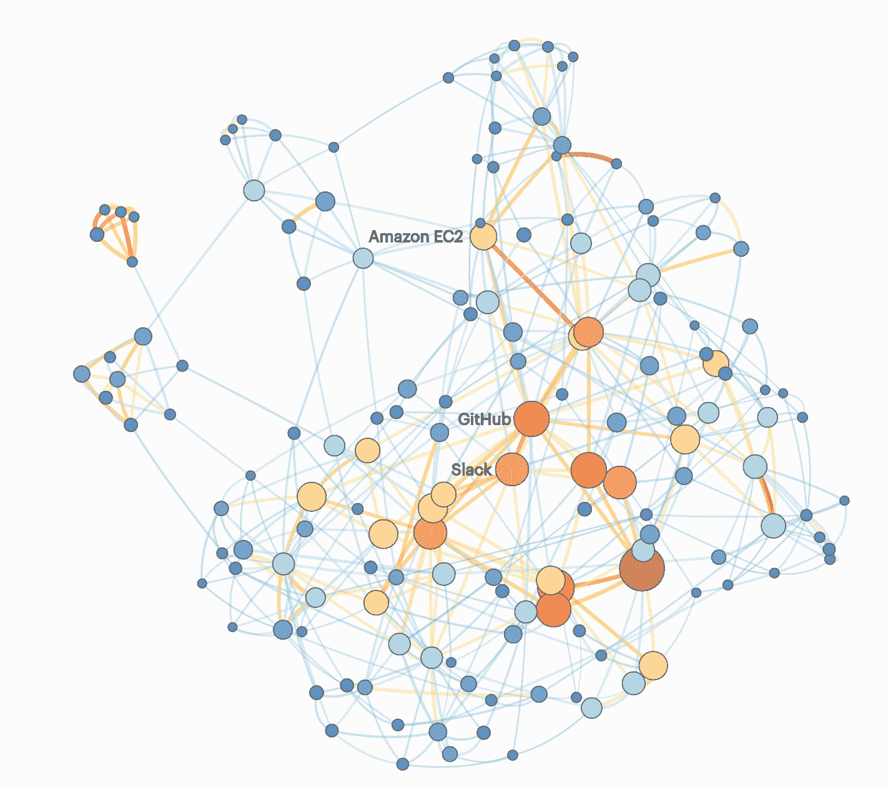

# 奇偶校验:Slack 正在成为开发者的核心工具吗？

> 原文：<https://thenewstack.io/parity-check-slack-really-central-modern-stack/>

新的堆栈使用了 [Slack](https://slack.com/) ，我们同意[沃尔特·莫斯伯格的](http://recode.net/2016/04/13/mossberg-slack-improvements-distraction/)最近的专栏，断言消息服务是伟大的，但需要改进，以使其对企业真正无价，并将其与过去宣传的其他通信/协作软件区分开来。

[Slack](https://thenewstack.io/slack-new-model-business-process-software/) 不断增长的开发者用户群可能是帮助实现该服务 38 亿美元估值的成功关键，假设开发者是新的决策者，而硅谷的精英阶层拥有不成比例的影响力。

但是 Slack 正在成为开发者的必备工具吗？我们来看看数字。

这种比较并不准确，但 Twitter 和 Slack 都脱颖而出，不仅仅是因为它们能为世界提供新的东西，还因为开放的 API 和开发人员优先的产品方法。Constellation Research 的分析师 Alan Lepofsky 告诉 CMS wire,“Slack 是一款“在正确的时间推出的产品”,该公司通过让开发者将它集成到他们的其他系统中，至少在一定程度上取得了成功。没有这种关注，它只是一个更新的 IRC 应用程序或微软 Skype/Lync 的竞争对手。Slack 意识到这一点至关重要，并在几个月前建立了一个特殊的类似 VC 的基金，投资于生产产品的项目和公司，这些产品最终将成为 Slack 生态系统的一部分。

在进一步深入之前，让我们通过比较 Slack 采用情况[统计数据](http://expandedramblings.com/index.php/slack-statistics/)与 AWS、GitHub、Twitter 和 Dropbox 来做一个现实检查。Twitter 被包括在内是因为它对开发者友好的历史，Dropbox 被包括在内是因为它试图将病毒式应用转化为企业的实际付费业务。

*   Slack 拥有 270 万日活用户。Twitter 每天有超过 1 亿的用户。去年，Dropbox 拥有 4 亿用户。
*   GitHub 至少有[1200 万用户](https://en.wikipedia.org/wiki/GitHub)，Twitter 有 3.2 亿。如果 Slack 的日活用户与总用户之比为 3:1，那么 Slack 将拥有 830 万用户。
*   一年前，AWS 拥有超过 100 万客户。2015 年，AWS 的收入接近 80 亿美元。截至 2016 年 3 月，Slack 的经常性年收入为 6400 万美元。

根据 [Benn Stancil](https://twitter.com/bennstancil) 的说法，Slack 与 AWS 和 GitHub 是开发者生态系统中的主要枢纽。本利用了来自 [StackShare](http://stackshare.io/) 的数据，该数据收集了同行提交的关于开发者和雇佣他们的公司所使用的应用程序的信息。通过图表分析，他获得了使用某项技术的公司数量，并用线条将它们联系起来，这些线条表明了公司同时使用这两种应用程序的频率。

在下面的图表中，我们看到 Slack 和 GitHub 有很强的联系，这与 Slack 经常被开发人员用来谈论正在进行的工作以及定期与 GitHub 集成有关。图中未标记的是许多语言和框架(例如 JavaScript 和 BootStrap)，它们被巧妙地排除在外，因为它们不具有可比性。然而，如果我有我的选择，其他大容量的点(在 StackShare 上给它评分的用户数量)将被包括在基本开发者中心的分析中，谷歌分析和新遗迹标签将被添加到图像中。

在 EC2、GitHub 和 Slack 之后，其他很多大节点都是编程语言，而不是应用。看互动版[这里](https://modeanalytics.com/benn/reports/c03f88db299f)。

那么，我们应该如何看待 Slack 的中心性呢？在分析图表时，我们必须考虑以下注意事项:

1.  这些数据基于在 StackShare 上自我选择提供信息的人。在无法访问 API 的情况下，我假设受访者倾向于为初创企业和前端开发人员工作。如果这是真的，结果可能会偏离企业规模的用例，这些用例经常推动技术趋势。
2.  使用某项技术的开发商和公司的数量并不能预测市场份额。一个应用程序可能由五家公司的 50 名开发人员进行评估，而另一个应用程序可能由总共一名开发人员进行评估。在现实世界中，在 StackShare 上被忽略的应用可能会有数百万人使用。

Stancil 通过不试图得出市场份额的结论来证明他作为分析师的价值。相反，他的大部分[分析](http://stackshare.io/posts/the-next-generation-of-software-stacks)集中在 AWS、GitHub 和 Slack 的用户在他们的堆栈中使用额外工具的可能性。一个亮点是，移动和 SaaS 公司比其他行业的公司更有可能使用 Slack，而金融服务和广告不太可能接受它。

金融服务采用滞后可能是由于合规性问题。尽管最近的一篇文章 [AdWeek](http://www.adweek.com/news/technology/agency-much-more-productive-it-started-using-chat-software-connect-clients-170695) 称赞聊天机器人的好处，但我研究创意总监使用项目管理和协作软件的经验告诉我，这些数据准确地描述了广告业对这类工具的沉默。看看其他协作工具的使用，如 Trello、JIRA 和 Asana，它们似乎比非开发人员使用得更频繁，所以 Slack 似乎正在为上述行业的这一工作角色创造一个利基。

更重要的是 Amazon EC2、GitHub 和 Slack triad 之间的紧密联系。它们经常被同时采用。AWS EC2 客户对 Slack 的使用比 StackShare 贡献者的整个样本高出 41 个百分点，GitHub 用户对 EC2 的采用高出 34 个百分点。这有一定的道理，因为初创企业有使用 AWS 的趋势，以基于开源的绿地技术环境开始可以解释这一现象。

在初创企业的大本营，硅谷的开发人员比整个 SlackShare 群体平均高出 12 个百分点，而开发人员的 Slack 使用率则高出 7 个百分点。这个国家和世界的其他地方呢？虽然硅谷经常领先，但情况并非总是如此。这可能是北加州近视导致人们过度宣传这些应用程序。

硅谷开发者使用 AWS、GitHub 和 Slack 的频率高于其他人。图表来自 [StackShare](http://stackshare.io/posts/the-next-generation-of-software-stacks) 。

这一切意味着什么？我们无法预测 Slack 将如何执行其商业计划。随着开发人员社区构建新的堆栈，我们能够并将继续跟踪 Slack 的重要性。

<svg xmlns:xlink="http://www.w3.org/1999/xlink" viewBox="0 0 68 31" version="1.1"><title>Group</title> <desc>Created with Sketch.</desc></svg>