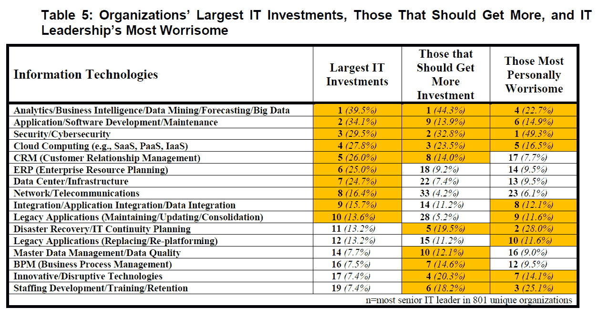
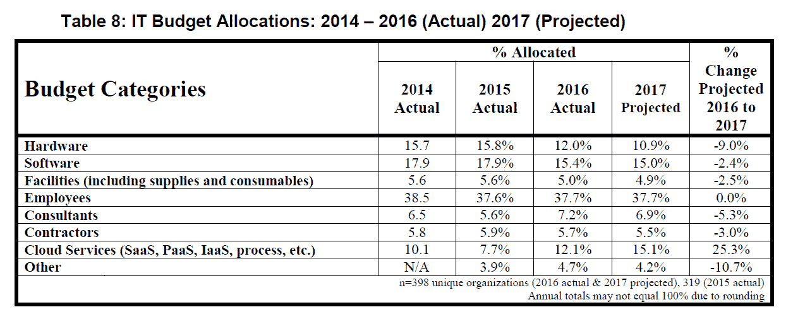
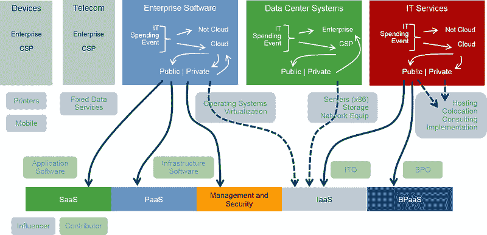
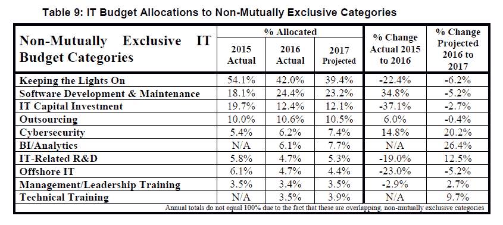
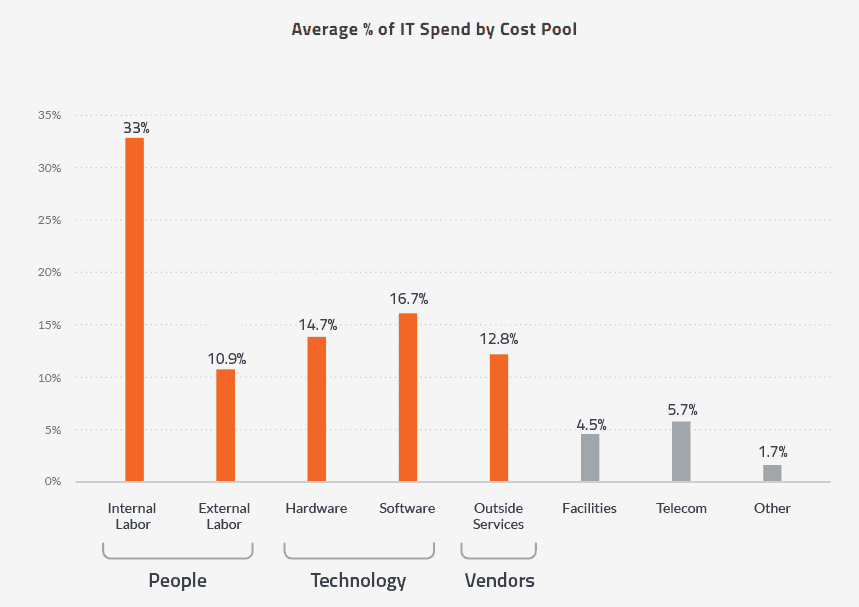
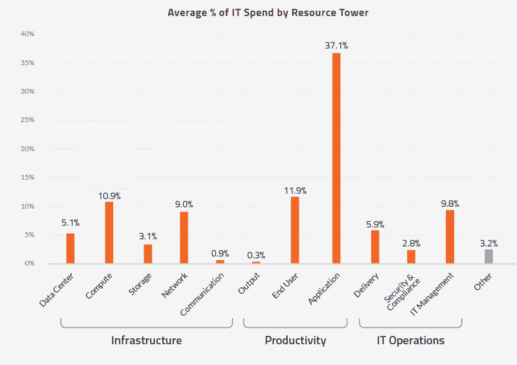
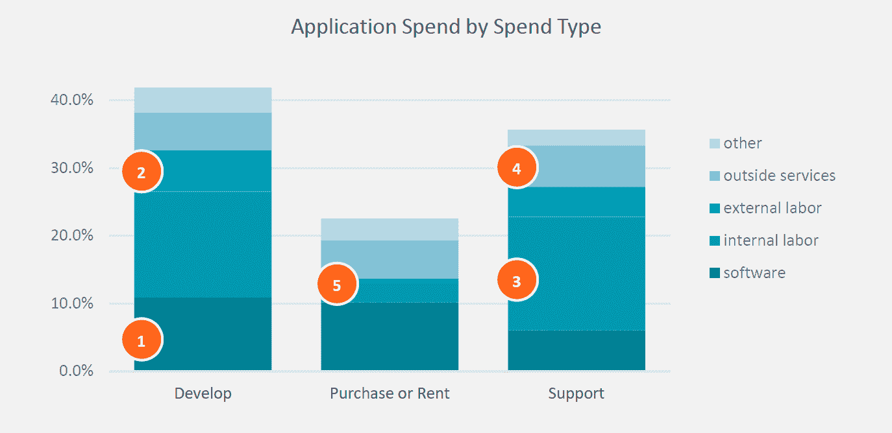

# 奇偶校验:软件预算的胃口被底线所控制

> 原文：<https://thenewstack.io/parity-check-software-budgets-appetite/>

不要被关于“即服务”软件支出大幅增加的报道所迷惑。马克·安德森著名地宣称[软件正在吞噬世界](http://www.wsj.com/articles/SB10001424053111903480904576512250915629460)五年后，现实描绘了一幅更加微妙的画面。

虽然应用程序的支出最近有所增加，但首席信息官们正专注于限制它。尽管“数字化转型”越来越重要，但企业并没有雇佣过多的开发人员。相反，软件开发和维护现在是许多 IT 工作角色和类别的一部分。

2017 年*SIM IT 趋势研究* 应该给那些期待软件赚大钱的人敲响了警钟。该报告调查了信息管理协会成员中的 1213 名成员，他们都是高级 IT 领导者，490 名是首席信息官。自 2012 年以来，应用程序/软件开发/维护在 it 预算中的相对地位有所上升，受访者将 IT 作为最大的 IT 投资领域之一，从 2015 年的 29%上升到 34%。

然而，只有 14%的人认为应用程序应该得到更多的投资。尽管首席信息官们计划继续在分析/数据、安全和云服务上投资，但在软件上的支出正受到挤压。

很少有 IT 领导者愿意继续投资应用程序和软件开发。表中没有看到的是，ERP 作为一项大的投资，从 2015 年的 32%下降到 2016 年的 25%。来源:2017 SIM IT 趋势研究。

去年，it 领导特别关注软件支出，因为他们认为软件支出将继续上升到 IT 预算的 18.6%。也许是因为支出控制，这种增长没有实现。相反，软件占 IT 预算的比例从 17.9%下降到 15.4%。我们看到的不是软件蚕食世界，而是硬件支出从 2015 年的 15.8%大幅下降到 2016 年的 12%，云服务(如 SaaS 或 PaaS)增长超过 4 个百分点。

增加软件支出的预期并没有实现，因为分配给软件的 IT 预算百分比从 17。9%到 15.4%。相反，硬件支出占预算的百分比从 2015 年的 15.8%下降到 2016 年的 12%。包括 SaaS 和 PaaS 在内的云服务增长超过 4 个百分点。来源:2017 SIM IT 趋势研究。

软件支出的下降主要是软件交付方式转变的结果。 [Gartner](http://www.gartner.com/newsroom/id/3384720) 已经注意到，尽管总体应用软件支出已经并将继续缓慢增长，但 SaaS 产品所占的比例正在增加。随着基础设施软件被 PaaS 和 SaaS 取代，预计也会出现同样的现象。

该软件的另一个变化是对业务支出的关注。正如我们在之前的中对[所写的，影子 IT 的问题已经有所缓解，因为它获得了对软件的责任，即使资金来自业务部门。如果营销等职能的支出增加，IT 的软件相关成本将更多地与集成和支持相关，而不是与许可相关。](https://thenewstack.io/parity-check-dont-afraid-shadow-yet/)

来源:Gartner(2016 年 7 月)。

为了讲述一个更完整的故事，SIM 研究还考察了基于功能的支出，这些功能不能平均分配给相互排斥的预算类别。从这个角度来看，软件开发和维护在 IT 预算分配中的比例从 18.1%飙升至 24.4%。软件支出的增加可能是由于整合 IT 采购所需的咨询工作，无论是硬件、软件还是服务。从这个角度来看支出，“维持运营”和离岸 IT 受到的冲击最大。

从不同的支出角度来看，软件支出正在上升，而“维持运营”和离岸 IT 支出正在下降。来源:2017 SIM IT 趋势研究。

计算花在软件上的费用是一项棘手的工作。从某种意义上说,“应用程序”一词定义了更大比例的 IT 支出，因为它考虑了支持软件所需的人力，而不仅仅是考虑软件许可证的价格。我们有理由相信 SIM 卡数据相当准确。相比之下，Gartner [估计](http://www.gartner.com/technology/research/it-spending-forecast/)软件占 2016 年 IT 支出的 10%到 16%，这取决于是否包括电信。我们还查看了来自 [Apptio](http://www.apptio.com/it-economics) 的数据，它以两种不同的方式展示了 2015 年的数据。使用与财务相关的成本术语，Apptio 报告软件占支出的 17%。或者，当观察不同的 IT 塔时，Apptio 看到 37%的支出专用于构建、购买或支持应用程序。

软件和应用程序支出的统计数据可能会因定义方式的不同而有很大差异。资料来源:应用程序。

Apptio 的成本池方法提供了额外的洞察力。不到四分之一的应用支出直接用于购买或租赁软件。内部劳动力是应用支出的最大一块，与实际开发相比，分配给支持的略多。Apptio 的 IT 经济报告第 2 期的一个关键要点是:

平均而言，应用程序支持比应用程序开发消耗更多的内部劳动力，尽管应用程序开发人员的工资通常高于支持人员。IT 领导应该确保考虑内部开发的应用程序的开发和持续支持的劳动力。

橙色圆圈指的是 Apptio 的 IT 经济报告第 2 期提供的分析。

根据[计算机经济](http://www.computereconomics.com/article.cfm?id=2189)的数据，从 2011 年到 2015 年，应用程序程序员与整体 IT 员工的比例完全没有变化——百分比稳定在 20%。因此，软件支出的任何相对增加都是因为工资上涨。劳动力成本通常被视为阻碍软件开发的因素。购买软件是避免依赖外部劳动力定制软件的一种方式，但通常需要内部劳动力来集成和支持软件。

如果你认为离岸外包或其他合同安排帮助企业解决了“开发人员短缺”的问题，那你至少部分错了。HfS Research 报告称，2016 年应用开发和维护收入增长了约 5%，尽管这一增长“受到定价压力和一些内包的影响。”大部分增加的支出可能用于开发，而不是维护。事实上，计算机经济学报告称，外包部分应用维护功能的公司比例[已经从 2011 年的 73%下降到 2015 年的 53%。](http://www.computereconomics.com/article.cfm?id=2181)

## 含义

云计算正在吞噬硬件支出。软件支出总体上可能略有上升，但在大多数市场活动中，实际上只是家具的重新摆放。云正在改变软件交付的机制。过去花在 ERP 和遗留软件上的钱正在转移到新兴的供应商那里。通过软件开发生命周期的自动化部分实现的节约正在被重新投资到新的软件项目中。

一如既往，当你听到一场革命正在改变我们的工作方式时，请保持警惕。仅仅因为商业创新是由软件驱动的，并不意味着软件支出必须增加。

通过 Pixabay 的特征图像。

<svg xmlns:xlink="http://www.w3.org/1999/xlink" viewBox="0 0 68 31" version="1.1"><title>Group</title> <desc>Created with Sketch.</desc></svg>