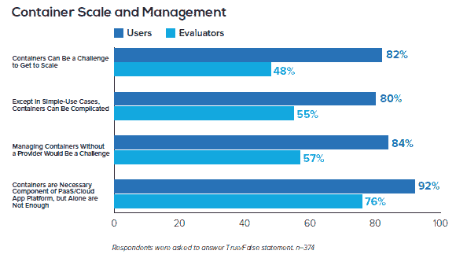

# 奇偶校验:Cloud Foundry，ClusterHQ 调查揭示了容器的采用

> 原文：<https://thenewstack.io/parity-check-survey-believe/>

关于他们在容器采用方面的发现，[新堆栈研究](https://thenewstack.io/tns-research-present-state-container-orchestration)与最近发布的[云铸造](https://www.cloudfoundry.org/hope-versus-reality-containers-in-2016/)和[集群总部](https://clusterhq.com/assets/pdfs/state-of-container-usage-june-2016.pdf)调查相比如何？

在 [Cloud Foundry Foundation](https://www.cloudfoundry.org/) 的报告中，一半的受访者表示他们使用平台或容器即服务(PaaS 或 CaaS)来编排或将编排容器。相比之下，ClusterHQ 调查、我们的调查和许多其他调查显示，像 Kubernetes、Swarm 和 Mesos 这样的编排平台是首选。经过审查，我们发现这一差异和其他差异是由于调查样本和问题的措辞方式造成的。

这些研究仍有一致之处。在过去的一年中，调查不断报告集装箱使用量的增加。此外，随着最近的 Docker 调查，这些报告一致表明相信容器将提高开发人员的效率，用户希望开发人员和 IT 运营人员都能使用的工具。

Cloud Foundry 调查表明，与我们的调查相比，他们更倾向于使用 PaaS。结合提供商管理的和自我管理的 PaaS 类别，45%的容器用户或评估者利用 PaaS 来管理或编排容器。相比之下，只有 7%的人认为 PaaS 是容器编排的主要方法。然而，由于 PaaS 和 CaaS 之间可能有重叠的定义，因此需要注意的是，Cloud Foundry 调查显示 21%的人更喜欢提供商管理的容器服务，相比之下，New Stack 调查中的这一比例为 12%。

45%的用户/评估者使用 PaaS 管理集装箱。(来源:云代工厂)

云铸造结果倾向于 PaaS 和 CaaS 有几个原因。首先，被问到这个问题的人的样本差异很大。与 ClusterHQ 和 New Stack 调查不同，Cloud Foundry 的参与者 1)来自一个在线小组，而不是自己选择参与，2)只在拥有 100 多名员工的企业工作。

Cloud Foundry 调查中的大型公司可能已经更有可能使用 PaaS 如果有人有这方面的确凿数据，请告诉我们。网络调查总是面临自我选择偏差，在线面板是衡量市场份额的好方法。也就是说，在线小组确实有局限性，比如很难找到领域专家。例如，根据我们与能够访问完整调查结果的 Cloud Foundry 员工的谈话，我们知道，虽然受访者是根据回答问题的能力进行筛选的，但参与者对容器的了解仍然比那些自我选择参与的人少得多。

> Cloud Foundry 的结果显示，至少目前，大型企业更倾向于捆绑解决方案。

Cloud Foundry 的 PaaS/CaaS 结果糟糕的另一个关键原因是，与其他两项调查相比，受访者对容器的使用不够成熟。Cloud Foundry 受访者正在使用或评估/部署容器。由于问题的措辞，我们相信这些回答者中的许多人正在非生产环境中使用容器，或者仍然只是模糊地计划使用容器。

相比之下，ClusterHQ 的所有受访者都表示他们正在使用容器，其中四分之三的人在生产中使用容器。同样，我们的研究结果包括 64%的生产用户，18%的非生产用户，其余的回答来自那些积极进行试验项目或评估的用户。

虽然新的堆栈调查没有深入研究部署容器的挑战，但其他调查研究了。Cloud Foundry 指出，50%的容器用户或评估者表示容器管理是他们面临的三大挑战之一。有趣的是，在使用容器的人中，他们比评估者更有可能相信他们需要 PaaS，特别是由第三方提供商管理的 PaaS，来有效地管理容器。

我们认为，许多受访者仍处于使用的早期阶段，随着他们的发展，他们不太可能关心容器管理，因为他们已经开始使用为处理容器部署而构建的工具。这些工具是否是提供商管理的 PaaS 还有待确定。

持久存储是 ClusterHQ 调查中最大的问题，但该结果可以半信半疑，因为供应商提供了该问题的解决方案，很可能调查中的许多参与者已经了解了该问题。

容器用户对他们管理和扩展容器的能力表示担忧。(来源:云代工厂)

虽然这三项调查都表明 Kubernetes、Docker Swarm 和 Mesos 是流行的编排平台，但也存在显著差异。Cloud Foundry 调查将这些工具称为自管理编排工具，并将[CoreOS](https://coreos.com/)architecture(一个商业企业准备的 Kubernetes 版本)列为首选。然而，我们认为，由于在可用的答案中没有其他 Kubernetes 选项，所以我们真的想回答“Kubernetes ”,并且对 CoreOS 口味没有偏好。

在这些结果中突出的另一件事是 [HashiCorp 的 Nomad](https://www.nomadproject.io/) 在这个利基市场中排名第二。由于 Nomad 在几个月前刚刚问世，我们相信这些答案中有许多来自仍在评估他们的选择的人们。集群总部数据显示为 18 %;内部开发的工具是第三大最常用的容器编排工具。这与主要使用 shell 脚本和定制的 16%的新堆栈调查参与者相似。我们相信，如果 ClusterHQ 提供了一个更大的可能答案列表，其结果也会显示人们选择 PaaS 和配置管理工具作为可能的解决方案。

根据 ClusterHQ 的调查，内部开发的工具是第三大最常用的容器编排工具。

Cloud Foundry 显然将自己定位为一个容器管理平台。他们的结果表明，至少目前，大型企业更倾向于捆绑解决方案。事实上，在他们报告的结尾，研究人员暗示大多数 PaaS 解决方案应该被称为容器管理平台。

虽然大多数(如果不是全部)PaaS 解决方案都具有容器管理功能，但我们不确定市场上的其他人是否会认为这是准确的。事实上，在我们的研究中，我们看到了对与 IaaS、CaaS 和私有云产品一起提供的 CaaS 和其他容器服务的偏好。当容器管理的责任至少部分地从应用程序开发人员的手中转移出去时，看看竞争会如何展开将是一件有趣的事情。

## 数据极客的笔记

在 Cloud Foundry 调查开发的早期阶段，我们与咨询公司 [ClearPath Strategies](http://www.clearpath-strategies.com/) 进行了交谈。虽然我们没有参与它的方法决策，但我们认为它根据信息和关注程度筛选用户的方法特别聪明。因此，他们拒绝接受来自回答者的数据，如果他们:

*   “表示他们可以向同事解释虚构的术语‘绿地即服务(GaaS)’”
*   当被要求选择他们熟悉的 PaaS 产品时，“选择了麦当劳或星巴克的标志/公司名称”。

CoreOS 、 [Cloud Foundry](https://www.cloudfoundry.org/) 和 [Docker](https://www.mirantis.com/software/docker/kubernetes/) 是新栈的赞助商。

来自 Pixabay 的特征图像。

<svg xmlns:xlink="http://www.w3.org/1999/xlink" viewBox="0 0 68 31" version="1.1"><title>Group</title> <desc>Created with Sketch.</desc></svg>