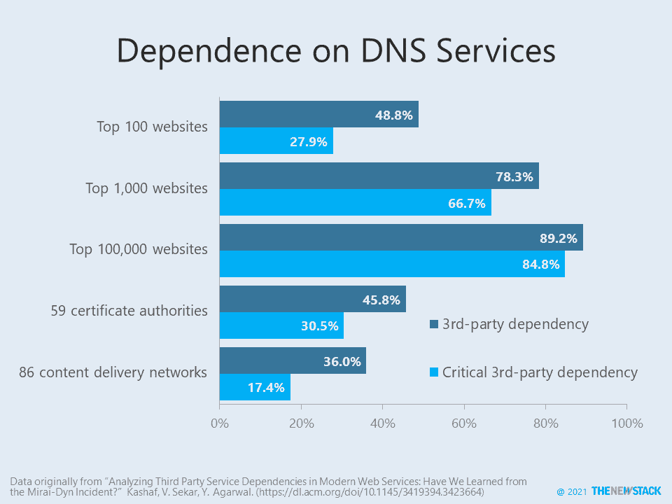

# Parler 的另一个安全风险:DNS 拒绝服务

> 原文：<https://thenewstack.io/parlers-other-security-risk-dns-denial-of-service/>

大多数网站面临中断的风险，因为它们依赖单一提供商提供一种或多种云服务。每个网站都需要一个 DNS 服务器来根据其域名路由互联网流量，但如果服务被拒绝，很少有网站有备份选项。事实上，根据卡耐基梅隆大学研究人员最近的一项[研究](https://dl.acm.org/doi/10.1145/3419394.3423664)，前 100，000 个 [Alexa 站点](https://www.alexa.com/topsites)中有 85%严重依赖单一第三方的 DNS。不幸的是，如果该提供商的服务中断，那么该网站很容易受到分布式拒绝服务(DDoS)攻击和服务中断。拥有超过一个提供商的[冗余 DNS 能力](https://thenewstack.io/ns1-avoid-the-trap-of-dns-single-point-of-failure/)解决了这个问题。

总体而言，研究中 40%的网站严重依赖于三种 DNS 服务——[亚马逊 Route 53](https://aws.amazon.com/route53/) 、 [Cloudflare](https://www.cloudflare.com/dns/) 和[DNS madeeeasy](https://dnsmadeeasy.com/)。如果包括与证书颁发机构(ca)相关的间接依赖关系，这一比例将跃升至 72%。CAs 支持 HTTPS 安全性，是当今网站运营商的标准要求。大约一半的企业自己使用第三方 DNS 服务，这可能使它们成为供应链中的特大薄弱环节。例如，排名前 10 万的网站中有 2%严重依赖于 DNS madeeeasy，因为它们直接使用这项服务，但如果考虑到领先的 CA[Digicert](https://www.digicert.com/)依赖 DNS madeeeasy 进行域名解析，这一数字将上升到 25%。

当[亚马逊网络服务](https://aws.amazon.com/?utm_content=inline-mention)终止其与 Parler 的服务条款时，它在许多方面发起了合法的拒绝服务“攻击”，其亚马逊 Route 53 DNS 服务只是被关闭的许多云服务之一，这[增加了其不断增加的安全灾难](https://thenewstack.io/how-parlers-data-was-harvested/)。社交媒体服务已经从一家俄罗斯公司获得了 DNS 服务。随着我们继续讨论市场力量如何影响供应商和技术锁定，请记住考虑小型云服务以及其他可能成为头条新闻的服务。

亚马逊网络服务(AWS)和 NS1 是这个新堆栈的赞助商。

通过 Pixabay 的特征图像。

<svg xmlns:xlink="http://www.w3.org/1999/xlink" viewBox="0 0 68 31" version="1.1"><title>Group</title> <desc>Created with Sketch.</desc></svg>