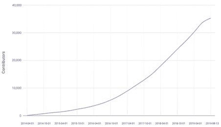
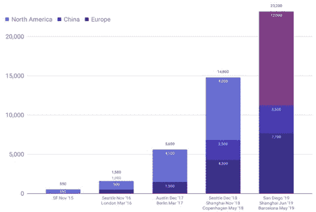
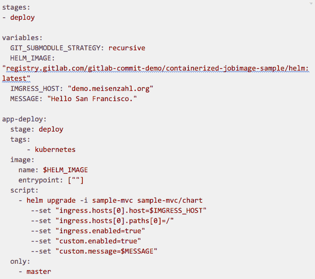
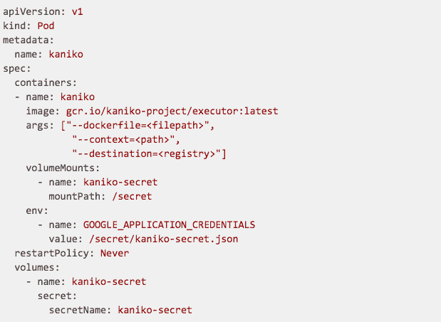
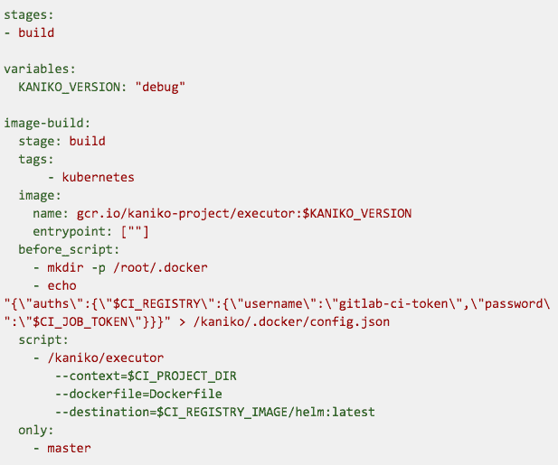

# 集装箱化 CI/CD 管道如何与 Kubernetes 和 GitLab 一起工作

> 原文：<https://thenewstack.io/part-1-how-to-improve-enhance-your-kubernetes-ci-cd-pipelines-with-gitlab-and-open-source/>

毫不奇怪，Kubernetes 的受欢迎程度在 2019 年继续增长，这一趋势可能会在 2020 年继续下去。

然而，尽管 Kubernetes 提供了如此多的优势，但它的采用也暴露出了新的困难，这些困难必须得到解决。其中之一是我们如何自动部署和管理我们的应用程序。通过下面的例子，我将分享一些有用的技巧和诀窍，告诉你如何在 GitLab 和开源技术的帮助下增强你的 Kubernetes CI/CD 管道。

对 Kubernetes 的捐款逐年增加。

KubeCon 和 CloudNativeCon 的与会者人数

## 将您的管道工作负载转移到集群中

 [尼科·梅森扎尔

Nico Meisenzahl 在 white duck 担任高级云和 DevOps 顾问。作为一名当选的 GitLab 英雄和 Docker 社区领袖，他目前热衷于围绕 Kubernetes、CI/CD、自动化、DevOps 和云的主题。Nico 还经常在欧洲和美国的会议、用户组活动和聚会上发言。](https://www.linkedin.com/in/nicomeisenzahl/) 

作为第一个例子，让我们检查 CI/CD 管道的一般情况，以及为什么我认为容器化管道可以帮助解决许多问题。

正如我们所知，一个管道被分成不同的链节，称为阶段。这些阶段可以包含单个或多个作业。作业描述了为实现预期结果而需要执行的命令。命令可以是二进制或复杂的工具链。与复杂性无关，工具及其依赖项需要在管道工作节点上可用。根据您的项目，您可能还需要为多个已安装的版本选择正确的版本和路径。

集装箱管道具有以下优势:

*   管道作业之间的隔离
*   管道作业之间没有依赖性问题
*   不变性，每个管道作业运行时完全相同
*   易于扩展

在容器化管道中，每个作业都在基于映像的容器中运行，映像包括单个项目所需的工具链的所有依赖关系和版本特性。容器化管道的众多优势之一是项目中的不同作业之间不会有冲突，包括在同一节点上运行的不同项目管道。您还可以在您的任何管道工作节点上运行这个特定的管道作业，因为所有需要的依赖项都被放在容器映像中。

有了容器化管道，您就可以将管道工作负载转移到现有的 Kubernetes 集群中。这有助于您通过在应用程序旁边运行管道工作负载来更好地利用现有计算资源。您还可以利用现有的 Kubernetes 优势，将您的管道扩展到几乎无限的范围。

听起来不错，对吧？先说细节。如果您使用过 GitLab CI/CD，您会知道 [GitLab Runner](https://docs.gitlab.com/runner/) —一个在工作节点上调度和管理管道工作负载的二进制文件。工作节点是提供计算来运行管道工作负载的机器(不管它们是虚拟化的还是裸机)。

GitLab Runner 还提供了一个所谓的 [Kubernetes 执行器](https://docs.gitlab.com/runner/executors/kubernetes.html)。这使我们能够将集装箱化管道转移到我们的 Kubernetes 集群。首先，Kubernetes 执行器在 Kubernetes 集群中作为一个 pod 运行。每次需要调度管道作业时，Kubernetes executor 都会与 Kubernetes API 对话，并根据定义的容器映像调度 pod。它还管理任何种类的内务任务，如代码签出、缓存和工件管理。Kubernetes 执行程序将构建分为多个步骤:

1.  准备:创建包含构建和服务容器的 pod。
2.  预构建:克隆存储库、恢复缓存、下载工件。
3.  构建:用户构建步骤。
4.  后期构建:创建缓存并上传工件。

除了所有在后台自动发生的内务处理步骤之外，Kubernetes 执行程序将运行我们在[中定义的管道步骤。第三步 gitlab-ci.yml](https://gitlab.com/gitlab-commit-demo/containerized-appdeploy-sample/blob/master/.gitlab-ci.yml) 。

让我们看一个定制管道的例子(你可以在这里查看整个例子):

上面的管道示例详细描述了部署阶段。部署阶段包含一个名为 app-deploy 的作业。该作业被定义为由 Kubernetes 执行器通过已定义的 Kubernetes 标记来调度(该标记还需要映射 GitLab Runner 定义中定义的标记)。image name 参数定义用于执行脚本部分中定义的命令的容器映像。在我们的示例中，我们使用 Helm 运行应用程序部署。这些命令是在一个基于 Alpine 的容器中执行的，该容器提供了 Helm 和 kubectl CLI(关于所用容器映像的详细信息可在这里[获得](https://gitlab.com/nmeisenzahl/dockerfiles))。

成功执行应用程序安装所需的 Kubernetes 身份验证细节通过 GitLab Runner 自动提供，并且在运行作业时可以在容器中获得。这是由 GitLab 的 [Kubernetes Integration](https://docs.gitlab.com/ce/user/project/clusters/index.html) 完成的，在项目或小组级别上可用。

## 在集群中运行容器构建

将我们的部署管道工作负载转移到我们的 Kubernetes 集群中给我们带来了许多优势和可能性，我在上面已经提到过。但是在我们的 Kubernetes 集群中构建我们的应用程序和其他容器映像不是很好吗？

您可能听说过一种叫做 Docker-in-Docker (DinD)的技术，它允许我们在容器内部构建和运行容器映像，但在我看来，Docker-in-Docker 带来了一些缺点，包括:

*   将主机的 Docker 套接字暴露到容器中。
*   将/var/lib/docker 安装到容器中。
*   运行特权容器，以便能够在容器内运行 Docker 守护程序。

避免 Docker-in-Docker 的一个方法是使用名为 [Kaniko](https://github.com/GoogleContainerTools/kaniko) 的开源项目。Kaniko 是 Google 推出的一个项目，它允许用户基于容器或 Kubernetes 集群内的 Dockerfile 构建容器映像。Kaniko 不依赖于 Docker 守护进程或任何其他外部依赖或特权。这使得用户能够在不能轻松或安全地运行 Docker 守护进程的环境中构建容器映像，比如托管的 Kubernetes 集群。Kaniko 被设计为基于官方容器映像(gcr . io/kaniko-project/executor:latest)作为容器运行。这是如何将 Kaniko 作为 pod 运行的示例:

上面的例子运行了一个基于容器的 pod，该容器运行最新的 Executor 映像。容器以下列参数启动:

*   –dockerfile 定义 docker file 的路径
*   –定义上下文根的上下文，可以是已挂载的卷、S3/GCS 存储桶或 Azure Blob 存储
*   –定义目标注册表、图像名称和标记的目的地。

还可以安装一个 Kubernetes secret，如果需要的话，可以用它来验证注册中心或上下文根位置。

当然，您也可以在 GitLab CI 管道中使用 Kaniko 来构建任何类型的容器映像。一个基于 Kaniko 的容器化构建管道示例如下所示(您可以在这里查看整个示例):

同样，我们有一个单阶段，其中有一个作业计划在一个带有 Kubernetes 标记的 GitLab Runner 上运行。该映像被定义为使用 debug 标记，该标记增加了对 GitLab Runner 工作所需的 shell 的支持。我们还需要覆盖容器映像入口点，以便能够执行配置的命令。在 before_script 部分，我们创建了一个名为 config.json 的文件，用于定义注册中心认证细节。

在我们的示例中，我们将图像推入 GitLab 项目注册表，我们可以使用 GitLab Runner 提供的 CI_JOB_TOKEN 环境变量对其进行身份验证。在脚本部分，我们运行 Kaniko executor 二进制文件，并定义上下文根、Dockerfile 路径和目的地细节。

Nico 在 2019 年布鲁克林 GitLab Commit 上的讲话，提供了关于集装箱管道和 Kaniko 的更多细节:

[https://www.youtube.com/embed/xiug3fC1t18?feature=oembed](https://www.youtube.com/embed/xiug3fC1t18?feature=oembed)

视频

## 获得进一步的见解

在 [GitLab Commit](https://about.gitlab.com/events/commit/) 上与我一起深入了解[容器化的 CI/CD 管道](https://thenewstack.io/category/ci-cd/)，以及 GitLab 和开源对您的 CI/CD 管道的进一步增强。

关于 1 月 14 日在旧金山举行的 GitLab Commit 的一些话:首届 GitLab Commit 将召集 GitLab 用户进行为期一天的学习、交流和启发。持续集成、持续交付、Kubernetes、DataOps 和安全领域的专家将提供关于最新 DevOps 技术的前沿见解。期待带着新的技巧、解决老问题的新方法和一些新朋友回家。

<svg xmlns:xlink="http://www.w3.org/1999/xlink" viewBox="0 0 68 31" version="1.1"><title>Group</title> <desc>Created with Sketch.</desc></svg>