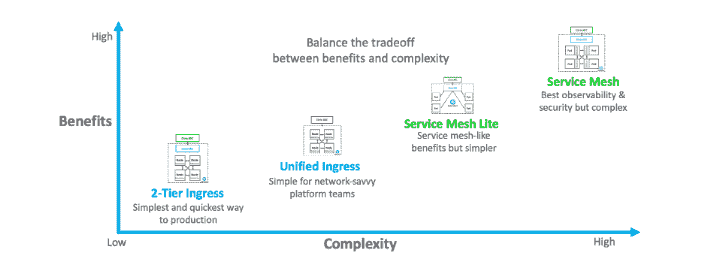

# 第 1 部分:为微服务应用交付选择代理架构的最佳方式

> 原文：<https://thenewstack.io/part-1-the-best-way-to-select-a-proxy-architecture-for-microservices-application-delivery/>

 [潘卡伊古普塔

潘卡伊是思杰公司云原生应用交付解决方案高级总监。Pankaj 为客户提供混合云微服务应用交付策略的建议。在思科任职期间，他领导了网络、安全和软件产品组合的战略营销计划。Pankaj 热衷于与 DevOps 社区就基于微服务和 Kubernetes 的应用交付的最佳实践进行合作。](https://twitter.com/PankajOnCloud) 

依靠微服务来实现更快的发布周期、模块化、自动化扩展和应用程序可移植性，正日益成为一个组织在其数字化之旅中的标志。然而，人们对管理由此产生的敏捷性的影响知之甚少，这为有效的应用程序交付带来了极大的复杂性。

解决办法？

在确保最终用户获得最佳体验时，代理架构和应用交付控制器(ADC)的选择至关重要。它必须提供适当级别的安全性、可观察性、高级流量管理和故障排除能力，并补充您的开源工具策略。此外，代理架构必须适应南北(N-S)流量和微服务间东西(E-W)流量需求。

单片应用程序的负载平衡非常简单。但是对于基于微服务的应用程序来说，复杂得多的负载平衡需求就不一样了。

这个由四部分组成的系列将根据七个关键标准评估基于微服务的应用交付的四种代理架构。

## 好处和复杂性之间的权衡

毫无疑问:微服务架构是复杂的。在开源创新的推动下，最佳实践随着技术的进步而快速发展。不同的架构提供了独特的优势，但也呈现出不同程度的复杂性。很多时候，这可以归结为在安全性、可观察性和复杂性等预期优势之间做出选择。当您考虑实现特定体系结构所需的技能集，以及为了确保满足所有利益相关者的需求而必须添加的特性时，尤其如此。

## 不同利益相关者需求的平衡行为

不同的利益相关者关心不同的事情，这使得架构选择更加复杂，因此评估标准总是不同的。平台团队是组织中微服务应用之旅的结缔组织，他们关心 Kubernetes 平台治理、运营效率和开发人员敏捷性。DevOps 团队关心更快的发布、自动化、金丝雀测试和渐进的推广。sre 最关心的是应用程序可用性、可观察性和事件响应。DevSecOps 专注于应用程序和基础架构的安全性和自动化。网络运营团队痴迷于网络管理、可见性、策略实施和合规性。微服务应用交付架构必须平衡他们的所有需求。

选择正确的代理架构并不容易。在做出任何决定时，务必要从长计议，并使用南北向和东西向流量的七个关键标准来评估架构选项:

*   应用程序安全性。
*   可观察性。
*   持续部署。
*   可扩展性和性能。
*   开源工具集成。
*   对开源控制平面的 Istio 支持。
*   需要 IT 技能。

通过这样做，组织可以确保他们能够安全可靠地交付现在和未来的应用程序，并提供世界一流的体验来转变他们的运营。

## 考虑架构选项

谈到当今的代理架构，有四个选项可供考虑:

*   双层入口。
*   统一入口。
*   服务网格。
*   服务网格精简版。

### 双层入口

对于云原生新手和专家来说，双层入口代理架构是部署生产级应用程序的最简单、最快速的途径。N-S 流量负载平衡分为两层，以简化两个管理域的划分:平台和网络组。微服务节点间(E-W)流量负载平衡使用简单的开源 L4 kube-proxy。平台团队和网络团队只需要很少的培训，因此两个团队都可以按照自己的速度前进。双层入口选项为南北向流量提供了很好的安全性、流量管理和可观察性，但东西向流量没有得到很好的覆盖。

### 统一入口

在 2 层入口的基础上，统一入口对于熟悉网络的平台团队来说实施起来相当简单。统一入口减少了 N-S 代理层并消除了一跳延迟。微服务节点间(E-W)流量负载平衡使用简单的开源 L4 kube-proxy。它适用于内部应用程序，并提供了以后添加 web 应用程序防火墙、SSL 终端和外部应用程序的选项。与两层入口架构类似，统一入口为南北向流量提供了出色的安全性、流量管理和可观察性，但东西向流量没有得到很好的覆盖。

### 服务网格

服务网格是最近才出现的最先进、最复杂的架构。服务网格为每个微服务单元配备一个边车，使东西向流量在进出单元时得到检查和管理。因此，它能够为微服务之间的流量提供最高级别的可观察性、安全性和细粒度管理。加密等重复性微服务功能可以卸载到侧柜中。服务网格对于平台团队来说有一个陡峭的学习曲线，因为它是一个复杂的架构。

### 服务网格精简版

对于那些希望增加服务网格带来的安全性、可观察性和高级流量管理，但更喜欢简单架构的人来说，服务网格精简架构是一个可行的替代方案。Kubernetes 集群内部部署了一组代理(例如，每个节点一个代理),所有单元间的流量都通过这些代理流动，而不是在每个单元上使用侧车。Service mesh lite 只需对平台和网络团队进行最少的培训，并提供从双层入口架构的轻松过渡。

请继续关注本系列第 2 部分中对双层入口代理和统一入口架构的深入探讨。

<svg xmlns:xlink="http://www.w3.org/1999/xlink" viewBox="0 0 68 31" version="1.1"><title>Group</title> <desc>Created with Sketch.</desc></svg>