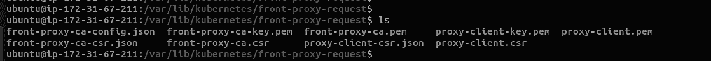
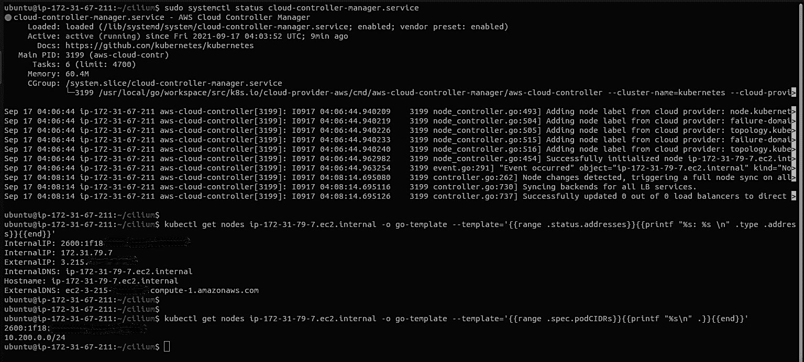
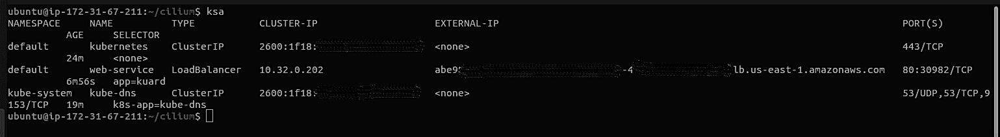
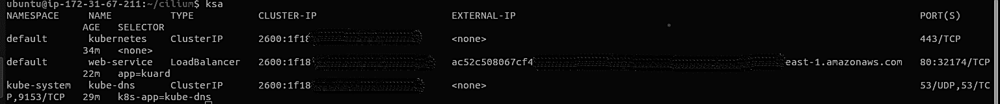

# 通过 Kubernetes 双栈集群访问 AWS 服务

> 原文：<https://thenewstack.io/part-2-access-aws-services-through-a-kubernetes-dual-stack-cluster/>

[](https://github.com/Lakers817)

[Saurabh Modi](https://github.com/Lakers817)

[Saurabh Modi 是一名 IT 专业人士，拥有十多年的工作经验，从商业智能、统计分析、应用程序开发到生产支持和 Kubernetes 云基础设施。他曾与大型金融科技公司和企业的咨询公司合作，使用独特和创造性的解决方案来解决问题。](https://github.com/Lakers817)

[](https://github.com/Lakers817)[](https://github.com/Lakers817)

在本系列的第一部分“通过 Kubernetes 双栈集群[访问 AWS 服务](https://thenewstack.io/access-aws-services-through-a-kubernetes-dual-stack-cluster/)中，我们使用 AWS-cloud-controller-manager`AWS-ccm`，使用 AWS 云提供商清单，将 Kubernetes 双 IPv4/IPv6 栈与 [Amazon Web Services](https://aws.amazon.com/?utm_content=inline-mention) 服务 API 连接起来。

在第二部分中，我们将讨论如何使用系统服务文件部署`AWS-ccm`。

**先决条件**:你需要一个运行在 AWS Cloud 上的 [Kubernetes 集群，并启用](https://thenewstack.io/7-tips-for-cutting-down-your-aws-kubernetes-bill/) [k8s 双栈特性。](https://kubernetes.io/docs/concepts/services-networking/dual-stack/)

**注意:**如果你想使用常规的 IPv4 集群步骤保持不变，但你不必启用双栈功能。

第一步:确保你已经在你的机器上安装了[Go](https://golang.org/doc/install)。

之后，你将不得不克隆[AWS-云提供商回购](https://github.com/kubernetes/cloud-provider-aws)来从 AWS-云提供商仓库为`aws-ccm`构建二进制文件。

`/cloud-provider-aws/cmd/aws-cloud-controller-manager$ go build main.go `

我通常将`main.go`复制到`aws-ccm.go`中，然后用它构建二进制文件，这完全取决于你。

`go build aws-ccm.go`

**第二步:**我们将使用`systemd`服务文件设置`aws-ccm`。

初始步骤与我们在第一部分中讨论的步骤相同。

您需要对您的 kube-apiserver 服务文件进行以下更改，如果您还没有这样做的话，请添加这些标志:

```
 --requestheader-client-ca-file=  front-proxy-ca.pem  \

   --requestheader-allowed-names=front-proxy-client  \

 --requestheader-extra-headers-prefix=X-Remote-Extra-  \

   --requestheader-group-headers=X-Remote-Group  \

   --requestheader-username-headers=X-Remote-User  \

   --proxy-client-cert-file=proxy-client.pem  \

   --proxy-client-key-file=proxy-client-key.pem  \

   --enable-aggregator-routing=true

```

如果您没有在运行 API 服务器的主机上运行 kube-proxy，那么您必须确保系统启用了以下`kube-apiserver`标志:

`--enable-aggregator-routing=true`

让我们为上述标志创建所需的证书，并为前端代理创建一个新的 ca 证书，不要使用我们为 API 服务器使用的证书。

```
sudo cat  &gt;&gt;  front-proxy-ca-config.json  &lt;  front-proxy-ca-csr.json
{
    "CN":  "kubernetes",
    "key":  {
        "algo":  "rsa",
        "size":  2048
    },
    "names":  [
        {
            "C":  "Country",
            "ST":  "State",
            "L":  "Location",
            "O":  "Kubernetes",
            "OU":  "System"
        }
    ]
}

EOF

sudo cfssl gencert  -initca front-proxy-ca-csr.json  |  cfssljson  -bare front-proxy-ca

  sudo cat  &gt;  proxy-client-csr.json  &lt;

```

将创建一组证书:



不要忘记重新加载文件 kube-apiserver 服务文件。

`sudo systemctl daemon-reload`

**第三步:**云控制器管理器客户端证书

生成云控制器管理器客户端证书和私钥:

```
sudo cat  &gt;  cloud-controller-manager-csr.json  &lt;&lt;EOF

{
  "CN":  "cloud-controller-manager",
  "key":  {
    "algo":  "rsa",
    "size":  2048
  },
  "names":  [
    {
      "C":  "Country",
      "ST":  "State",
      "L":  "Location",
      "O":  "cloud-controller-manager",
      "OU":  "System"
    }
  ]
}

EOF

sudo cfssl gencert  \
  -ca=ca.pem  \
  -ca-key=ca-key.pem  \
  -config=ca-config.json  \
  -profile=kubernetes  \

cloud-controller-manager-csr.json  |  cfssljson  -bare cloud-controller-manager

```

**第四步:**云-控制器-管理器 Kubernetes 配置文件

为云控制器管理器服务生成 kubeconfig 文件:

```
kubectl config set-cluster kubernetes  \
--certificate-authority=ca.pem  \
--embed-certs=true  \
--server=https://[::1]:6443 \
--kubeconfig=cloud-controller-manager.kubeconfig

kubectl config set-credentials cloud-controller-manager  \
--client-certificate=cloud-controller-manager.pem  \
--client-key=cloud-controller-manager-key.pem  \
--embed-certs=true  \
--kubeconfig=cloud-controller-manager.kubeconfig

kubectl config set-context default  \
--cluster=kubernetes  \
--user=cloud-controller-manager  \
--kubeconfig=cloud-controller-manager.kubeconfig

kubectl config use-context default  --kubeconfig=cloud-controller-manager.kubeconfig

```

您的 systemd 服务文件`Cloud-controller-manager.service` 应该看起来像这样:

```
[Unit]
Description=AWS Cloud Controller Manager
Documentation=https://github.com/kubernetes/kubernetes

[Service]
ExecStart=/your-aws-binary-location/aws-cloud-controller-manager  \
  --cluster-name=kubernetes  \
  --cloud-provider=aws  \
  --authentication-kubeconfig=/file-path/cloud-controller-manager.kubeconfig  \
  --authorization-kubeconfig=/file-path/cloud-controller-manager.kubeconfig  \
  --kubeconfig=/file-path/cloud-controller-manager.kubeconfig  \
  --allocate-node-cidrs=true  \
  --requestheader-client-ca-file=/file-path/front-proxy-ca.pem  \
  --requestheader-allowed-names="front-proxy-client"  \
  --requestheader-extra-headers-prefix=X-Remote-Extra-  \
  --requestheader-group-headers=X-Remote-Group  \
  --client-ca-file=/file-path/ca.pem  \
  --cloud-config=/file-path/cloud-config.conf  \
  --configure-cloud-routes=false  \
  --leader-elect=true  \
  --leader-elect-lease-duration="15s"  \
  --leader-elect-renew-deadline="10s"  \
  --leader-elect-resource-lock="leases"  \
  --leader-elect-resource-name="cloud-controller-manager"  \
  --leader-elect-retry-period="2s"  \
  --use-service-account-credentials="true"  \
  --v=2
Restart=on-failure
RestartSec=5

[Install]
WantedBy=multi-user.target

```

**第五步:**创建一个 RBAC 文件，`aws-ccm-rbac.yaml `

```
---

kind:  ClusterRoleBinding
apiVersion:  rbac.authorization.k8s.io/v1
metadata:
  name:  cloud-controller-manager
roleRef:
  apiGroup:  rbac.authorization.k8s.io
  kind:  ClusterRole
  name:  cloud-controller-manager
subjects:
-  kind:  User
  name:  cloud-controller-manager
  apiGroup:  rbac.authorization.k8s.io

---
apiVersion:  rbac.authorization.k8s.io/v1
kind:  ClusterRole
metadata:
  name:  cloud-controller-manager
rules:
-  apiGroups:
  -  ""
  resources:
  -  events
  verbs:
  -  create
  -  patch
  -  update
-  apiGroups:
  -  ""
  resources:
  -  serviceaccounts
  -  serviceaccounts/token  
  -  configmaps
  -  endpoints
  -  namespaces
  -  secrets 
  verbs:
  -  create
  -  get  
-  apiGroups:
  -  coordination.k8s.io
  resources:
  -  leases
  verbs:
  -  create
  -  get
  -  list
  -  update
  -  watch
-  apiGroups:
  -  ""
  resourceNames:
  -  node-controller
  -  service-controller
  -  route-controller
  resources:
  -  serviceaccounts/token
  -  secrets  
  verbs:
  -  create
  -  get  
-  apiGroups:
  -  ""
  resources:
  -  events
  verbs:
  -  create
  -  patch
  -  update
-  apiGroups:
  -  ""
  resources:
  -  serviceaccounts
  verbs:
  -  create
-  apiGroups:
  -  coordination.k8s.io
  resources:
  -  leases
  verbs:
  -  create
  -  get
  -  list
  -  update
  -  watch
-  apiGroups:
  -  ""
  resourceNames:
  -  node-controller
  -  service-controller
  -  route-controller
  resources:
  -  serviceaccounts/token
  verbs:
  -  create
-  apiGroups:
  -  ""
  resources:
  -  persistentvolumes
  -  services
  -  secrets
  -  endpoints
  -  serviceaccounts
  verbs:
    -  get
    -  list
    -  watch
    -  create
    -  update
    -  patch
-  apiGroups:
  -  ""
  resources:
  -  nodes
  verbs:
    -  get
    -  list
    -  watch
    -  delete
    -  patch
    -  update
-  apiGroups:
  -  ""
  resources:
  -  services/status
  verbs:
    -  update
    -  patch
-  apiGroups:
  -  ""
  resources:
  -  nodes/status    
  verbs:
    -  patch
    -  update
-  apiGroups:
  -  ""
  resources:
  -  events
  -  endpoints
  verbs:
    -  create
    -  patch
    -  update

```

**注意:**在 RBAC 文件中的用户名应该与我们在 kubeconfig 默认上下文中的用户名相同。

一旦您的数据平面启动并运行，在 5-10 秒后启动 `cloud-controller-manager`服务。您可以启动您的节点，并确保在此之后部署容器本机接口(cni)插件，以便节点处于就绪状态，否则您将收到以下警告:

`1 node_controller.go:354] Specified Node IP not found in cloudprovider for node "ip-172-31-79-7.ec2.internal"`

但是它不会出错，这意味着`aws-ccm node-controller`无法从 AWS 获取节点信息。

我为`aws-ccm`清单测试的场景对于 AWS-ccm systemd 服务保持不变。



## 负载平衡器即服务

我尝试通过在服务文件中添加注释来使用网络负载平衡器作为双栈部署，但它对我不起作用，我必须手动更改一些设置。

尽管负载均衡器已配置好，并且实例处于活动状态但不健康，但它仍在进行中。

它在我的待办事项列表中，可能会有自己的帖子来讨论它。

## IPV4 作为首选双栈服务

在 kuard k8s 服务文件中，如果我在顺序列表中将 IPv4 作为首选 IP:

`ipFamilyPolicy: PreferDualStack`

`  ipFamilies:`

`  - IPv4`

`  - IPv6`



## IPV6 作为首选双栈服务

如果我在顺序列表中将 IPv6 作为首选 IP:

` ipFamilyPolicy: PreferDualStack`

`  ipFamilies:`

`  - IPv6`

`  - IPv4  `



这就是 Kubernetes 双栈中的 AWS 云控制器管理器。

<svg xmlns:xlink="http://www.w3.org/1999/xlink" viewBox="0 0 68 31" version="1.1"><title>Group</title> <desc>Created with Sketch.</desc></svg>