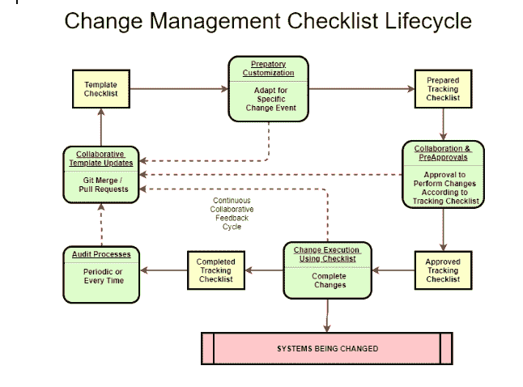

# 第 2 部分:GitHub 和 GitLab 上的清单如何帮助团队协作

> 原文：<https://thenewstack.io/part-2-how-checklists-on-github-and-gitlab-can-help-team-collaboration/>

本文是由三部分组成的系列文章的第二部分。第 1 部分证明了人工执行的清单本质上是源代码，并且根据 GitOps 原则，就像成功管理软件栈所需的任何其他代码一样，属于 git。[第 3 部分](https://thenewstack.io/human-processed-code-part-3-a-multiplatform-toolset-for-markdown-checklists/)讲述了为什么以及如何使用丰富的桌面编辑工具来创建和完成清单。

## 清单意识和怀疑

 [达尔文·萨诺伊

Darwin 是 GitLab 的高级解决方案架构师，在他专注于自动化的职业生涯中，他对云、DevOps 和 CI/CD 充满热情。他和他的两个孩子和妻子住在费城附近。当他不在路上试图弄坏他的山地车时，他就在车库里调音。](https://www.linkedin.com/in/DarwinSanoy/) 

总有一些人觉得清单是不必要的时间浪费，因为他们认为他们总能记住完成任务的基本步骤。许多人也没有意识到使用它们会带来巨大的跨学科的好处。如果你没有研究过清单本身，你可能会认为它们只适用于非常复杂的情况，而简单的情况不会受益。如果你认识的任何人有这种感觉，我会鼓励他们阅读阿图尔·加万德的[“清单宣言”](https://www.barnesandnoble.com/w/checklist-manifesto-atul-gawande/1100358644#/)关键要点包括:

*   问题中的清单是高度惯例化的程序，每个人都应该隐含地知道并自动执行。
*   通过使用这些标准化程序的检查表来避免错误的频率是非常重要的。
*   被认为是房间里最敏锐的专业人士(首席外科医生、飞机驾驶员、机长等。)并不像许多人认为的那样不需要清单。
*   大多数复杂的活动都是由一个团队来完成的——许多适当结果的失败都来自于对其他人做了什么或者谁有权在过程中指出问题的假设。清单解决了这个问题，因为它们确保了沟通，并给予任何人指出遗漏项目的权利。

“清单宣言”表明，清单不仅可以防止由于已知问题导致的错误，还可以改变团队的人际关系和沟通动态，从而可以持续产生更好的结果。因此，如果有人告诉你他们不需要清单，因为他们正在做的“不是脑外科手术”，你可以让他们知道真正的脑外科医生实际上使用清单来处理简单的事情，如果出错，也会有危及生命的后果。

## 完整的清单生命周期

核对表生命周期没有一套标准的术语，所以我们将使用我们自己的一些术语，并用术语“模板核对表”和“跟踪核对表”将其与 DevOps 核对表联系起来正如您将看到的，这些核对清单类型之间的重要区别暗示了使用什么工具来创建和更新模板核对清单与使用什么工具来处理跟踪核对清单。

我们称之为“模板清单”的地方是我们表达以下内容的地方:

*   需要做什么。
*   要求的步骤完成顺序和/或并行步骤执行容差。
*   如何完成过程(如果过程太长而不能包含在内联中，则是指向过程的指针)。
*   为什么特定的方法或顺序很重要(如果标准程序出现问题，便于程序调整)。
*   在清单开始或现场工程跟踪清单完成之前可能需要定制的填写字段。
*   可选的和特定于上下文的过程块，可能只需要在某些情况下执行，或者根据目标环境等因素以不同方式执行。

我们称之为“跟踪清单”是用来在不丢失你的位置的情况下执行清单的。这是我们追踪的地方:

*   处理核对清单时，核对清单项目的当前实时完成状态。
*   谁完成了清单。
*   当他们完成的时候。
*   他们完成清单的目标是什么(如果有多种可能性)。
*   记录与预期产出或结果相比的差异。
*   应考虑是否存在暗示或直接表明模板清单更新的差异。

模板清单通常需要预先定制，以用作跟踪清单。例如，同一个模板可能用于将更改推送到五个环境中的一个，因为除了一些可变数据(如环境的位置和该环境的配置详细信息)之外，该过程是相同的。这些可能只是简单地在顶部完成一个细节表，或者可能需要从头到尾更精细的编辑。准备阶段对批准过程也很重要，任何需要预先批准的人都希望在批准之前看到准备好的跟踪清单中的具体细节。最后，完成的跟踪清单是变更事件的正式记录，通常需要保留用于审计和过程改进研究。

整个清单生命周期允许针对模板清单的持续协作反馈。随着越来越多的关于在各种情况下该做什么的知识聚集在一起，清单的价值大大提高了。如果异常流程或不经常执行的部分变得很大，可能有必要将它们分解成自己的子检查表模板，只在需要时调用。

## 普通降价

如果您正在为 Git 编写任何类型的文档，Markdown 当然是首选的格式。这里提出的解决方案关注于无味的、标准的降价，以便尽可能最适用于最渲染的环境。一个小小的变化是，当呈现引擎支持 CSS 时，使用 SPAN 或 MARK html 标记为图章添加颜色背景。然而，这不仅在不呈现 CSS 的环境中被简单地忽略，使用它的标记也有标准的 markdown 格式，使它们足够突出。

## 跟踪清单工具和存储

在本系列的第 1 部分中，顺便讨论了“主”清单的概念。由于 GitLab 和 GitHub 的特性，您可以选择以不同于跟踪清单的方式存储模板清单。

## GitLab 和 GitHub 上的清单交互性

两个主要的源代码管理系统在系统的特定项类型中支持复选框交互性。这些项目类型包括问题、注释和提取/合并请求。交互性意味着您可以直接单击以选中和取消选中复选框，而不必先将项目置于完全“编辑”模式。这使得通过网站执行清单显得更加自然。

由于代码只能通过代码审查过程来更改，所以 GitLab 和 GitHub 都不支持源代码文件中的复选框交互。

这种交互性对于清单执行的实时协作具有积极的意义，因为对清单的状态更新是实时的，不需要提交-推送周期来更新状态。如果多个人更新同一清单，也没有合并冲突的风险。问题还具有跟踪整体工作可见性和完成情况的优势，通常用于审计已完成的工作。

这种交互性使得非编码人员也能参与到“markdown”格式的检查表的协作完成中来，markdown 是一种标准的标记语言。这意味着他们不必复制存储库、配置编辑器、学习 markdown 语法、学习如何提交和推送代码等等。即使有可用的在线编辑器，如果一个以上的用户同时处理或查看清单，用户也必须学习 markdown，并且必须快速关闭单个复选框编辑。

当谈到问题中复选框的可审核性时，GitLab 有一个与众不同的特性，它在问题讨论日志中添加了一个注释，用于跟踪对复选框采取了什么操作(选中或取消选中)、谁采取了该操作以及该操作发生的时间。这对一般的可审计性有很大的帮助。如果在操作或等待状态完成时仔细检查复选框，它还可以帮助提供流程的特定部分需要多长时间的度量。在尝试优化缓慢的自动化流程和/或缓慢的人工执行步骤时，经过时间信息会有所帮助。这是对一次由多人执行的清单的进一步帮助，因为您可以知道谁完成了哪些步骤。

## 模板清单工具和存储

由于对模板清单的更改很可能由不止一个做出更改的人来审查，因此它们应该直接存储在 git 中，以便更改可以像管理机器代码一样服从协作和审查需求。

您打算如何保存已完成的清单记录可能会影响您存储主文件的位置。如果已完成的清单通过保留在已完成的问题和拉/合并请求中而被视为永久记录，您应该记住它们不是项目的 git 记录的一部分，并且在您移动 git 文件系统时不会转移。如果“历史记录”是您的 GitOps 规程的一部分，那么您可能希望在源代码文件夹中至少有一份完整清单的副本。然而，如果工作清单存储在 Git 中，它们在 Web 上是不可交互的，这使得它们的功能更少——特别是对于实时协作。

以下是完成跟踪清单时要考虑的一些存储选项(模板清单总是在源代码中的某个地方):

1.  仅在源代码中。
2.  仅在已完成的问题和提取/合并请求中。
3.  无论是作为一个问题还是拉/合并请求，为了便于记录，都要将副本放入 git。

第三种选择是将清单存储在两个地方，这样便于发现和实时协作执行。它还允许您选择哪些清单将成为永久记录—也许只需要保留“升级到生产清单”,而不是所有生产前环境清单？

## Github 和 Gitlab 中的模板存储

在考虑存储模板清单时，完整清单存储之所以重要，是因为 GitLab 和 Github 都支持将 markdown 文件放在 git 文件系统中的特殊位置，从而使它们成为模板。这使得它们既可以在协作源代码控制之下，又可以在每个系统的 web UI 中轻松地发现问题和拉/合并请求的模板。这些也是支持交互式清单使用的相同子系统。因此，您可以设想使用模板清单模板，如“发布准备清单”、“升级到试运行清单”，这些模板在创建问题或拉取/合并请求时很容易选择，并且需要协作审查才能更新。

以下是使减价文档成为模板的特殊子文件夹位置——尽管也可能是其他位置。每个产品中的这些特定位置允许为每个支持的类型使用多个模板，并且在制作本地存储库克隆时也是隐藏的。

GitLab:

*   。gitlab/issue_templates/
*   。git lab/merge _ request _ templates/

Github:

*   。github/ISSUE_TEMPLATE/
*   。github/PULL_REQUEST_TEMPLATE/

## 准备清单的拉/合并请求

虽然 GitLab 和 GitHub 都支持问题和拉/合并请求中的清单处理，但这两个系统都只支持合并/拉请求的批准。您可能想考虑合并一些良性的东西，比如令牌文本文件更新，作为一种为清单准备提供批准的方法。然后，可以将生成的准备好的清单插入到问题或实际的合并请求中。

## 拉/合并请求批准清单完成的正式把关

GitHub 和 GitLab 都支持为拉/合并请求创建批准工作流的概念，当拉/合并请求包含一个必须完成的清单时，这使得清单完成成为一个更强的控制。由于 GitOps 的引入，GitLab 在这方面的功能更加丰富。因为 GitLab 还管理环境部署，所以合并请求不仅在代码审查和签署中，而且在部署审查和签署中都起着关键作用。多个合并批准规则、电子签名、合并提交的构建和十多个其他控件在 GitLab 的各个版本中都可用。

## GitHub 细微差别

GitHub 模板必须在文档开头添加 YAML 封面内容，以便在创建问题时显示为可选模板。以下存储库包含上述位置的合并请求和问题模板的示例，以及作为问题和合并请求的进行中清单。

GitHub 目前没有针对多个拉请求模板的选择器，你必须[使用 http 查询参数来选择一个，即使是在 GUI](https://help.github.com/en/github/managing-your-work-on-github/about-automation-for-issues-and-pull-requests-with-query-parameters) 中。

GitLab 只要求将文件放在适当的文件夹中，然后它们将在 web UI 的模板选择器中可用。这也意味着用户只能通过标题来初步判断模板的适用性——清楚地表达和区分每个模板的用途的文件命名是必要的。

## 为信息插入创建占位符标记

指示需要在清单中插入特定数据的一个很好的方法是使用一个具有独特的标准化标记的代码栏，如下所示:`_REPLACE_WITH_ (some text)`与您自己的定制解决方案相比，这为指示记录结果信息的位置提供了多种优势:

*   在大多数 markdown 编辑器和渲染引擎中，代码栏已经支持独特的高亮显示(通常是反向的)。
*   它们可以放在几乎任何其他降价的上下文中(表格、项目符号、区块报价等)。
*   替换令牌的使用可以由人或编辑的搜索和替换功能直接使用，也可以由自动化(如 CopyQ)使用。
*   替换标记方法可用于快速清单准备信息，该信息在整个清单中重复，例如在一次操作中搜索一个或多个清单中所有出现的“_REPLACE_WITH_ X.Y”并将其替换为实际的变更集版本号。
*   除了清单准备之外，替换令牌方法同样适用于将在清单执行期间完成的值，例如`_REPLACE_WITH_ screenshot-of-messages-log`。

## 样本库

这些样本存储库包括模板以及正在处理的问题和合并请求，其中包含部分完成的清单，可帮助您了解问题和提取/合并请求模板的工作方式以及交互式复选框的工作方式:

[https://git lab . com/darwinjs-ideas/gitopsforhumanprocessed checklists](https://gitlab.com/darwinjs-ideas/GitOpsforHumanProcessedChecklists)

[https://github . com/Darwin js/gitopsforhumanprocessed checklists](https://github.com/darwinjs/GitOpsforHumanProcessedChecklists)

## 有时你甚至需要更多

本文和示例存储库相当全面地展示了最常见的 git 协作系统中内置的模板和交互式清单支持。本系列的最后一篇文章将着眼于多平台桌面工具，以获得更加丰富的降价编辑体验，以及在创建模板清单或跟踪清单完成过程中插入标准化降价格式片段的能力。

*有关基础设施最佳实践的更多案例研究讨论，请参加 1 月 14 日在旧金山举办的 [GitLab Commit。GitLab 的用户活动将通过战略和技术讨论、经验教训、开发生命周期的幕后观察等展示 DevOps 的强大功能。](https://about.gitlab.com/events/commit/#)*

<svg xmlns:xlink="http://www.w3.org/1999/xlink" viewBox="0 0 68 31" version="1.1"><title>Group</title> <desc>Created with Sketch.</desc></svg>