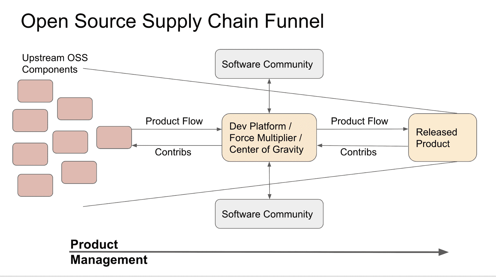

# 第 2 部分:操作化企业开发人员

> 原文：<https://thenewstack.io/part-2-operationalize-the-enterprise-developer/>

 [约翰·马可·沃克

约翰是第一资本公司开源项目办公室的主任。在加入 Capital One 之前，John 是开源协作的长期实践者和倡导者，在 Red Hat、EMC、Gluster、Hyperic 和 SourceForge 领导开源工作。](https://www.linkedin.com/in/johnmarkwalker/) 

在本系列的第 1 部分中，我介绍了企业开发人员是如何接管软件开发世界的，并指出了一些让开发人员更快交付价值的平台示例。然后，我将这与开发人员日常面临的复杂现状进行了对比。具有讽刺意味的是，当涉及到平台、框架和工具时，开发人员比以往有了更多的选择，但这是以降低用户体验为代价的。的确是选择的悖论。

虽然开发人员面临着复杂的局面，但我们有大量有用的构建模块供我们使用。也许更重要的是，我们可以通过遵循更好的实践来简化我们的开发人员工作流程。从短期来看，我们可以更好地利用现有资源，并投资于更高效的流程，以改进我们现有的持续交付工具。作为一个长期的解决方案，我们将着眼于一些潜在有用的技术，它们可能代表着开发人员体验的一次重大飞跃。但是现在，让我们想想如何把这些柠檬变成柠檬水。

## 更无聊

首先，无聊的事情——制造可靠的平台。如果工具和平台不可靠，并且没有达到预期的性能，您就不能操作您的开发工作流程。确保您的开发人员可以轻松地充分利用您的平台。如果您为 90%的用户解决了问题，您可以更轻松地创建简化治理、责任和合规性的系统。其他 10%的人可以建立他们自己的责任和治理系统，只要你为他们提供一种与核心 API 结合的方法。

为了完成以上任务，你首先需要[让你的平台变得无聊](https://skamille.medium.com/make-boring-plans-9438ce5cb053)。关于创新和创新应该发生在哪里，有很多话要说。如果从核心系统中分离出来，实验是很棒的。同样，您希望您的应用程序开发人员在增值的东西上进行创新和试验，而不是可能干扰您的业务运营的东西。利用现有资源。不要创建或再造你的核心平台。如果你有强烈的欲望去构建前沿平台，先问问你的开发者他们需要什么。构建比现有供应商已经提供的更多的平台是一项艰巨的任务，很难超越。相反，采用第三方平台，您知道这些平台可以在应用层上工作和创新。

## 软件供应链

接下来，你需要了解你的发展是如何发生的。考虑到在许多工程商店中，你的软件有很大一部分是开源的，我们需要停止把我们的工程工作看作是“创造”而更类似于系统集成。我们组装零件，将它们拼在一起，并为最终用户抛光。我发现将这种开发放在软件供应链漏斗的环境中是有用的，这种漏斗通常从左边(原始的上游组件)移动到右边(成品)。*【见图】*

当开发人员采用这些开源组件时，他们要么将它们作为胶水应用到现有的开发人员平台上，要么将这些胶水绑定组件到开发人员平台中。在开源生态系统成熟的这一点上，大多数开发者平台已经存在，就像组成平台的上游组件一样。通常，产品开发部门会寻找和部署合适的组件和平台，为最终用户将产品和服务粘合在一起。从现有的开发者平台，一点代码就可以搭建新的平台。

【T2

“左移”是更好的产品交付的一个关键。也就是说，为了做出一个伟大的发布，你需要一个伟大的开发者平台。为了拥有一个优秀的开发者平台，你需要更好的上游组件。向上游工作，改进和影响您构建的组件的方向，然后使用它们来创建更好的最终产品。

我可能不是第一个谈论积极管理您的[开源软件供应链](https://opensource.com/article/16/12/open-source-software-supply-chain)的人，但我至少从 2014 年就开始倡导这一点了。

然而，这意味着从左到右的流程并不总是像看起来那么简单。该图在每个阶段都有双向运动——持续的反馈和改进对于原始组件、开发人员平台和最终产品的发展至关重要。在这种模式中，上游移动对于有效管理技术债务和改进整体产品都是必要的。

虽然可能没有现成的解决方案可以做到这一点，但从本质上来说，肯定有工具和方法可以提供帮助。首先，您应该从最高质量的组件开始。这意味着使用各种扫描工具来检测和修复易受攻击的代码和错误。您还应该让您的开发人员尽早使用这些工具。没有什么比完成项目的 90%后才意识到你的构建模块需要立即修补或替换更糟糕的了。然而，扫描只是工具箱中的一个工具——您还需要确保您的开发人员可以修复或改进组件，并将它们应用到上游。

为什么这很重要？为了拥有一个高效的供应链，尽可能地减少日常维护是很重要的。如果你应用了只有你可以访问的补丁，那么恭喜你——你已经成为了一个开源项目的维护者。您现在负责应用任何和所有补丁，当您的 fork 不同步时重置基础，并保持它的正常运行。这是增加技术债务的一种方式。一般来说，您应该尽可能早地、尽可能频繁地将您的符合性检查构建到开发人员工作流中。如果你的“无聊平台”依赖于特定的平台、组件和设计选择，最好在最早的阶段将这些选择推给开发者。

随着您在产品交付阶段的进展，您应该在您的过程中建立正交集成和创新的期望。您选择的平台不仅支持您的直接团队，还支持任何其他发现您的平台稳定且有用的团队。在某种程度上，这需要在可靠性和安全性上权衡最新和最好的，偏向于支持尽可能广泛的生态系统。

最后，仅仅因为你到达了发布阶段并不意味着你可以停止改进开发中使用的过程或组件。让产品准备好发布必然意味着了解你的技术和过程中的差距**和**授权你的开发人员识别和修复这两者。您在产品开发过程中所学到的东西应该让您深入了解在开发平台、上游组件和方法上应该修复什么。

因此，如果我们想将它分解成几个步骤，从开发人员的角度来看，它可能是这样的:

*   提供对预先批准、认可的组件、运行时和框架的访问
*   让您的开发人员能够对他们的上游开发做出修正和改进
*   推动经过批准的、可靠的和**乏味的**开发者平台的标准化，支持开发者和产品的生态系统
*   启用并倡导开发者平台和支持的生态系统之间的高效反馈循环
*   当准备好发布产品时，除了上游开源构建块之外，确保有足够的途径向上游开发者平台提供反馈

公司使用大量的图表和流程图来记录软件开发生命周期——这是该主题的另一个变体。我更喜欢这个版本，因为它证明了双向上游维护的需要延伸到你的雇主的四面墙(缩放墙？);而大多数 SDLC 图则没有。事实上，您可以将供应链图叠加到 SDLC 流程之上，从而获得开发过程的清晰图像。

## 那么，接下来去哪里？

如果以上听起来工作量很大，你并不孤单。总有一天，一些有进取心的供应商或几个供应商会想出如何提供综合服务来解决上面提到的许多问题。然后，我们会把它全部拆掉，建造新的东西，因为这就是我们所做的。我们将重新发现我们之前在不同环境中解决的所有问题。这就是科技生活的圈子。

在此之前，我们将自动化，将我们的合规性构建到工作流中，减少(一些)开发人员的选择，在枯燥的平台上标准化，并通过授权您的开发人员为上游组件做出贡献来维持上游组件。

通过 Pixabay 的特色图片。

<svg xmlns:xlink="http://www.w3.org/1999/xlink" viewBox="0 0 68 31" version="1.1"><title>Group</title> <desc>Created with Sketch.</desc></svg>