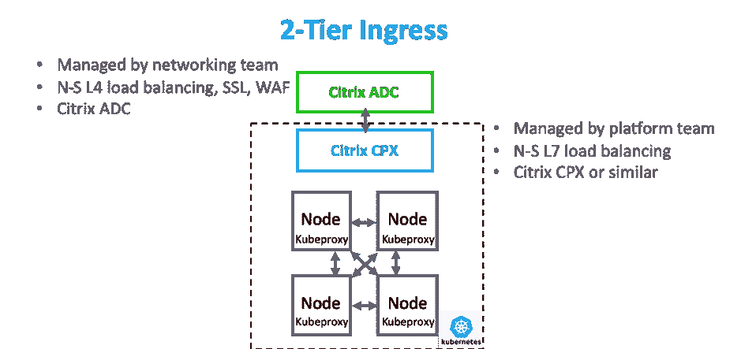
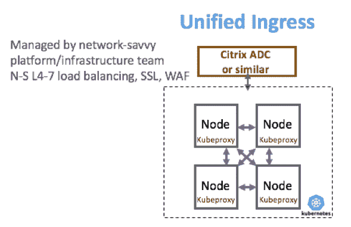

# 第 2 部分:为微服务应用交付选择代理架构的最佳方式

> 原文：<https://thenewstack.io/part-2-the-best-way-to-select-a-proxy-architecture-for-microservices-application-delivery/>

[Citrix](https://www.citrix.com/networking/microservices.html) 赞助了这篇文章。

 [潘卡伊·古普塔

Pankaj 是 Citrix 云原生应用交付解决方案高级总监。Pankaj 为客户提供混合多云微服务应用交付策略建议。在思科任职期间，他领导了网络、安全和软件产品组合的战略营销计划。Pankaj 热衷于与 DevOps 社区就基于微服务和 Kubernetes 的应用交付的最佳实践进行合作。](https://twitter.com/PankajOnCloud) 

本文是为交付基于微服务的应用程序选择合适的代理架构系列文章的第二篇。第一篇[文章](https://thenewstack.io/part-1-the-best-way-to-select-a-proxy-architecture-for-microservices-application-delivery/)介绍了选择正确的代理架构的重要性、评估标准以及四种架构选择的概述。本文将深入探讨双层入口代理架构。

我们的经验和观察表明，双层入口代理架构是在生产环境中部署应用程序的最快速、最简单的架构，对于云原生新手和专家都是如此。

双层入口代理架构具有两层应用交付控制器(ADC ),用于南北(N-S)流量。图中所示的第一个 ADC(即绿色 ADC)主要用于入站流量的 L4 负载平衡，以及 N-S 流量安全功能，如 SSL 终端和 web 应用防火墙(WAF)。它通常由熟悉面向互联网的流量的现有网络团队成员管理。这个绿色 ADC 可能是 Citrix ADC 或类似产品。绿色 ADC 还可以用于 L4-7 负载平衡、SSL 端接和同时使用的其它单芯片应用的 WAF 功能。

图中蓝色所示的第二个 ADC 处理 N-S 流量的 L7 负载平衡。它由平台团队管理，在 Kubernetes 集群中用于将流量导向正确的节点。第 7 层属性，如 URL 和 HTTP 头中的信息，可用于流量负载平衡决策。蓝色 ADC 不断接收关于 Kubernetes 集群内微服务 pod 的可用性和各自 IP 地址的更新，并可以决定哪个 pod 最能够处理请求。作为一个容器部署在 Kubernetes 集群中，蓝色 ADC 可以是容器中的思杰 CPX 或其他类似产品。

微服务单元之间的东西向(E-W)流量由开源 kube-proxy 管理，这是一个基本的 L4 负载平衡器，具有非常简单的基于 IP 地址的循环或最少连接算法。Kube-proxy 缺乏许多高级功能，如第 7 层负载平衡、安全性和可观察性，这使它成为东西流量的盲点。

让我们来评估双层入口代理架构如何满足对各利益相关方至关重要的七个关键标准。

## 应用程序安全性

安全性是所有应用程序的强制性要求，也是每个人最优先考虑的事情。绿色 ADC 应为南北向流量提供全面的第 3-7 层安全保护，大多数 ADC 都能做到这一点。SSL 终止最好在边缘完成，以便检查加密流量。绿色或蓝色 ADC 均可应用认证。Kube-proxy 为微服务间的 E-W 流量提供非常有限的网络策略和安全支持。对于东西网络策略和细分[项目，需要部署 Calico](https://www.projectcalico.org/) 或类似产品。一句话:双层入口为南北向流量提供了出色的安全性，但对东西向流量非常有限。

## 可观察性

可观察性对于理解微服务环境中发生的事情至关重要。拥有有价值的洞察力将有助于更快地发现问题和排除故障，并使现场可靠性工程师(SREs)能够调查事故以防止将来出现问题。

绿色和蓝色 ADC 为南北向流量提供出色的可视性，因为所有南北向流量都流经它们。他们可以将遥测数据报告给采集器进行处理，并进行后续的观察和故障排除。由于 kube-proxy 的遥测能力非常有限，因此对东-西交通的可视性非常有限。一句话:双层入口为南北向流量提供了出色的可观察性，但对东西向流量的可观察性非常有限。

## 持续部署

为了支持自动化 canary 部署、渐进部署、蓝/绿部署和回滚的高级流量管理，双层入口代理架构可自动管理 N-S 流量的不同微服务版本之间的流量。

对于南北向流量，双层入口代理架构具有出色的持续部署能力，因为它可以与 CI/CD 工具集成，如 Spinnaker 和 Jenkins X。对于东西向流量，kube-proxy 仅提供基本的负载平衡，并且缺乏与持续部署工具集成的 API。一句话:双层入口非常适合南北向流量的持续部署，但几乎不具备东西向流量的能力。

## 可扩展性和性能

双层入口架构非常适合南北向流量。多个 N-S ADC 可以组成一个主动/主动结构的集群，并行处理请求。E-W 流量依赖于 kube-proxy，它为用户空间、iptables 和 IPVS 提供了三种部署模式。由于 iptable 模式的可扩展性有限，所以建议在 [IPVS](https://kubernetes.io/blog/2018/07/09/ipvs-based-in-cluster-load-balancing-deep-dive/) (IP 虚拟服务器)模式下部署 kube-proxy，这种模式旨在获得更好的可扩展性、更好的响应时间和更低的 CPU 使用率，但它增加了复杂性。总之，双层入口对于南北向流量的可扩展性非常好，但对于东西向流量来说仅仅是好的。

## 开源工具集成

入口代理架构与其使用和熟悉的工具相集成是至关重要的。

对于南北交通，这是非常简单的。大多数用于南北交通的 ADC 将集成流行的开源工具，如 [Prometheus](https://prometheus.io/) 、 [Grafana](https://grafana.com/) 、 [Spinnaker](https://www.spinnaker.io/) 、 [Elasticsearch](https://www.elastic.co/) 、 [Fluentd](https://www.fluentd.org/) 和 [Kibana](https://www.elastic.co/products/kibana) 用于数据收集、监控和分析以及 CI/CD 参与。E-W 流量受到开源工具集成 kube-proxy API 的限制，这意味着更难执行 pod 间流量所需的任务。因此，双层入口选项为南北向流量提供了出色的开源工具集成，而为东西向流量提供了非常有限的集成选项。

## 对开源控制平面的 Istio 支持

随着企业转向统一控制平面，由 Google 和 IBM 与 Lyft 的 Envoy 团队合作开发的 Istio 正在成为一种流行的开源首选。许多用于南北向流量的 ADC 将与 Istio 集成，但用于东西向流量的 kube-proxy 目前不与 Istio 集成。底线:Istio 集成支持南北向流量，但不支持东西向流量。

## 所需的 IT 技能

因为双层入口代理架构在设计上是分叉的，所以很容易为控制设置特定的分界点；网络团队可以拥有和管理绿色 ADC，平台团队可以在 Kubernetes 环境中工作。无论是网络团队还是平台团队，都不需要学习很多新的东西。两个团队都可以继续以他们自己的速度做他们知道的事情，同时确保有效的应用交付。因此，我们的结论是，对于绝大多数网络和平台团队来说，双层入口是最简单、最快速的生产途径。

## 统一入口代理架构:精通网络的平台团队的绝佳选择

统一入口与双层入口代理架构非常相似，只是它将 N-S 流量的两层应用交付控制器(ADC 或代理)统一为一层。减少 ADC 层可有效消除 N-S 流量的一跳延迟。

统一入口在安全性、可观察性、持续部署、规模和性能、开源工具支持和 Istio 集成方面具有与双层入口代理架构相同的优点和缺点。不同之处在于实施所需的技能。借助统一入口，南北向流量的 ADC 和东西向流量的 kube-proxy 均由平台团队成员管理，他们必须精通网络才能实施和管理此类架构。

统一入口代理架构能够参与 Kubernetes 集群的覆盖网络。这使得它可以直接与微服务单元进行通信。因此，平台团队必须了解网络堆栈的第 3-7 层，才能充分利用这种架构。Unified ingress 也适用于内部面向员工的应用程序，并提供了一个选项来添加 web 应用程序防火墙(WAF)、SSL 终端和外部面向客户的应用程序。

与服务网格相比，统一入口代理架构的部署相当简单，并为 N-S 流量提供了出色的功能。但是，由于 kube-proxy 的局限性，并且因为它需要精通网络的平台团队来实现，所以它对于 E-W 流量的功能非常有限。

说到代理架构，有很多选择。在评估它们时，一定要考虑它们是否提供了适当的安全性、可观察性、高级流量管理和故障排除能力，并补充您的开源工具策略。这样做，我们觉得你会为你的组织做出正确的选择。

下一篇文章将深入探讨服务网格架构。敬请关注。

通过 Pixabay 的特征图像。

<svg xmlns:xlink="http://www.w3.org/1999/xlink" viewBox="0 0 68 31" version="1.1"><title>Group</title> <desc>Created with Sketch.</desc></svg>