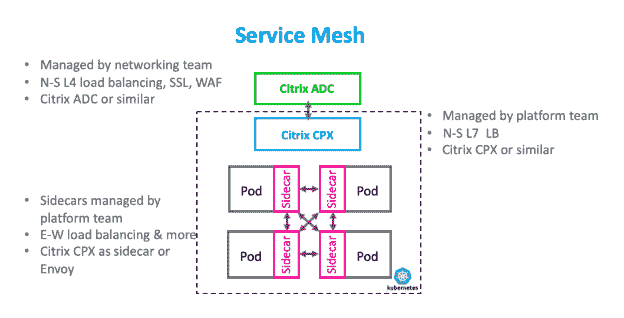

# 第 3 部分:为微服务应用交付选择代理架构的最佳方式

> 原文：<https://thenewstack.io/part-3-the-best-way-to-select-a-proxy-architecture-for-microservices-application-delivery/>

[Citrix](https://www.citrix.com/networking/microservices.html) 赞助了这篇文章。

 [潘卡伊·古普塔

Pankaj 是 Citrix 云原生应用交付解决方案高级总监。Pankaj 为客户提供混合多云微服务应用交付策略建议。在思科任职期间，他领导了网络、安全和软件产品组合的战略营销计划。Pankaj 热衷于与 DevOps 社区就基于微服务和 Kubernetes 的应用交付的最佳实践进行合作。](https://twitter.com/PankajOnCloud) 

本文是关于评估基于微服务的应用程序交付的代理架构的四篇系列文章的第三篇。[的第一篇](https://thenewstack.io/part-1-the-best-way-to-select-a-proxy-architecture-for-microservices-application-delivery/)文章提供了评估标准的概述和各种架构的总结。[的第二篇](https://thenewstack.io/part-2-the-best-way-to-select-a-proxy-architecture-for-microservices-application-delivery/)文章分析了双层入口代理和统一入口架构。本文将关注服务网格架构。

服务网格是最新最现代的应用架构。它的受欢迎程度最近出现了爆炸式增长，因为它为微服务中的流量(即东西向(E-W)流量)提供了最佳的可观察性、安全性和细粒度管理。然而，它是一个复杂的体系结构，可能适合也可能不适合您的组织。

以下是一些需要考虑的事项:

典型的服务网状架构类似于南北(N-S)流量的双层入口代理架构，并具有我在[上一篇文章](https://thenewstack.io/part-2-the-best-way-to-select-a-proxy-architecture-for-microservices-application-delivery/)中概述的丰富优势。

服务网格和双层入口之间的主要区别以及最大的价值在于，服务网格采用轻量级应用交付控制器(ADC)作为东西流量的每个微服务单元的边车。微服务也不直接沟通；微服务之间的通信通过边车进行，这使得单元间的流量在进入和离开单元时得到检查和管理。

通过使用代理边车，服务网格在微服务之间提供最高级别的可观察性、安全性和细粒度的流量管理和控制。此外，重试和加密等重复性微服务功能可以卸载到侧柜。尽管每个边车都被分配了自己的内存和 CPU 资源，但边车通常都是轻量级的。

对于 sidecar，可以选择像 Envoy 这样的开源解决方案或像 Citrix CPX 这样的解决方案。由平台团队管理并连接到每个 pod 的 Sidecars 创建了高度可扩展的分布式架构，但它们也增加了巨大的复杂性，因为它们添加了更多的移动部件。

让我们根据以下七个标准来评估服务网格代理架构，这七个标准是组织中各个利益相关者最关心的。

## 应用程序安全性

在微服务中，边车为东西交通提供了最好的安全性。本质上，微服务之间的每个 API 调用都是通过 sidecars 代理的，以获得更好的安全性。可以在微服务之间实施身份验证。可以设置策略和控制来防止误用。可以检查微服务之间的流量，以检查任何安全漏洞。

此外，加密可以在微服务通信中强制执行，加密功能可以卸载到边车。为了防止微服务不堪重负而发生故障，可以对微服务之间的流量进行速率限制。例如，如果一个微服务每秒只能接收 100 个呼叫，则可以设置速率限制。

使用服务网格，N-S 流量的安全性非常好，与双层架构提供的安全性相当。对于具有严格监管或高级安全需求的应用程序，如金融和国防行业部署的应用程序，服务网格体系结构是最佳选择。一句话:服务网格为南北向和东西向流量提供了出色的安全性。

## 可观察性

服务网格为微服务中的东-西流量提供了最佳的可观察性，因为所有 pod 间的流量对于侧柜都是可见的。来自边车的遥测数据可以通过开源或供应商提供的分析工具进行分析，以获得更好的见解，从而更快地进行故障排除或容量规划。服务网状架构的 N-S 流量可观测性非常出色，与双层入口代理架构提供的水平相当。一句话:服务网格为南北向和东西向流量提供了出色的可观测性。

## 持续部署

借助服务网格，面向连续部署的高级流量管理(如自动化 canary 部署、渐进式部署、蓝绿色部署和回滚)同样支持南北和东西流量。与 kube-proxy 不同，sidecars 拥有高级 API，使它们能够与 Spinnaker 等 CI/CD 解决方案集成。

一句话:服务网格为南北向和东西向流量提供了出色的连续部署能力。

## 可扩展性和性能

由于服务网格是一种分布式架构，因此它对于东西向流量具有高度的可扩展性。它还有助于扩展可观察性、安全性和高级流量管理和控制等功能。此外，将重复性功能从微服务转移到辅助服务还有额外的好处，包括重试、断路器和加密等优秀的候选功能。

性能取决于 sidecar 的选择，因为不同的 sidecar 供应商之间的性能和延迟可能有所不同。由于东-西流量由边车代理，使用边车会给 pod 间流量增加两个额外的跳，这将增加整体延迟。如果使用 Istio 控制平面，则会增加额外的延迟，向提供策略实施的 Istio 混合器增加一跳。在每个 pod 上运行 sidecars 需要内存和 CPU，这对成百上千个 pod 来说会非常快地增加。

服务网格提供了出色的 N-S 流量可扩展性和性能，与双层入口代理架构不相上下。

一句话:服务网格为南北向流量提供了出色的可扩展性和性能，虽然它对东西向流量也很出色，但要注意延迟影响和 CPU/内存需求，它们会随着 pod 数量的增加而线性增加。

## 开源工具集成

用于南北向流量的 ADC 和用于东西向流量的 sidecars 都集成了流行的开源工具，如 [Prometheus](https://prometheus.io/) 、 [Grafana、](https://grafana.com/)、 [Spinnaker](https://www.spinnaker.io/) 、 [Elasticsearch](https://www.elastic.co/) 、 [Fluentd](https://www.fluentd.org/) 和 [Kibana](https://www.elastic.co/products/kibana) ，用于数据收集、监控、分析和 CI/CD。大多数边车都有大量的 API 用于集成各种工具。

一句话:Service mesh 为南北向和东西向流量提供了优秀的开源工具集成。

## 对开源控制平面的 Istio 支持

用于南北向流量的 ADC 和用于东西向流量的 sidecars 都与 Istio 开源控制平面集成良好。请注意，Istio 为 Istio Mixer 增加了一个额外跳的延迟，这为东-西流量提供了策略实施。

底线:Istio 集成支持南北向和东西向交通。

## 必备的 IT 技能

服务网格极其复杂。管理成百上千的边车是一个巨大的挑战。这种新的分布式代理体系结构给 IT 带来了一个陡峭的学习曲线。平台团队面临的主要挑战可能是用边车管理如此多的移动部件。平台团队必须了解延迟和容量需求。他们必须能够排除任何数量的分布式代理以及数据平面和 Istio 控制平面组件中的问题。技术是新的，这并没有什么帮助——知识的源泉还很浅。此外，还存在人才短缺的问题。

一句话:平台团队将需要加快步伐并投资于学习，因为实现服务网格架构是复杂的，并且随着规模的增加会变得更加复杂。

服务网状代理架构是最先进的架构，可实现安全性、可观察性、细粒度流量管理、开源工具支持以及南北和东西流量的 Istio 集成。也是部署超安全微服务的合适选择。但这也带来了挑战。如果您没有准备好管理大量的边盘和增加的延迟，或者缺少资源来管理需要很高学习曲线的非常复杂的实施，那么它可能不适合您的组织。

[下一篇文章将关注“服务网格精简版”架构](/part-4-when-a-service-mesh-lite-proxy-is-right-for-your-organization/)，它提供了类似服务网格的好处，但更易于实现和管理。敬请关注。

来自 Pixabay 的特征图像。

<svg xmlns:xlink="http://www.w3.org/1999/xlink" viewBox="0 0 68 31" version="1.1"><title>Group</title> <desc>Created with Sketch.</desc></svg>