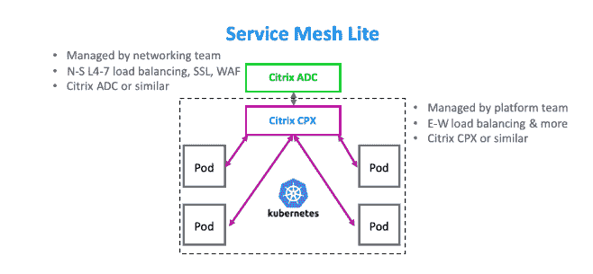
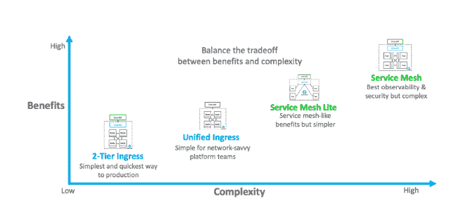

# 第 4 部分:什么时候“服务网格精简版”代理适合您的组织

> 原文：<https://thenewstack.io/part-4-when-a-service-mesh-lite-proxy-is-right-for-your-organization/>

[Citrix](https://www.citrix.com/networking/microservices.html) 赞助了这篇文章。

 [潘卡伊·古普塔

Pankaj 是 Citrix 云原生应用交付解决方案高级总监。Pankaj 为客户提供混合多云微服务应用交付策略建议。在思科任职期间，他领导了网络、安全和软件产品组合的战略营销计划。Pankaj 热衷于与 DevOps 社区就基于微服务和 Kubernetes 的应用交付的最佳实践进行合作。](https://twitter.com/PankajOnCloud) 

本文是关于评估基于微服务的应用程序交付的代理架构的四篇系列文章中的第四篇，也是最后一篇。[的第一篇文章](/part-1-the-best-way-to-select-a-proxy-architecture-for-microservices-application-delivery/)提供了评估标准的概述和各种架构的总结。[的第二篇文章](/part-2-the-best-way-to-select-a-proxy-architecture-for-microservices-application-delivery/)是对双层入口代理和统一入口架构的分析。第三篇文章关注服务网格架构。

我们在文章系列的最后描述了如果 IT 希望以更低的复杂性获得类似服务网状的好处，您有哪些选择。答案是“服务网格精简版”

服务网格是安全性、可观察性、细粒度流量管理和开源工具以及南北和东西流量 Istio 集成方面最先进的架构，但它很复杂。

使用 service mesh lite 架构，图中所示的绿色应用交付控制器(ADC)负责南北(N-S)流量的第 4-7 层负载平衡，以处理入站请求并负载平衡到正确的 Kubernetes 集群。绿色 ADC 可以执行 SSL 终止、web 应用防火墙、认证或其他网络服务。ADC 可以是 Citrix ADC 或类似产品，由网络团队管理。

根据隔离和规模要求，service mesh lite 代理架构使用一个或多个 ADC(图中以粉红色显示)代理微服务单元之间的通信，以管理单元间(E-W)流量，而不是使用连接到每个单元的独立侧柜。代理可以部署在每个节点上。

服务网格精简版提供了服务网格的许多优势，但由于每个集群只有一个 ADC 实例来管理单元间流量，因此降低了整体复杂性。最终结果是，由于所有流量都通过一个或多个 ADC，因此提供了与服务网状代理架构相同的高级策略控制、安全性和细粒度流量管理，而没有任何复杂性。

让我们根据七个关键标准来评估服务 mesh lite 代理架构:

### 应用程序安全性

服务网格精简版的安全优势与服务网格相似。绿色 ADC 为南北向流量提供出色的安全性。因为所有东西向流量都要通过粉红色 ADC，所以它可以提供出色的安全功能，如策略执行、网络分段、速率限制和 API 保护。然而，如果需要 E-W 加密，加密必须在每个单独的微服务中实施，因为没有像服务网格那样自动加密流量的边盘。随着像 Secure Production Identity Framework For every one(sp iffe)这样的新兴开源项目的出现，这有望变得更加容易。一句话:服务网格为南北向和东西向流量提供了出色的应用安全性。

### 可观察性

由于 ADC 可以看到南北向和东西向的应用流量，可见性非常好，与服务网格相当。一句话:服务网格 lite 为南北向和东西向流量提供了出色的可观测性。

### 持续部署

与服务网状网络一样，南北向和东西向流量都支持高级流量管理，用于持续部署，如自动 canary 部署、渐进式部署、蓝绿色部署和回滚。像 Spinnaker 这样的 CI/CD 工具也可以集成用于东西向流量。一句话:Service mesh lite 为南北向和东西向流量提供了出色的持续部署能力。

### 可扩展性和性能

与服务网格一样，这种架构也可以轻松扩展南北向和东西向流量，并受益于高级可观察性、安全性和流量管理。与服务网格相比，服务网格精简版的一个额外优势是它在东西流量的延迟方面少了一跳。一句话:服务网格为南北向和东西向流量提供了出色的可扩展性和性能。

### 开源工具集成

service mesh lite 和 service mesh 都存在与第三方工具的相同集成。

就像使用 service mesh 一样，它可以集成流行的开源工具，如 [Prometheus](https://prometheus.io/) 、 [Grafana、](https://grafana.com/)、 [Spinnaker](https://www.spinnaker.io/) 、 [Elasticsearch](https://www.elastic.co/) 、 [Fluentd](https://www.fluentd.org/) 和 [Kibana](https://www.elastic.co/products/kibana) 。一句话:Service mesh 为南北向和东西向流量提供了优秀的开源工具集成。

### Istio 支持

Service mesh lite 支持南北向流量的 Istio 集成。Istio 对东西向流量的支持往往不完全，但正在迅速缩小差距。一句话:使用 Istio 作为开源控制平面为南北向和东西向流量提供了良好的支持。

### 需要更少的 IT 技能

service mesh lite 的主要优势在于，与 service mesh 相比，实现和管理它所需的 IT 技能要简单得多。与双层入口类似，网络团队可以管理绿色 ADC，平台团队可以管理粉色 ADC，因此两个团队都可以按照自己的速度前进。底线:无论是网络团队还是平台团队都不需要什么新知识。

对于希望获得类似服务网格的特性而又不那么复杂的组织来说，Service mesh lite 代理体系结构是一个极好的选择。它还提供了从双层入口架构的轻松过渡，带来了更好的可观察性、增强的安全性、与开源工具的更好集成以及对东西流量持续部署的支持等额外优势。

## 结论

在选择正确的架构时，没有对错之分。

想要最快速、最简单的生产部署架构的云原生新手可以从两层入口开始。如果需要完全控制基于微服务的应用，并针对南北和东西方向的流量提供可见性、安全性和集成，那么最佳架构选择是服务网格，但前提是它非常复杂。如果 IT 希望获得服务网格的好处，同时降低复杂性，那么服务网格精简版可能更合适。或者从两层入口开始，随着时间的推移迁移到服务 mesh lite。

要为您的组织做出最佳选择，请考虑您的应用程序交付控制需求和 IT 团队的技能，然后权衡好处和复杂性。最重要的是，要从长计议，这样您才能满足当前的业务需求，并为未来进行扩展。

来自 Pixabay 的特征图像。

<svg xmlns:xlink="http://www.w3.org/1999/xlink" viewBox="0 0 68 31" version="1.1"><title>Group</title> <desc>Created with Sketch.</desc></svg>