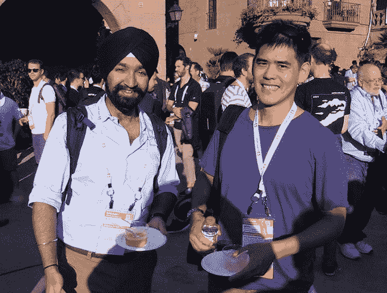
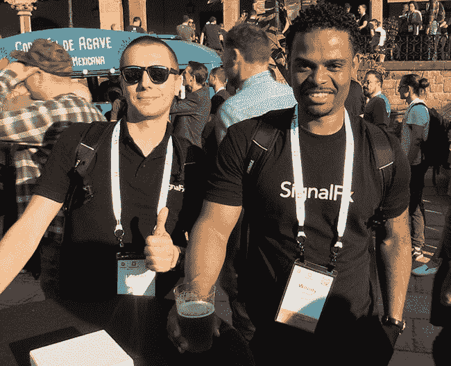
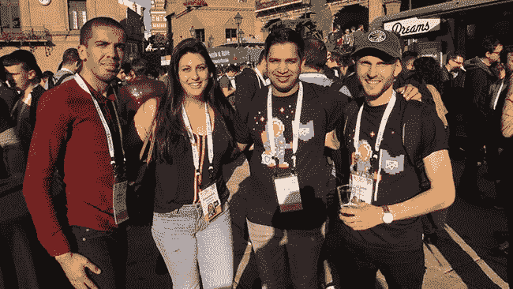

# 派对赛道:KubeCon + CloudNativeCon +巴塞罗那+海鲜饭+ Estrella Damm...

> 原文：<https://thenewstack.io/party-circuit-kubecon-cloudnativecon-barcelona-paella-estrella-damm/>

*运行 [KubeCon + CloudNativeCon](https://events.linuxfoundation.org/events/kubecon-cloudnativecon-europe-2019/schedule/) 的人们总能找到精致的地点举办与会者派对，今年在巴塞罗纳举办的活动也不例外。 [Poble Espanyol](https://www.poble-espanyol.com/en/) 是一座由 117 栋建筑重建而成的城镇，这些建筑展示了西班牙各地区的主流建筑。在美丽的夜空下，技术人员聚集在一起谈论他们自己的建筑，并与朋友和远方的同事聊天，同时享受海鲜饭和美味的地方啤酒 Estrella Damm。*

谷歌的戈宾德·乔哈尔(左)和[韦伯·杜](https://github.com/bowei)。

SignalFX 的康拉德·帕库拉(左)和伍迪·拉贝约夫。

中层阵容在库贝肯(从左到右)全部到齐:[索菲恩·马祖吉](https://twitter.com/Sofyen_Mrzg)，亚历山德拉·斯蒂德曼，鲁尔·谢诺伊，安托万·比内特瑞。

*Norris Deajon 是奥斯汀地区的一名摄像师/摄影师。*

AspenMesh、KubeCon + CloudNativeCon、VMware 是新堆栈的赞助商。

<svg xmlns:xlink="http://www.w3.org/1999/xlink" viewBox="0 0 68 31" version="1.1"><title>Group</title> <desc>Created with Sketch.</desc></svg>