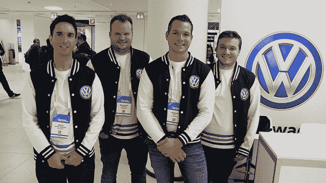

# Party Circuit:在欧盟云铸造峰会上庆祝开源

> 原文：<https://thenewstack.io/party-circuit-toasting-open-source-at-the-cloud-foundry-summit-eu/>

海牙的街道两旁是庄严的历史建筑，它是荷兰的政府所在地，也是世界各国司法的所在地。然而，在 9 月 11 日，人们从四面八方来到海牙的世界论坛会议中心，寻求有关开源应用程序和平台的信息。[云铸造基金会](https://www.cloudfoundry.org/)为其 [2019 欧盟云铸造峰会选择了这座美丽的城市。](https://www.cloudfoundry.org/event/summit/)下面是几张参加展位爬行和其他社交活动的与会者的照片。

大众汽车公司的工作人员——耶稣·安东·塞拉诺、本杰明·阿德霍尔德、提莫·德罗夫和罗曼·沃尔夫。

Cloud Foundry Foundation 和 Pivotal 是新堆栈的赞助商。

<svg xmlns:xlink="http://www.w3.org/1999/xlink" viewBox="0 0 68 31" version="1.1"><title>Group</title> <desc>Created with Sketch.</desc></svg>