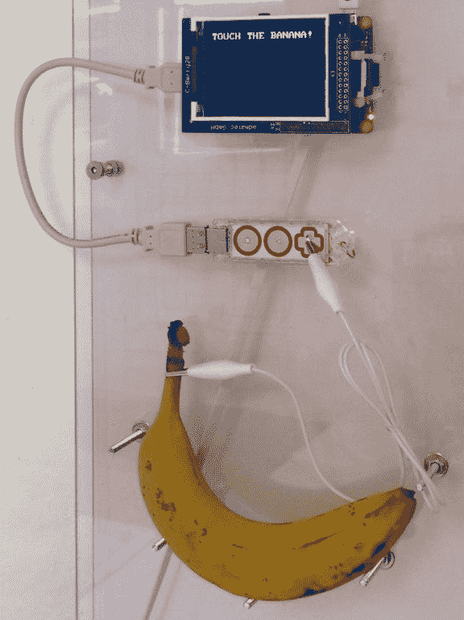

# 密码分发香蕉投入生产

> 原文：<https://thenewstack.io/password-dispensing-banana-pushed-production/>

 周四早上，丹麦的一名网络管理员[发布了关于他的最新项目](https://www.reddit.com/r/networking/comments/41z4x1/quick_update_on_the_wireless_banana/)的更新——一种可以分发 Wi-Fi 密码的香蕉。“香蕉已经安装完毕，正在生产中，”他在 Reddit 上发帖，分享了[两张](http://i.imgur.com/IJ6zvTw.jpg) [图片](http://i.imgur.com/2PfhXVz.gifv)。

香蕉使用 Makey Makey 生产的特殊电路板[在香蕉和一台附有屏幕的廉价 Raspberry Pi 计算机之间形成连接。果然，一个](http://shop.makeymakey.com/products/makey-makey-go)[动画。gif](http://i.imgur.com/2PfhXVz.gifv) 显示按下香蕉确实会触发显示新的 Wi-Fi 密码。

“很有趣，”网络管理员[发帖称](https://www.reddit.com/r/networking/comments/41j04h/wifi_guest_access_you_gotta_touch_the_banana/cz3v10s)，他在 Reddit 上的账号是 SysVival。在回答这个不可避免的问题——归结为“为什么”——时，他回答说“它会让人微笑。这比静态的 WPA 密码有趣多了。”

最重要的是，“当人们离开我们的办公室时，他们无法访问我们的 WI-Fi，因为没有香蕉可以触摸。”

秘密成分似乎是 Makey Makey 的 GO，这是他们的[启动电路板](http://shop.makeymakey.com/products/makey-makey-go)的一个新版本，售价 19 美元。一个宣传视频显示，它可以检测到手指在甜甜圈、苹果甚至果冻上的按压。是的，它还可以检测到手指在香蕉上的按压。

人类手指的触摸会产生微小的电连接，然后改变香蕉的电容，这种变化可以被电路板检测到。SysVival 的照片显示[一根引脚电缆搁置在香蕉](http://i.imgur.com/HfqaRAJ.jpg)上，电路板的 USB 棒将其连接到树莓 Pi。

“电脑只是认为你在触摸键盘或鼠标，”Makey Makey 在他们的视频中解释道，该视频帮助他们在去年夏天通过 KickStarter 活动筹集了近 20 万美元。但是他们的新设备直到上个月才开始发货——直到这个星期，其中一个才被用来创造一个事件激活的香蕉。

这个网络管理员有一种邪恶的幽默感。用户输入密码的实际网页的特征是[一只狗在背景中舔着屏幕](http://i.imgur.com/DoFlTVM.gif)。

他的最后一个项目是[一个网络控制的转子灯](https://www.reddit.com/r/sysadmin/comments/3vrnih/i_built_a_network_controlled_rotor_light_for_our/)，它通过闪烁的红灯提醒服务台未关闭的门票，让人想起警车。“我做了一个 cron 作业，每五分钟运行一次，”他在 Reddit 上解释说，“如果 Zendesk 中有任何未签名的门票，它会让红灯闪烁五秒钟。”这些灯售价 15 美元，由一个简单的 [TCP 激活的功率继电器](http://www.aliexpress.com/store/product/Network-4-CH-Ethernet-relay-board-Android-phone-computer-Control-smart-home-automation-control-remote-control/319400_32263912234.html)激活，售价 49 美元。

有人在 Reddit 上回应道:“这将会非常令人讨厌。”。

“这就是我的目标，”网络管理员回答道。

他的香蕉黑客[于周一](https://www.reddit.com/r/networking/comments/41j04h/wifi_guest_access_you_gotta_touch_the_banana/)首次出现在 Reddit 的企业网络链接分论坛上，并迅速成为该论坛过去 12 个月[最受欢迎的链接](https://www.reddit.com/r/networking/top/?sort=top&t=year)和[有史以来第二受欢迎的链接](https://www.reddit.com/r/networking/top/?sort=top&t=all)。“我是香蕉界的史蒂夫·乔布斯，”网络管理员一度开玩笑说。他还发誓他永远不会改变香蕉，因此最终只有触摸一只被果蝇包围的旧的棕色香蕉才能分发密码，这代表了物联网的又一个新的里程碑。

“如果你想要无线网络，你必须触摸它。再臭你也摸！!"

* * *

## WebReduce

*   空间站指挥官展示第一朵在外太空生长的花。
*   SpaceX 的猎鹰火箭降落在他们的无人机上，但随后[翻倒并爆炸](https://www.instagram.com/p/BAqirNbwEc0/)(视频)。
*   Siri 的发明者正在打造一个全新的人工智能[，它会做你要求的任何事情](http://www.wired.com/2014/08/viv/)。
*   宣布 [Wolfram 编程实验室](http://blog.wolfram.com/2016/01/19/announcing-wolfram-programming-lab/)。
*   比较 C，Julia，Python，Numba，Cython 的速度[。](https://www.ibm.com/developerworks/community/blogs/jfp/entry/A_Comparison_Of_C_Julia_Python_Numba_Cython_Scipy_and_BLAS_on_LU_Factorization?lang=en)
*   Node.js 在 2015 年被[下载了 91932773 次——平均每天 266472 次下载，仅 12 月 9 日一天就有 487658 次下载。](https://nodesource.com/blog/node-by-numbers-2015/)
*   Cloud Foundry 庆祝[一周年](https://twitter.com/sramji/status/687439810705764352)。
*   JFrog 筹集了 5000 万美元为物联网提供应用商店。
*   雅虎为研究人员发布了有史以来最大的机器学习数据集。
*   微软慈善捐赠[10 亿美元云计算资源](http://news.microsoft.com/2016/01/19/microsoft-philanthropies-announces-commitment-to-donate-1-billion-in-cloud-computing-resources-to-serve-the-public-good/)“用于公益”

<svg xmlns:xlink="http://www.w3.org/1999/xlink" viewBox="0 0 68 31" version="1.1"><title>Group</title> <desc>Created with Sketch.</desc></svg>