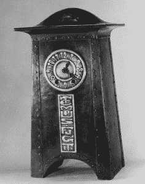

# 好心铺路:拯救网络时间协议的尝试

> 原文：<https://thenewstack.io/paving-good-intentions-attempt-rescue-network-time-protocol/>

在 Heartbleed bug 于 2014 年 4 月揭露了 OpenSSL 项目的人员不足和资金不足之后，[网络时间基金会](http://nwtime.org/)被发现是处于类似状况的几个项目之一。不幸的是，由于项目分叉，向国家结核控制规划提供支持的努力只是分裂了发展社区，并在原本只有一个项目的地方创造了两个争夺资金的项目。

[网络时间协议](http://www.ntp.org/) (NTP)是一个[互联网工程任务组](https://www.ietf.org/about/) (IETF)协议。它负责使用各种参考时钟作为指南，在服务器之间同步时间。对于普通用户来说，这个功能似乎无关紧要，但知道千分之一秒或更少的时间对于无数的计算机功能来说是必不可少的。例如，电子股票交易的确切时间可能意味着数百万美元的差价。类似地，在 2003 年美国东北部和加拿大的大停电中，在停电前的 9 秒钟内，记录了 10000 个事件，但是，因为它们没有准确的时间标记，所以证明不可能准确地记录发生了什么并从发生的事情中学到什么。

正如[网络时间基金会网站所观察到的](http://nwtime.org/about/about-time/)，“知道时间并不重要。直到它是。”

NTP 最初是由大卫·l·米尔斯在 1985 年写的。今天，这个项目已经由哈伦·斯滕管理了多年，他开发协议的时间经常超出资金，而且主要是自愿牺牲他自己的咨询业务。目前，该项目有四个主要贡献者，其中一人正在休假。该项目是网络时间基金会的一部分，但其他贡献者正在从事相关项目，所有这些项目都[一样人手不足](http://nwtime.org/about/our-team/project-members/)。

19 世纪的美国钟。资料来源:纽约市气象局。

当斯滕向互联网土木工程研究所(ICEI)寻求资金，并最终试图与 ICEI 代表 Eric S. Raymond 和 Susan Sons 合作时，拯救 NTP 的努力开始变得复杂。关于到底发生了什么，说法不一，但合作并不成功。

在一次采访中，后来与 Raymond and Sons 合作的 Mark Atwood，主要分歧是关于“开发速度、贡献者的适当信任、构建工具的更新和修复，以及关于搁置多长时间和私下传播安全问题的政策”的技术分歧

然而，Atwood 表示，主要问题是 Stenn 更喜欢使用 BitKeeper 进行版本控制，而不是 Git。“当时，”阿特伍德说，“Bitkeeper 仍然是专有的，并且有许可条款，禁止任何 BitKeeper 用户对任何其他竞争的开源控制工具做出贡献，所以大多数开源开发者拒绝接触它。”

相比之下，斯滕在接受采访时讲述了一个不同的故事。根据 Stenn 的说法，他确实短暂地维护了一个 Git 仓库，主要是因为这样做是从 Linux 基金会的[核心基础设施倡议](https://www.coreinfrastructure.org/) (CII)获得资金的要求——部分是在 Atwood 的建议下，Atwood 当时是 CII 的顾问。Stenn 声称，当 Sons 收到美国国家科学基金会的一小笔拨款，在几个月内修复 NTP 时，转折点就来了——他认为这是不现实的。

斯滕恩说，“她极力推动让我和网络时代基金会把 NTP 项目交给她进行抢救。他们会解决问题，除掉我，干掉 NTF，然后把 NTP 交给一个维护团队……我反复告诉苏珊，除非她把自己的方式从救援者转变为合作伙伴，否则我们不会在一起工作。”斯滕指控说，他拒绝按照儿子的方式做事导致她的资助减半，并且，随着合作努力的失败，儿子和雷蒙德宣布了一个名为 [NTP 安全(NTPsec)](https://www.ntpsec.org) 的分支。

这两个项目在 2016 年都得到了 CII 的部分资助，但是，随着优先事项从直接资助转移，这两笔赠款似乎都没有延期。

## 性格的冲突

Atwood 声明“我们对 NTF 或 Harlan Stenn 没有个人敌意”，并呼吁 NTP 和 NTPsec 之间的合作。然而，NTPsec 的贡献者意见不一。例如，NTPsec 的安全官员丹尼尔·弗兰克(Daniel Franke)称 NTPsec 为[“一个敌对的分支”。](https://blog.ntpsec.org/2016/12/13/fantastic-bugs-and-where-to-find-them.html)

Sons 在评论 NTP 时尤其直言不讳。在与 O ' Reilly 的 Mac Slocum 的视频采访中，她说，当试图与 NTF 合作时，她开始意识到“如果我不解决这个问题，互联网将会崩溃”——这一说法证实了 Stenn 对合作尝试失败原因的描述。

在采访中，Sons 还声称 NTP 的构建系统位于一个根密码丢失的服务器上，代码已经过时，“甚至无法使用现代工具进行审计”，安全补丁的发布被过度延迟。

> “即使几年也不足以掌握一切。”—哈兰·斯坦恩

然而，斯滕否认了这些说法。他还指出，NTP 是该协议的“完整参考实现”,只要有需求，就必须支持旧系统。“我们建立在许多不同版本的不同操作系统上，在各种各样的硬件架构上，”Stenn 说。“如果有重大问题，为什么没有人向我们报告？”他补充说，该项目在 2016 年发布了[五个主要补丁，并且在 2009 年至 2014 年间，平均每年更新 85 个软件。](http://support.ntp.org/bin/view/Main/SecurityNotice#Recent_Vulnerabilit)

儿子也不止于此。尽管她和 Stenn 都同意 NTP 需要新的志愿者，但 Sons 描述了这个问题，称 NTP 等核心基础设施项目的开发人员通常“比我父亲年长”，而且“并不总是与时俱进”，并建议他们“应该退休”。

## 两种编码方法

严格来说，NTP 的和 NTPsec 的代码没有可比性。一方面，阿特伍德解释说，“我们一直非常小心，没有触及米勒博士的算法和基础数学，”而是致力于“包裹在它周围的东西”，如公用事业。另一方面，NTP 项目认为它有义务支持旧机器，继续支持甚至有缺陷的代码也比完全不支持要好。

这些差异可以解释为什么 NTPsec 不断地将删除大约 170，000 行代码作为一项成就。理由是更少的代码意味着更少的错误——例如，Raymond 在一封电子邮件中解释说，通过减少代码库，NTPsec 在许多情况下“在漏洞为人所知之前就消除了攻击面。”

18 世纪的法国时钟。资料来源:纽约市气象局。

然而，至少在某些地方，这种成就可能是以牺牲功能为代价的。Stenn 声称，NTPsec“已经删除了许多零报告错误的东西，如 sntp、ntpsnmpd 代码和各种 refclocks，”只是因为它没有立即有用。同样，虽然 Windows 部分的代码可能早就应该重写了，但 NTPsec 在替换代码准备好之前删除它似乎是一个安全解决方案，至少与问题一样麻烦。

NTPsec 的其他成就，比如用 Python 而不是 Perl 重写一些相关的工具，看起来更像是一种偏好，而不是实际的改进。正如 Stenn 指出的，还有其他一些问题值得怀疑，例如当“在一个版本的 C 编译器上消除编译器警告会导致在同一操作系统上不同版本的 C 编译器产生新的警告”时，NTPsec 是否可以修复所有的编译器警告同样，Stenn 质疑 NTPsec 声称已经将 NTP 计时的精度提高了 10 倍，因为“操作系统的内部时钟精度通常远没有那么好。”至于让构建方法更快，Stenn 指出，当代码被删除时，编译自然会更快。

NTPsec 当然可以声称取得了一些有用的成就，比如创建了清晰简洁的文档，包括 Raymond 关于在 Raspberry Pi 中添加[时间服务器的说明。然而，它声称的许多成就听起来像是公共关系，其首要目标是通过暗示贬低其竞争对手的代码。](https://www.ntpsec.org/white-papers/stratum-1-microserver-howto/)

经过研究，许多这些声明给人的印象是，NTPsec 做得太多太快，而且可能对一个拥有 30 多年历史的大型代码库了解太少。尽管有自己的经历，Stenn 承认他自己对代码的理解有时会发生巨大的变化，甚至是关于他认为他理解的主题。“如果你不确切了解每件事是如何运作的，以及它在哪里合适，当事情变得繁忙时，可怕的事情就会发生。甚至几年也不足以掌握一切。”

正如 Atwood 所观察到的，这两个项目方法的不同之处在于，对于 NTP 来说，制定方案是一个科学的过程，在这个过程中，精确很重要，谨慎是一种美德。但是，对于 NTPsec 来说，该协议只是另一个开源项目，其中的错误可以在下一个版本中得到纠正。这些差异导致了优先事项的重大差异。

对 NTPsec 来说，NTP 是保守的，对保留代码过于谨慎。作为回报，对 NTP 来说，NTPsec 似乎不知情，也不在乎做出改变。没有人需要表明立场就能意识到这两种观点很难调和。

## 善意的失败

Sons 宣布她已经“向前看”，不再积极参与 NTPsec，因此这两个项目可能有机会在追求各自目标的同时实现和解。作为临时项目负责人，阿特伍德在谈话中表现出比儿子们更少的对抗性，以及对斯滕多年来所做工作的真正尊重，这可能意味着合作可能会慢慢成为可能。

问题是，Sons 在宣传她对事件的看法方面非常成功，以至于即使在她离开后，两个项目之间的敌意仍在继续。

青铜钟，1890-1905 年，纽约大都会博物馆。

与此同时，那些努力可能被更好地集中起来的程序员处于对立的阵营，并且正在争夺已经稀缺的资金，这些资金通常来自相同的来源。无论你倾向于哪个项目，这个结果都很难被认为是进步。

当所有的个性和技术问题被搁置一边，事实仍然是，经过两年的关注，网络时间协议的未来仍然过度依赖于少数过度工作和报酬过低的志愿者。最后，这些问题在今天看来并没有比几年前更接近解决，当时几乎没有用户听说过这个协议。

专题图片:[17 世纪末德国镀金青铜钟](http://www.metmuseum.org/art/collection/search/196391?sortBy=Relevance&amp;ft=clock&amp;offset=0&amp;rpp=100&amp;pos=42)，纽约[大都会艺术博物馆](http://www.metmuseum.org/)，公共领域。

<svg xmlns:xlink="http://www.w3.org/1999/xlink" viewBox="0 0 68 31" version="1.1"><title>Group</title> <desc>Created with Sketch.</desc></svg>