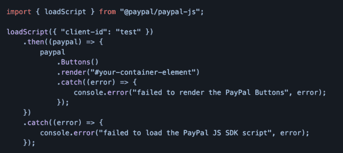
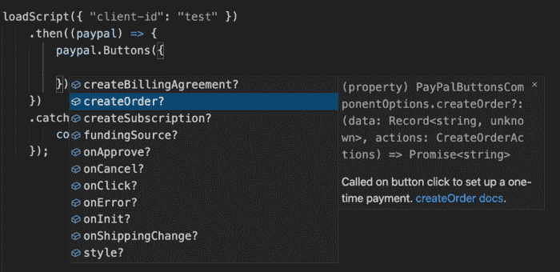
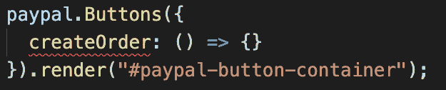
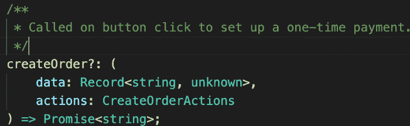
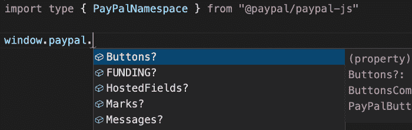
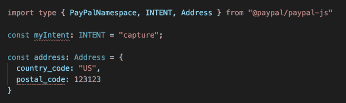
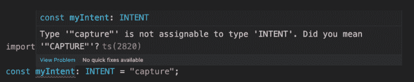

# PayPal 通过 TypeScript 类型定义增强了 JavaScript SDK

> 原文：<https://thenewstack.io/paypal-enhances-javascript-sdk-with-typescript-type-definitions/>

电子支付巨头 PayPal 在其 JavaScript SDK、 [paypal-js npm 包](https://github.com/paypal/paypal-js#paypal-js) 中加入了 TypeScript 类型定义。

TypeScript 类型将允许 JavaScript 开发人员享受与 TypeScript 用户相同的好处，例如详细的类型定义、到文档的直接链接和类型提示。Paypal 开发人员关系经理 Jamund Ferguson 在最近的[博客文章](https://medium.com/paypal-tech/using-typescript-to-speed-up-development-with-the-paypal-javascript-sdk-84dbb21ad2ae)中解释说，有了这些，应用程序开发人员将“在编写应用程序时更有效率”。

PayPal 的类型定义可作为 *loadScript()* 方法的一部分一起导入，或单独使用导入类型功能导入。下面的帖子将重点介绍该包的一些特性，并提供如何“利用类型定义来加速 PayPal 应用程序的开发”的见解。

无论是使用 *loadScript()* 还是导入类型功能，包的安装都是一样的。

`npm install @paypal/paypal-js`

## **用 LoadScript 进行类型定义**

paypal-js 模块允许简单地异步加载 PayPal JavaScript SDK。流程如下:

*   *paypal-js* 模块提供了 *loadScript()* 方法。
*   *loadScript()* 将 SDK *<脚本>* 标签注入到页面上。
*   当脚本标签被注入到页面上时，会返回一个承诺。
*   该承诺在脚本成功加载后解析。

使用该实用程序，诸如处理错误和在参数改变(例如货币改变)时重新加载脚本之类的任务变得容易多了。

下图展示了一个基本的使用示例。

## **打字稿提示**

在 TypeScript 和 JavaScript 文件中，一旦 P aypal 在 loadScript 回调中被键入，TypeScript 自动完成就会出现。自动完成功能将显示 PayPal 名称空间上所有可能的优先级(导航可获得每个优先级的更多详细信息)。

TypeScript 类型定义概述了输入的预期内容以及预期的返回值。在上面的例子中，这可以在下拉菜单的创建订单按钮的高亮选项中看到。就在它旁边，有一个第二菜单，准确地显示了创建订单按钮的内容。

*createOrder* 选项接受一个回调，该回调可以接受两个参数:一条记录和 *CreateOrderActions。* 记录是一个标准的 JavaScript 对象，键是一个字符串，值被列为 unknown，这意味着它可以是任何值。这将返回一个包含订单 id 的承诺，一个字符串值。第二个参数，*CreateOrderActions*是另一个对象。

如果缺少任何内容或输入不正确，IDE 将不会指出错误。

将鼠标悬停在文本上将提供关于缺少的参数的详细信息，并点击 cmd-单击 *createOrder* 方法将直接将开发人员带到 TypeScript 定义。

## **选择加入附加功能**

尽管 JavaScript SDK 类型定义是日常综合的，但支持的方法取决于传递到 JavaScript SDK *<脚本>* 标记中的组件查询参数。默认情况下，Buttons 是唯一支持的方法。 [脚本配置指南](https://developer.paypal.com/sdk/js/configuration/#components) 有更多关于选择必要组件的细节。

## **没有 LoadScript 的类型脚本定义**

在用户应用程序中启用类型脚本定义不需要使用 *loadScript()* 方法。使用导入类型语法而不是更常见的导入语法将绕过将依赖性引入应用程序，并在构建时授予访问 TypeScript 的好处，而不会增加包的大小。

从 *paypal-js* 模块导入和导入类型都提供了对 *loadScript* 模块和全局 *window.paypal* 变量的类型定义的访问。

为 PayPal JavaScript SDK 维护的所有类型都是从 *paypal-js* 模块的根直接导出的，可以单独导入。

在上面的例子中， myIntent 和 postal_code 属性都输入错误，提示类似下图中的错误。这说明了使用导入和导入类型语法时类型定义功能之间的相似性。

有几十种与 PayPal 相关的类型，每一种都有自己丰富的关于属性和用途的文档，可供应用程序使用。

<svg xmlns:xlink="http://www.w3.org/1999/xlink" viewBox="0 0 68 31" version="1.1"><title>Group</title> <desc>Created with Sketch.</desc></svg>