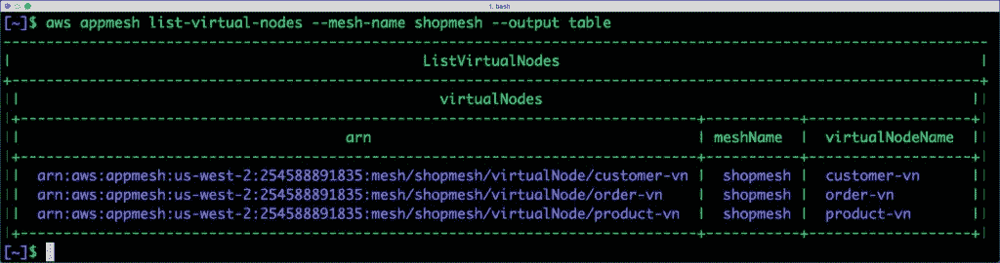
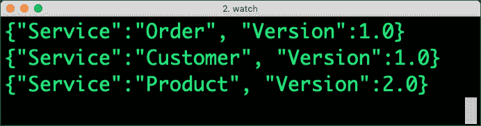
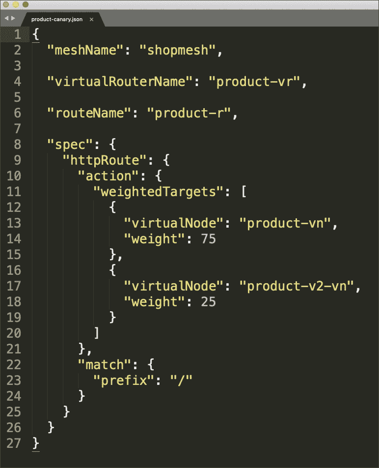

# 通过亚马逊 EKS 上的 AWS 应用网格执行金丝雀部署

> 原文：<https://thenewstack.io/perform-canary-deployments-with-aws-app-mesh-on-amazon-eks/>

在本教程中，我将带您浏览使用 AWS App Mesh 在亚马逊 EKS 上执行 canary 部署所需的所有步骤。在本系列的[上一篇文章](https://thenewstack.io/aws-app-mesh-amazons-own-service-mesh-for-microservices/)中，我介绍了 AWS App Mesh，这是一个托管服务 Mesh，用于控制和监控部署在 Amazon Web Services 中的微服务。

在 canary 部署中，的软件更新将向一小部分用户推出。通过这种方式，新功能和其他更新可以在面向整个用户群上线之前进行测试。在这个关于设置 canary 部署的教程中，我们将处理一个具有三种服务的电子商务应用程序——订单、产品和客户。订单服务作为 REST 端点向外界公开，而产品和客户微服务由订单消费。

【T2

目标是将下一版本的产品微服务部署为一只金丝雀，只向其发送一部分流量。在有限流量的生产环境中测试新服务后，我们将逐渐增加发送到最新版本的请求数量，并终止先前版本的实例。

所有三个微服务及其新版本都将部署在亚马逊 EKS。我们将把这些服务集成到应用网格中，以应用影响流量的策略。

先决条件是:

*   对 Docker & Kubernetes 有基本了解
*   主动订阅 AWS
*   最新版本的 [AWS CLI](https://aws.amazon.com/cli/)
*   [eksctl](http://eksctl.io) 和 [kubectl](https://kubernetes.io/docs/tasks/tools/install-kubectl/) 二进制文件

通过克隆 [Github 库](https://github.com/janakiramm/app-mesh-tutorial)开始本教程。

### 构建和推送 Docker 图像

对于本教程，我们使用通过 Python 和 Flask 构建的极其简单的 REST API。这些服务被打包成 Docker 容器映像。调用 REST API 端点将简单地返回包含服务名及其版本的元数据。

请随意探索 services 文件夹的 **src** 目录中的代码。

如果您想使用存储在您自己的 Docker Hub 帐户中的图像，请在构建好图像后推送它们。如果您想在不构建和推送图像的情况下尝试本教程，您可以安全地跳过这一步。

```
cd Services
export DOCKER_HUB_USER='Your Docker HUB username'
./build.sh
cd  ..

```

### **配置 AWS 应用网格**

在我们在 Kubernetes 中部署基于微服务的应用程序之前，我们需要准备好应用程序网格配置。这将建立控制平面来处理网络拓扑和路由规则。

使用以下命令创建网格和整个拓扑。确保您位于网格文件夹中。

```
cd Mesh
./create_mesh.sh
cd  ..

```

该命令为订单、产品和客户服务的 V1 创建虚拟节点。产品和客户服务被称为订单虚拟节点的后端。为指向服务的 DNS 名称的每个虚拟节点配置一个虚拟路由器。每个虚拟路由器都与将流量驱动到同一虚拟节点的路由相关联。

您可以查看每个服务目录中的 JSON 文档，其中包含虚拟节点、虚拟路由器和路由的定义。

此时，我们已经为将部署在 EKS 的应用程序的 V1 建立了基线网格配置。

通过 AWS CLI 浏览拓扑。

  

## 启动亚马逊 EKS 集群

对于本教程，一个 **t2.medium** ，一个节点 EKS 集群就足够了。让我们通过运行调用 **eksctl** 实用程序的脚本，在 **US-West-2** 地区启动它。

```
cd EKS
./launch_cluster.sh

```

等待单节点集群配置完毕并准备就绪。


## **部署并测试应用程序的 V1**

有了应用网格和 EKS 集群，我们就可以部署和测试我们的应用了。

如果您想使用推送到您自己的 Docker Hub 帐户的定制图像，通过运行如下所示的脚本用图像名称更新 Kubernetes 工件。如果您想使用我的存储库中的默认容器图像，请跳过此步骤。

转到 Kubernetes 文件夹，执行下面的命令:

这导致了三个部署和三个服务的创建。订单服务通过弹性负载平衡器(ELB)公开。


几分钟后，您可以通过 ELB 向*订单*服务发送 GET 请求。


请注意，应用程序的所有服务都反映了版本 1.0。现在，我们该对产品 v2 微服务进行金丝雀式部署了。

## V2 产品的金丝雀部署

确保您在 Mesh 文件夹中之后，执行下面的命令为产品 v2 创建一个虚拟节点。

现在，为 V2 部署 Kubernetes pod，它已经映射到 App Mesh 中的产品 v2 虚拟节点。

```
cd  ../Kubernetes
./deploy_v2.sh

```

这为产品 v2 创建了一个部署和一个新的服务端点。

 

最后，让我们推出应用网状策略，将 25%的总流量路由到产品 v2。

```
cd  ..
cd Mesh
./deploy_canary_v2.sh

```

当您通过 ELB 反复访问订单服务时，您可以看到产品服务的版本正在反映 2.0。

运行下面的命令，通过 watch 实用程序监视 curl 的输出。watch 命令的参数表示标题是隐藏的，间隔设置为 1 秒。

```
watch  -t  -n  1  curl  -s  a845b88e01f0b11e9a11702bbe424cfd-2026743997.us-west-2.elb.amazonaws.com

```



现在，我们对 V2 深信不疑，是时候为它发送额外的流量了。让我们把一半的流量开到 V2。

打开位于 **Mesh/V2/** 产品文件夹下的 **product_canary.json** 文件。将两个虚拟节点的权重更新为 50。



通过执行 **deploy_canary_v2.sh** 脚本，将更新的策略应用到应用网格。

当您这次访问 ELB 时，您会注意到每个备用请求都由*产品* v2 微服务提供服务。

继续玩流量分成，看看神奇。这种场景最大的好处是，在将流量部署和路由到新版本时，应用程序不会停机。

最后，通过使用以下命令删除 EKS 集群和应用网格资源来清理资源:

```
./Mesh/delete_mesh.sh
./Kubernetes/remove_deploys.sh
./Kubernetes/delete_cluster.sh

```

希望本教程和演练对你有用。

随着 AWS App Mesh 走向全面上市，我们可以看到更多的功能和集成变得可用。

通过 Pixabay 的特征图像。

<svg xmlns:xlink="http://www.w3.org/1999/xlink" viewBox="0 0 68 31" version="1.1"><title>Group</title> <desc>Created with Sketch.</desc></svg>