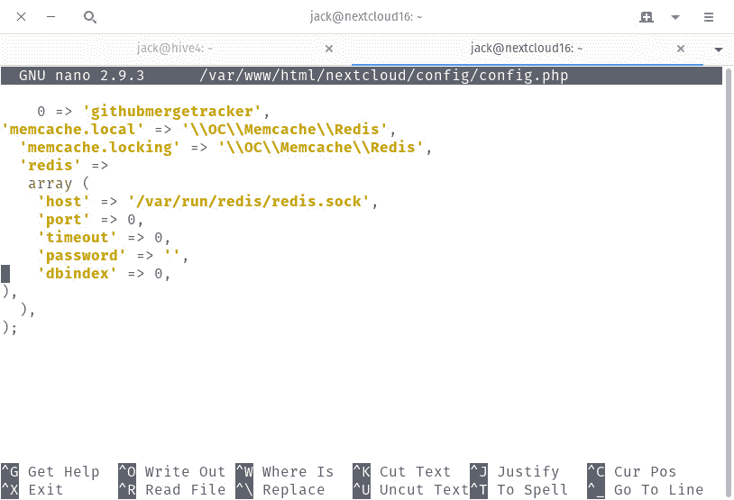
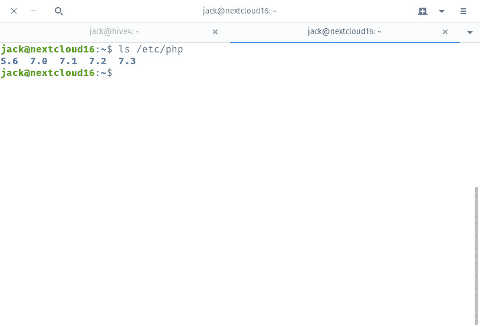

# 通过缓存调整 Nextcloud 的性能

> 原文：<https://thenewstack.io/performance-tune-nextcloud-with-caching/>

[Nextcloud](https://nextcloud.com/) 已经成为全球使用最广泛的内部云解决方案之一。这是有原因的。这个云软件不仅是开源的，而且是可升级的，可扩展的，可靠的。但对于希望获得尽可能高性能的大公司来说，Nextcloud 可能需要一点开箱即用的调整。为什么？因为默认情况下 Nextcloud 不启用缓存。

为什么需要缓存？您可能已经知道，缓存通过在内存中存储频繁请求的对象来提高性能。通过这样做，对这些对象的检索会快得多。因为我们在谈论云，你可能有数百(甚至数千)个用户同时访问那个服务器。如果不启用缓存，当每个用户检索对象时，服务器将会受到严重影响。

幸运的是，有了 Nextcloud，启用缓存不再那么困难。这并不像在设置中点击一个复选框那么简单，但你可以添加这个功能，而不必跳过太多的关卡。

我们就这么做吧。我们将在运行在 Ubuntu Server 18.04 平台上的 Nextcloud 16 上启用缓存，以帮助您的 Nextcloud 服务器像冠军一样运行。

## 你需要什么

显然，你需要一个正在运行的 Ubuntu Server 实例。我还假设您已经安装了 Nextcloud。如果没有，请查看“[如何在 Ubuntu Server 18.04](https://thenewstack.io/how-to-install-nextcloud-16-on-ubuntu-server-18-04/) 上安装 Nextcloud 16”。你还需要一个拥有**权限的用户。就是这样。您已经准备好调整 Nextcloud。**

### 安装 Redis

在配置 Nextcloud 缓存之前，必须先安装缓存服务。我们将使用内存中的数据结构存储， [Redis](https://redis.io/) (因为 Redis 也是开源的、可扩展的，并且与 Nextcloud 集成得很好)。

要安装 Redis，登录到您的 Nextcloud 服务器，打开一个终端(如果您的服务器有 GUI)，发出命令:

```
sudo apt-get install redis-server  -y

```

这应该可以顺利安装。安装完成后，使用以下两个命令启动并启用 Redis:

```
sudo systemctl start redis-server
sudo systemctl enable redis-server

```

## 配置 Redis

安装 Redis 后，现在必须对其进行配置。使用命令打开配置文件:

```
sudo nano  /etc/redis/redis.conf

```

编辑以下行以反映这些更改:

```
port  0
unixsocket  /var/run/redis/redis.sock
unixsocketperm  700

```

保存并关闭配置文件。

在进入 Nextcloud 配置之前，我们还必须将 redis 用户添加到 www-data 组。不这样做，Nextcloud 就会失败。要将 redis 用户添加到组中，发出命令:

```
sudo usermod  -aG redis www-data

```

Redis 配置到此为止。

## 配置 Nextcloud

我们现在必须配置 Nextcloud，以使用我们新添加的 Redis 服务。为此，使用命令打开 Nextcloud 配置:

```
sudo nano  /var/www/html/nextcloud/config/config.php

```

向下滚动到该文件的底部。最后两行应该是:

在这两行上面，粘贴以下内容:

```
'memcache.local'  =&gt;  '\\OC\\Memcache\\Redis',
'memcache.locking'  =&gt;  '\\OC\\Memcache\\Redis',
'redis'  =&gt;
array  (
'host'  =&gt;  '/var/run/redis/redis.sock',
'port'  =&gt;  0,
'timeout'  =&gt;  0,
'password'  =&gt;  '',
'dbindex'  =&gt;  0,
),

```

配置现在看起来应该类似于下面的**图 1** 所示。



图 1:添加到 Nextcloud 的 Redis 配置。

保存并关闭文件。最后，使用命令:
重新启动 Apache

```
sudo systemctl restart apache2

```

这就是为 Nextcloud 启用 Redis 缓存的全部内容。

## 启用 Opcache

您还可以在 **php.ini** 文件中启用 op cache——next cloud 推荐的配置，以改进基本功能。如果没有启用 opcache，当您以 Nextcloud admin 用户身份登录时，可能会看到一条警告。要启用 PHP opcache，您必须配置 **php.ini** 文件。首先，你需要找到你的服务器上安装的 PHP 的最新版本。要找到 PHP 的最新版本，发出命令:

您应该会看到包含所有已安装版本的目录(**图 2** )。



图 2:安装了版本 5.6 到 7.3。

如果 PHP 7.3 是最新安装的版本，打开配置文件的命令应该是:

```
sudo nano  /etc/php/7.3/apache2/php.ini

```

在该文件中，确保以下几行反映了下面的更改(配置选项从第 1799 行开始):

```
opcache.enable=1
opcache.enable_cli=1
opcache.interned_strings_buffer=8
opcache.max_accelerated_files=10000
opcache.memory_consumption=128
opcache.save_comments=1
opcache.revalidate_freq=1

```

完成更改后，保存并关闭文件。要使更改生效，使用命令:
重新启动 Apache

```
sudo systemctl restart apache2

```

## 安装并启用 PHP APCu

我们可以配置 PHP APCu 来处理本地缓存，同时 Redis 控制文件锁定缓存。注意:仅当您的服务器有内存开销时才这样做。

要安装 PHP APCu，发出命令:

```
sudo apt-get install php-apcu  -y

```

安装完成后，使用命令再次打开 Nextcloud 配置:

```
sudo nano  /var/www/html/nextcloud/config/config.php

```

在该文件中，更改以下行:

```
'memcache.local'  =&gt;  '\\OC\\Memcache\\Redis',

```

到:

```
'memcache.local'  =&gt;  '\OC\Memcache\APCu',

```

保存并关闭文件。使用命令重新启动 Apache:

```
sudo systemctl restart apache2

```

此时，您的用户应该开始看到 Nextcloud 服务器的性能有了显著提高，这都归功于少量的缓存。当然，由于缓存的性质，用户可能不会立即体验到这种改进。然而，随着时间的推移，他们应该会注意到 Nextcloud 的响应效率大大提高。

<svg xmlns:xlink="http://www.w3.org/1999/xlink" viewBox="0 0 68 31" version="1.1"><title>Group</title> <desc>Created with Sketch.</desc></svg>