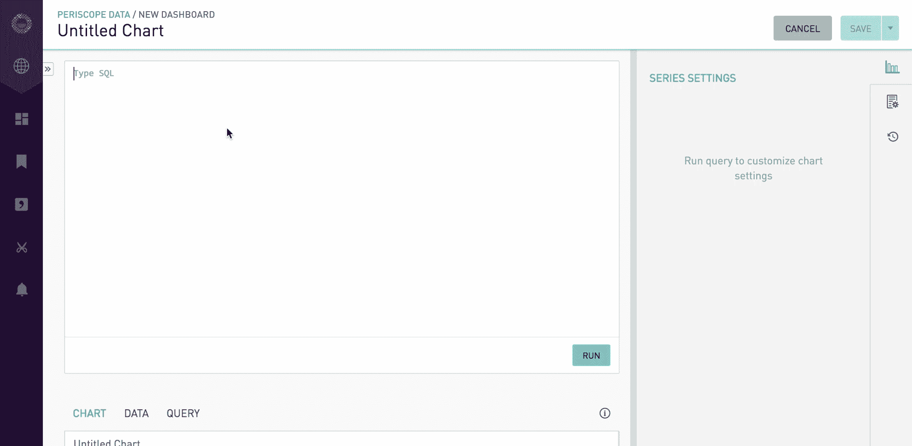

# Periscope 数据将经过权限过滤的数据带到 Slack

> 原文：<https://thenewstack.io/periscope-data-answering-big-datas-big-small-questions/>

随着公司越来越依赖远程和同处一地的团队， [Slack](https://api.slack.com/) 越来越多地用于团队沟通。然而，有时团队会为谁应该在大型企业松弛部署中看到什么而争论不休。这种身份验证的缺乏意味着许多人可以预览到他们不应该访问的信息的链接。为了提供帮助，Slack 最近推出了一个应用编程接口(API ),用于设置查看内容的权限。

这个 API 为数据分析软件提供商 [潜望镜数据](https://www.periscopedata.com/) 提供了基础，为从其平台上提取的结果提供过滤器。

Periscope 是一个平台，旨在为致力于在内部和外部共享数据的数据科学家和数据分析师提供见解和答案。 创始人兼“首席电子邮件官” [Harry Glaser](https://twitter.com/harryglaser?lang=en) 声称潜望镜数据“提供数据更快，数据为工具移动和变化”，让这些数据科学家“效率提高 150 倍”。该软件提供了一种跨多个数据源运行 SQL 查询的方法。

目前，如果数据科学家想要回答为什么转换率会随着时间的推移而下降，他们必须使用 SQL 查询和 Excel 图表的组合来维护长数据库，并努力跟上自上而下的每日更新需求。我们仍处于从大数据中获取价值的开端，离以高效的方式获取价值更远。

现在，当通过 Slack 分享一些东西时，Periscope 数据可以检测这个人是否有能力查看这些数据，并决定是否进行预览。这是面向在公司内共享公司数据的数据科学家的。这些数据团队通常负责信息和谁能看到信息，但通常不了解谁在或不在一个松散的社区或渠道中，也没有时间考虑错综复杂的渠道群体。

这种潜望镜-Slack 集成和伙伴关系通过 API 工作。当你将一个链接粘贴到 Slack 频道时，它会调用 Periscope，然后 Periscope 会回复预览和链接是否可以显示。

这是 Periscope 众多 API 中的一个，其中还包括基于平台内数据触发和访问机器学习的能力。一家拼车公司使用这项技术来绘制最佳路线。另一个 客户是 [FlexPort](https://flex.com/) ，一家货运代理的航运和物流公司。FlexPort 是业内第一家在 Periscope 中运行全部业务的初创公司，包括端口的打开和关闭、复杂的收入确认规则以及销售分析。

应用监控平台 New Relic 使用 Periscope 进行营销渠道分析，确定哪些渠道以最低的获客成本产生最多的业务。

Periscope 在获得 3700 万美元风险投资后，拥有 85 名团队成员和 700 多家客户。

那么，在数据世界发生了这么多事情的情况下，他们能为希望利用大数据世界的公司提供什么建议呢？格拉泽说:“错误在于没有提出后续问题，也没有增加他们所做事情的深度。

他警告说，许多公司认为他们是数据驱动的，当他们给自己设置的只有六个问题、关键绩效指标和图表时。 “真正的数据来源于人们问后续问题的时间和原因。他说:“那些较早雇佣专门数据团队的公司总是更成功的公司。”。

通过 Pixabay 的特征图像。

<svg xmlns:xlink="http://www.w3.org/1999/xlink" viewBox="0 0 68 31" version="1.1"><title>Group</title> <desc>Created with Sketch.</desc></svg>