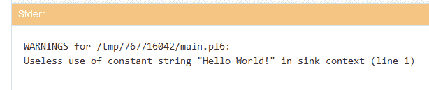

# Perl 6:对象的乐趣

> 原文：<https://thenewstack.io/perl-6-fun-with-objects/>

*本教程是学习 Perl 6 编程语言基础的系列中的第二篇[。大约一个月检查一次新的分期付款。](/getting-started-at-long-last-on-perl-6/)*

 我们的第一个教程记录了[安装并运行 Perl 6 是多么容易。但是，如果你想要一种更简单的方法来尝试这种语言，在 O 'Reilly 's 2017 年的书“](/getting-started-at-long-last-on-perl-6/)[思考 Perl 6:如何像计算机科学家一样思考”中有一个非常好的提示。](https://books.google.com/books/about/Think_Perl_6.html?id=wH_PDgAAQBAJ&printsec=frontcover&source=kp_read_button#v=onepage&q&f=false)它提醒初学者，他们也可以在浏览器中运行 Perl 6，指引他们到方便的站点 [Glot.io](https://glot.io/) (它让你可以在线运行和分享 37 种不同编程语言的代码片段——包括 Perl 6)。

请记住，Glot.io 实际上是在运行您键入的代码——它不是那种方便且通用的读取-评估-打印循环。

而在我的系统上，从 Windows 命令行输入`perl6`就会启动交互式 REPL 环境。因此，如果我键入一个字符串并按回车键，该字符串的*值*将会在屏幕上打印出来。

`> "Hello World"
Hello World`

在 Glot.io 中键入与独立 Perl 6 程序相同的内容会产生错误。

当然，在我的 REPL 环境中仍然有可能产生错误。如果我键入“Hello Perl 6”*而不带*引号——我仍然会得到一条(令人惊讶地冗长)的四行错误消息。

`> Hello Perl 6
===SORRY!=== Error while compiling:
Two terms in a row
at line 6
------> Hello Perl 6
expecting any of:
infix
infix stopper
postfix
statement end
statement modifier
statement modifier loop`

哦，说到 shell……就像最初的 Perl 编程语言一样，Perl 6 也可以运行 shell 命令——甚至在我的 Windows 系统上。在 Perl 6 中，语法出奇的简单。Shell 命令只是放在引号中，并以单词`shell`开头

`shell "dir"`

印刷品…

`Volume in drive C is OS
Volume Serial Number is 8A6A-491E`

 `Directory of C:\Users\desti
05/07/2019 04:06 PM <DIR> .
05/07/2019 04:06 PM <DIR> ..
05/07/2019 03:53 PM <DIR> .perl6`

但是现在我正沉浸在我的第一个 Perl 6 Read-Eval-Print 循环的荣耀中——有一个非常酷的 Perl 6 新特性，我一直在等着去体验它…

### 玩转物品

即使你只是想打印“Hello world”，Perl Intro 文档站点也揭示了另一个有趣的 Perl 6 技巧。是的，您显然可以说“Hello world”(使用 Perl 的“say”命令在它后面跟随一个新行)。

`say 'Hello world'`

但是您也可以用一种新的类似 Perl 6 的语法来完成同样的事情。

`'hello world'.say`

这是怎么回事？我回想起 2015 年的那个晚上，拉里·沃尔第一次在三藩市向观众介绍 Perl 6。在引擎盖下隐藏着许多复杂的新技术，有一次他笑着说“一切都是物体。但前提是你希望它是……”

为了进行演示，他展示了可以要求 REPL 为——嗯，几乎任何东西——提供对象类型。

`> say 8.WHAT
(Int)`

`> say "eight".WHAT
(Str)`

 所以*。说*和*。哪些*只是两个方便的内置对象方法，可用于输出关于您正在处理的变量的信息。(第*。什么*方法明显提供了对象的类型。)

安德鲁·什托夫的书《 [Perl 6 深潜](https://www.oreilly.com/library/view/perl-6-deep/9781787282049/a40bb2e8-7092-4da8-848e-10c325662f91.xhtml)》解释了*。比方说*方法实际上调用了`gist`方法，然后它打印出一个对象的“文本表示”。对于一个字符串，文本表示*显然是*字符串。

这就是我输入`say pi`时发生的事情(我现在意识到，它也可以写成`pi.say`)。它给了我一个圆周率的表示(在这个例子中，它的值是 15 位数)。

Perl 6 采用了严格的“一切都是对象”模型，所以一切都已经预装了大量非常强大的方法。

`> pi.say
3.141592653589793`

那么我还可以调用哪些有趣的内置方法呢？Perl Intro 文档指出每个字符串都有一个`.flip`方法，该方法将[反转所有字符的顺序](https://perl6intro.com/#_hello_world)。

`> my $site = "The New Stack"
The New Stack
> $site.flip
kcatS weN ehT`

一般来说，Perl 6 预见到了程序员做的那些事情——并将它们安装到相应的方法中。对于数组，现在有一个内置的`.elems`方法来打印出元素的数量。

`> my @array = ("Manny", "Moe", "Jack")
[Manny Moe Jack]
> say @array
[Manny Moe Jack]
> @array.elems
> 3` 

旧的“push”和“pop”函数(在 Perl 5 中用来从数组中添加和删除元素)现在是`.push`和`.pop`方法。

`> @array.push("Curly")
[Manny Moe Jack Curly]
> @array.pop
Curly
> say @array
[Manny Moe Jack]` 

还有一个内置的方法，提供了一个更简单的方法来排序您的阵列。

`> my @numerical_array = (99, 50, 1)
[99 50 1]
> @numerical_array.sort
(1 50 99)`

甚至还有一个新的 for 循环语法，可以循环遍历数组中的每一项。

`for @numerical_array -> $array-item {
say $array-item * 100
}` 

当然，Perl 6 仍然有*散列*数组。

`> my %Trek_actors = ('Spock', 'Nimoy')
{Spock => Nimoy}`

但它们也是对象，有自己的内置方法。

`> %Trek_actors.push: ('Kirk', 'Shatner')
{Kirk => Shatner, Spock => Nimoy}`

因为它们是对象，所以检索它们的键和值的语法要简单得多

`> %Trek_actors.keys
(Kirk Spock)
> %Trek_actors.values
(Shatner Nimoy)
> %Trek_actors.kv
(Kirk Shatner Spock Nimoy)`

您还可以使用 Perl 6 的. WHAT 方法来返回您的散列数组变量的类型。

`> %Trek_actors.WHAT
(Hash)`

### 告诉我更多

如果一个变量可以保存多种类型，`WHAT`返回当前保存的变量的值。

但是如果你想要一个对象的所有属性(不仅仅是类型),还有一个内置的方法`.^attributes`

在同一篇文章中，拉里·沃尔还在 2015 年让观众惊叹不已，因为他透露，只要使用正确的语法，你就可以调出一个列表，列出所有可用的与 Perl 6 的对象交互的方法。

`> 8.^methods
*(new Capture Int Num Rat FatRat abs Bridge chr sqrt base polymod expmod is-prime floor ceiling round lsb msb narrow Range unival rand acotanh sech succ acotan tan asech pred tanh atan2 acos cosh roots cosec sec unpolar Complex cotan sinh log cos truncate log10 asinh cis asin cosech exp acosec sin atanh acosech asec conj cotanh sign atan isNaN acosh WHICH perl Bool Str Real gist Numeric ACCEPTS DUMP)*`

等等，所以有一个内置的 *is-prime* 方法，我可以在数字上运行？我们试试吧…

`> 8.is-prime
False`

`> 2.is-prime
True`

很难想象这是一次多么独特的经历。我正在用代码做我以前从未做过的事情——简单而即时。我以前使用过其他编程语言，但即使如此，对我来说，Perl 6 也是一种完全不同的动物。

这让我想起了拉里·沃尔在公布 Perl 6 的那个晚上说的最后一句话。经过 15 年的开发，观众中有人问他，Perl 6 的哪一部分是他最喜欢的？

“我们完成的部分，”他一开始开玩笑说。但接着他似乎在思考他即将与世界分享的所有新奇迹，并回答说…

“我有点喜欢这一切，真的。”

特征图像:一个炽热的、膨胀的恒星碎片云，36 光年宽，来自超新星爆炸，[钱德拉天文台，美国宇航局/CXC/SAO](https://apod.nasa.gov/apod/ap190801.html) 。

<svg xmlns:xlink="http://www.w3.org/1999/xlink" viewBox="0 0 68 31" version="1.1"><title>Group</title> <desc>Created with Sketch.</desc></svg>