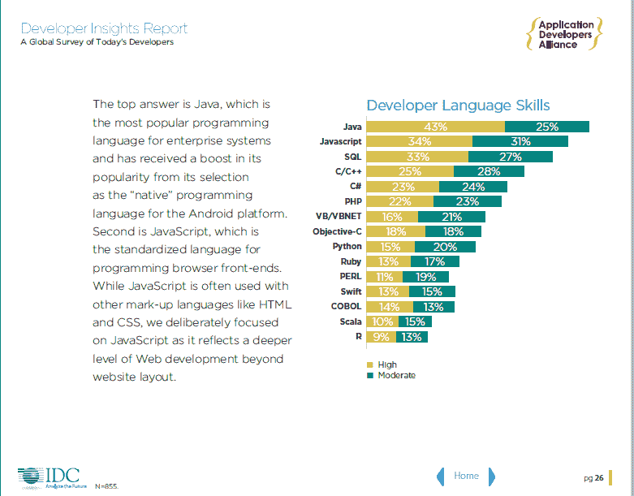

# Perl 回来了，并准备好迎接大数据人群

> 原文：<https://thenewstack.io/perl-back-ready-roll-big-data/>

这个月将会看到 Perl 6 的发布——这是一个期待已久的全新语言的发布，它已经酝酿了超过 15 年。但它被标榜为有 28 年历史的 Perl 的“姐妹语言”, Perl 也仍在积极开发中——作为一种独立的语言。

在这个奇怪的时刻，两个 Perl 社区都变得强大起来，在 Perl 进入第四个十年的时候，为 Hadoop 和 Docker 应用程序编写新的 Perl 代码。这一切都提醒我们，在大数据和基于云的应用程序的现代世界中，Perl 仍然有一席之地。

用 Perl 5 编写的配置管理工具[的主要开发者布莱恩·凯利说:“Perl 有一个庞大的狂热用户社区，尽管有人诋毁，但它仍在继续发展。”。“这个社区就像计算领域每种语言的社区一样，正在被拉入大数据世界，不管你喜不喜欢。”](http://search.cpan.org/dist/Net-FullAuto/lib/Net/FullAuto.pm)

早在 2009 年，一个“Perl Mongers”meetup 就已经在讨论如何通过简单的标准输入(STDIN) filehandle 对来自 Hadoop 的数据流使用 Perl，并且 Perl 仍然被用于大数据应用程序。“我们在金融行业的许多客户都在使用 ActivePerl 从各种数据库中提取数据并对其进行处理，”ActiveState 的工程总监 Tom Radcliffe 说，active state 发行自己的[商业版 Perl](http://www.activestate.com/perl) 。“它被用作‘大数据精简版’或加载大数据 Hadoop 系统的一种方式。”

波音、西门子和 CA 只是被列为 active state Perl 发行版用户的财富 1000 强公司中的一部分。ActiveState 的网站指出“作为一种开源编程语言，Perl 立即降低了前期项目成本。”Radcliffe 说，仅他们自己的 Perl 发行版每年就有超过 100 万的下载量，2015 年 11 月已经超过了 100 万的下载量。

Perl 的当前状态:TNS 对栈溢出的研究发现，59%的 Perl 用户不打算在将来使用它，与其他开发人员相比，某些语言(Python、C、C++、SQL)更有可能出现在他们的路线图上。(左侧)

去年二月，Booking.com 宣布他们将招聘 100 名 Perl 开发人员，事实证明他们不是唯一的招聘对象。最近在技术工作网站 Dice.com 上搜索发现了近 4000 个包含单词 Perl 的新条目。

这些上市的公司种类繁多，包括易贝、亚马逊和甲骨文等科技公司，以及摩根大通和 Capitol One 等金融公司，甚至还有彭博社(Bloomberg L.P .)和梦工厂动画(Dreamworks Animation)等媒体公司。

最终，每 22 份工作列表中就有一份提到了 Perl——87543 份中有 3939 份。相比之下，有 2916 份工作清单提到了 Ruby，17341 份提到了 Java。事实上， [TIOBE Index](http://www.tiobe.com/index.php/content/paperinfo/tpci/index.html) 自 2002 年以来一直试图通过简单地统计每种语言的名称有多少不同的搜索引擎结果来计算编程语言的受欢迎程度。11 月，他们报告说 Perl 仍然是排名前 10 的语言之一——由于 Visual Basic 的崛起而下降了一个等级。Net 和 Ruby 分列第 8 和第 9 位，但仍高于 Swift 和 Objective-C，后者在过去 12 个月里从第 3 位一路下滑至第 14 位。

来自应用开发者联盟的一项研究显示，Perl 知识水平相当高，这表明这种语言有一个潜在的人才基础，可以重新激发。(左侧)

更重要的是，该指数实际上显示，自 2014 年 2 月以来，Perl 在对话中的份额稳步上升，这是从九年缓慢下降中突然出现的逆转。Perl 在 2005 年排名第 5，在 2010 年排名第 7。即使在我们的大数据世界中，“我看到 Perl 扮演着它一直扮演的角色，”Perl 开发者 Kelly 说，“在我看来，它比其他任何东西都更好——T2 胶水 T3 语言。这种力量，它的力量从未超过正则表达式的能力，也从未超过 CPAN 库，将 Perl 定位为大数据领域的重要参与者。”

Perl 总是能够连接 Unix 命令行工具并自动执行特定的任务，但是全面的 Perl 存档网络(CPAN)仍然是 Perl 最大的优势之一。“在软件仓库中，我认为 CPAN 是黄金标准，”硅谷 Perl 用户组的组织者之一 Lambert Lum 说。“您下载了一个模块，所有相关的模块都会被下载。然后你运行它，你希望它没有错误地运行，尽管事实上数百个相关的模块来自不同的作者。

分布在 233 个镜像站点上， [CPAN](http://www.cpan.org/) 拥有 157，982 个现成的 Perl 代码模块，这些模块是由超过 12，000 名不同的贡献者在过去 20 年中编写的，包括经过严格检查的库，这些库可以帮助开发人员处理大数据。

“遵循 Perl 强大的测试传统，每一个上传到 CPAN 的模块发行版都会在各种平台和 Perl 配置上自动测试，”Perl 的官方网站解释道。“该社区的成员已经建立了一个测试网络，并捐赠了他们的资源，以使每个 Perl 模块在他们可用的每个平台上都尽可能地健壮。”

自 1995 年以来，在中央存储库中添加新代码的简单能力使得 Perl 在几十年中保持新鲜和相关成为可能。“它还在很大程度上弥补了 Perl 5 本身无法做到的事情，”积极致力于 Perl 编程语言的程序员之一 Carl Masak 指出。他提到了 Perl 开发人员 Matt Trout 创造的一个口号，即“ *CPAN* 是我的语言。”

## 认识新的 Perl

随着 Perl 6.0 版本的发布，Perl 的故事在这个月有了新的转折。Perl 6 的 Rakudo 编译器[的测试版现在已经发布](http://rakudo.org/)，为长达 15 年的开发周期画上了圆满的句号。(Perl 6 于 2000 年首次发布)。根据 Carl Masak 的说法，这些年来，几乎有数百名开发人员为 Perl 6 做出了贡献，其中有几十人的团队仍然拥有“直接提交权”和对内部机制的深刻理解。最近的一个周日下午，Perl 6 的官方 IRC 频道显示有超过 250 人加入了该频道。已经有 464 个 Perl 6 模块可以从一个新的全面的 Perl 6 档案库中下载，该档案库位于[proto.perl6.org](http://proto.perl6.org)。

开发人员强调，Perl 6 和 Perl 5 实际上是两种独立的语言，尽管他们计划最终创建一个翻译程序(用于大多数 Perl 5 代码)来翻译其等价的 Perl 6 语法。Perl 6 的编译器也可以在“Perl 5 兼容模式”下运行，这将识别并执行 Perl 5 代码。 [Inline::Perl5](https://github.com/niner/Inline-Perl5) 模块试图将 Perl5 代码导入到 Perl6 中，为过去 20 年的现有 Perl5 代码库提出了一个全新的应用程序。Perl 6 还可以加载用其他语言编写的模块——这只是它引人入胜的新特性之一。

Perl 已经因其识别字符串模式的能力而闻名，但是 Perl 6 通过将相关的 regexps 组合成一个有意义的、可重用的集合，扩展了这种能力。Masak 说:“*文法*允许人们将正则表达式收集到类中。“当你想解析一种数据格式或一种结构化语言时，它是很棒的，”Masak 说，他相信 Perl 6 对语法的支持与其他语言相比是“无与伦比的”。

但是 Perl 6 也将能够识别*序列*。10 月，Perl 的创始人拉里·沃尔在旧金山探索博物馆的[特别预览会上展示了这一特性。范围 *1，2，4 … 2**32* 跨越了超过 40 亿个数字，但是序列运算符 *(…)* 识别模式——所有 2 的幂——并生成仅包含 33 个数字的适当列表。还有内置的操作符来寻找两个数的最大公分母，以及它们的最小公倍数(分别是 *gcd* 和 *lcm* )。](https://www.youtube.com/watch?v=kwxHXgiLsFE&feature=youtu.be)

但是用户甚至可以定义他们自己的*操作符。“我们真的不区分内置和用户定义，”拉里·沃尔告诉三藩市的观众。虽然大多数语言都有一个先执行操作的硬连接层次结构，但在 Perl 6 中这也是可定制的。Perl 6 还带来了该语言的一个特殊子集，称为不完全 Perl(或“NQP”)——一个小的、低内存的“类似 Perl 6 的环境”，使其更容易为虚拟机创建代码库。*

Perl 6 最终也将编译到 Java 虚拟机上，至少有一位开发人员认为这将使它在大数据领域更受欢迎。开发 Perl 5 模块[Apache::Hadoop::web HDFS](http://search.cpan.org/~afaris/Apache-Hadoop-WebHDFS-0.04/lib/Apache/Hadoop/WebHDFS.pm)的 Adam Faris 表示:“如果具体说到 Hadoop，Python (Jython)和 Ruby (Jruby)语言的分叉具有在 Java JDK 内运行的优势。注意，这两种语言实际上是作为 Java 字节码运行的，它们可以访问 Hadoop 的原生 Java API(JVM 执行额外的内存管理)。但是当 Perl 6 编译到 JVM 时，它将获得类似的性能结果。

拉里·沃尔是著名的语言学家，很明显他在这门新语言的结构上花了很多心思。这种新语言是多范例的，它支持过程式编程，以及函数式和面向对象的编程，内置方法已经可用于整数、数组和代码中声明的任何新变量。(“一切都是物体，但前提是你想让它成为物体，”沃尔 10 月份对旧金山的观众打趣道。)Perl 6 开发人员 Carl Masak 将其描述为“选择加入”类型的系统。“你不必声明你的类型。你在有意义的时间和地点做它。但实际上，Perl 6 是有类型的，可以基于类型优化您的代码。”

Wall 在 10 月份告诉大家，他也希望学术界对使用 Perl 6 来教育未来的程序员感兴趣，而不仅仅是因为它是免费和开源的。Perl 6“可伸缩性”很好——它以其宽容的语法欢迎新用户，同时也允许更复杂和精密的计算——并且它允许用户以许多不同的编程范例进行编程(这对教育者来说应该是有吸引力的)。Perl 5 最初的口号是赞美它的灵活性——“有不止一种方法可以实现”——而 Perl 6 现在有了一个新的口号来宣扬它的设计目标。“简单的事情应该保持简单，困难的事情应该变得容易，不可能的事情应该变得困难。”

随着数百名开发人员自愿贡献他们的时间来开发这两种语言，Perl 继续着它与时俱进的发展。已经有一个 Docker 镜像[包含了 Perl 6 的 Rakudo 编译器](https://hub.docker.com/_/rakudo-star/)(还有一些其他的附加模块)，这不是唯一可能的应用。ActiveState 的工程总监 Tom Radcliffe 说:“企业使用语法来构建与 Perl 6 代码和库无缝互操作的高效且富于表现力的特定领域语言的潜力尤其令人感兴趣。

“这是一种新语言，具有许多强大的功能，从语法等主要结构组件到自动线程操作符等实现细节。像 Perl 5 社区的许多人一样，我们也在饶有兴趣地关注着 Perl 6。”

<svg xmlns:xlink="http://www.w3.org/1999/xlink" viewBox="0 0 68 31" version="1.1"><title>Group</title> <desc>Created with Sketch.</desc></svg>