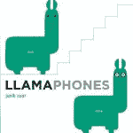
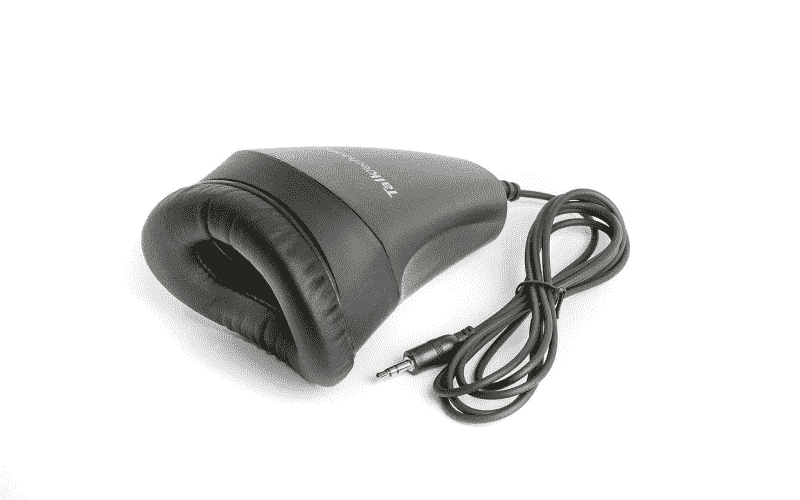

# Perl 程序员开创了语音编码

> 原文：<https://thenewstack.io/perl-programmer-pioneers-coding-by-voice/>

看到新技术给我们的日常生活带来真正的变化总是令人鼓舞的。程序员 [Emily Shea](https://twitter.com/yomilly) 在本月匹兹堡 [Perl conference 2019](https://perlconference.us/tpc-2019-pit/2019/06/25/thank-you-for-coming/) 上提供了另一个例子。她通过语音命令编写 Perl 程序。

谢伊是总部位于旧金山的内容交付网络公司 [Fastly Inc.](https://www.fastly.com/) 的高级软件工程师，她在该公司的平台上工作，提供代码 CDN 配置。对于*为什么*她想通过语音编写代码的问题，她有一个很好的答案，她形容自己是“一个不幸的灵魂，最终患有 RSI 症状”，这削弱了她的打字能力。在尝试了所有可能的补救措施——包括物理治疗和专用键盘——之后，她仍然发现，无论她白天能做多少小时的打字工作，仍然会被频繁需要的休息所打断，她形容这种休息“不断被你的身体打断”

“因为我觉得很受限制，所以我开始寻找不用手的替代方法。”

她渴望超越键盘和鼠标的传统组合，并向观众展示了一个鼓舞人心的演示，展示了它是如何工作的。

她的快速演示赢得了一片掌声。

[https://www.youtube.com/embed/Mz3JeYfBTcY?start=465&feature=oembed](https://www.youtube.com/embed/Mz3JeYfBTcY?start=465&feature=oembed)

视频

谢伊从一个好的麦克风和语音识别软件开始。她的工具包包括来自 Dragon 的 NaturallySpeaking，但也包括 Talon，“我今天非常兴奋地向大家介绍的技术”，该技术由 Patreon 贡献者提供支持[。使用 Dragon 的听写 API，Talon](https://www.patreon.com/lunixbochs) [为计算机提供免提输入](https://talonvoice.com/)(响应语音命令)，“所以你可以离开键盘，但仍然可以控制你的计算机。”

但是最好的是，整个解决方案可以在本地托管的文件中使用 Python 代码进行配置。“所以我可以疯狂地定制这个东西，”她说。

例如，如果有特定于语言的命令，她可以指示它们应该只在处理具有特定于语言的文件扩展名的文件时才是活动的(比如*)。pl* 。但她也让听写字母变得更容易了。她指出，字母表中的所有字母都与其他字母押韵，这可能会导致准确性问题。她向观众展示了一张幻灯片，其中有一个熟悉的替代词，即北约拼音字母(Alpha，Bravo，Charlie……)，但谢伊没有使用这个词——每次她想要字母 N 时就说“11 月”——而是简单地定制了软件，以识别她自己的 26 个单词来代表字母表中的字母。

在[的第二个演示](https://www.youtube.com/watch?v=Mz3JeYfBTcY&feature=youtu.be&t=770)中，她很快脱口而出“Pit Each Red Look”——单词“perl”出现在屏幕上……在大约 10 秒钟内，她打出了整个短语“Perl 太棒了”——包括纠正两个错别字。

Perl 代码包含了许多符号，但是“这些非常简单。我不需要花太多时间去解决这个问题。所有的符号都是你想象中的样子，”她说。所以美元符号是“美元”，at 符号是“at 符号”，管道符号是“管道”还支持添加你自己的单词，比如`undef`。

语音工作的一个独特问题是:同音词。这是两个听起来完全一样，但又不一样的词——就像“咬”和“字节”。她用语音单词“电话”解决了这个问题当后面跟着一个同音字时，它会弹出一个菜单，里面有该单词所有可能的选项。所以说“phones byte”和“pick three”会从弹出窗口中快速选择 byte 的第三种可能的拼写。如果只有两个选择，说出“phones”(高亮显示第一个单词后)将会换成另一种拼法。

她在一本儿童板书《骆驼电话》中找到了一套很好的入门词汇

她还在语音单词中编码，以便在语音单词位于短语之前时格式化她的文本(例如，用大写字母)。说“snake”会在单词之间添加下划线(这种格式通常称为“snake case”)，而“kabob”会在单词之间添加连字符，这种样式称为“kabob case”

在一个短语前说“allcaps”将会输入所有大写字母，但最有趣的一个可能是“pac title”它以两个冒号分隔的形式显示后面的单词——如果您试图使用 Perl 的包识别语法来识别名称空间，就可以像这样对它们进行标点。

演示进行到大约 20 分钟时，她播放了一段视频，在视频中她写了一个更长的应用程序。在三分半钟内，她编写了[一个 17 行的 Perl 程序](https://github.com/2shea/random_emoji)——并设置了它的权限，这样它就可以在她的网络浏览器中运行。首先，谢伊说出“短语 iterm”，它调出 Mac 终端模拟程序 iTerm2，然后开始在命令行中输入字母，大声说出每个字母的“语音字母表”。

以下是当 Shea 说“疯狂的 Krunch Dip sIt Red space snake perl demo enter”时发生的情况

`> mkdir perl_demo`

然后她通过说“cd snake perl_demo enter”立即切换到该目录

`> cd perl_demo`

一路上有一些便捷的捷径。Perl 程序的第一行标识了解释程序的位置——通常类似于#！/usr/bin/env Perl——但是 Shea 没有键入所有这些内容，而是简单地说了“Perl hash bang”

它很快变得太复杂而难以理解——每个需要输入的符号都有一个单词或短语，代码很快出现在屏幕上，一行又一行。Shea 通过说“Harp Trap Mad Look”键入字符串“html”，而“Yank Air Yank space Perl”翻译成“yay perl”最重要的 Unix 命令`chmod`变成了“Cap Harp Mad Odd Dip”——她用它来切换文件的可执行标志。Daemon 是“Dip Air Each Mad Odd Near”，很快她就准备在她的 web 浏览器中运行该程序。

它显示短语“YAY PERL”，两边都有一个随机变化的表情符号。

然后她的下一个演示展示了她提交到 Git，推送到 GitHub，并发出一个 pull 请求。

显然，如果你在一个开放的办公室工作，也会面临挑战。(你的同事会听到你在编码，而你自己的麦克风可能会听到同事的对话。谢伊指出的一个解决方案是[一个速记面罩](https://talktech.com/stenomask-steno-sr/)——一个带在你嘴上的隔音外壳，里面有一个小麦克风来接收你的命令。

对于更大的隔音外壳，有[隔音办公室](https://www.archiproducts.com/en/products/office-booths/acoustic/2)，也称为“隔音舱”

当然，还有第三种选择:远程工作。她告诉观众，她的团队一直很支持她，给她一个灵活的时间表，并坚持让她照顾好自己。她说，异步通信也有帮助，如果实时对话是必要的，视频通话可能比 Slack 上的长时间对话更好。

事实上，用声音编码有一个意想不到的好处。“因为我不需要键盘，我可以躺在我的沙发上和电脑说话。或者躺在地板上，你知道吗？”她甚至告诉观众，如果她愿意，她可以在做瑜伽姿势时部署软件。“太棒了。”

她承认学习曲线很陡，将其比作定制键盘。“拿着这个，但是现在想象一下，你正在使用你身体的一个不同部分。你现在听到的是你不习惯听到的声音，所以你可能无法在工作时快速思考，因为你现在听到的是东西。所以这可能会很困难。”

但另一个大问题是工具、应用程序或网站没有良好的辅助功能。“这是一个有按钮的网站，我无法点击它，因为它不是实际的 HTML 按钮，也不是链接，所以我无法访问它。这真的很令人沮丧…因为那样我就得花很多额外的时间来解决这个问题，或者找到一个新工具，学习如何使用一个新工具…

“所以这是我的呼吁，对我们所有的开发者来说……有很多关于可访问性的大讨论。让自己保持在可访问性空间，找到一些精彩的演讲，并帮助构建有朝一日你可能会喜欢使用的工具。”

但是在她的整个演讲中，有一个明确无误的信息是响亮而清晰的——科技真的可以带来改变。“如果我不重申这种技术对那些不能使用键盘或鼠标的人的影响，那我就是在帮倒忙，”谢伊告诉她的听众。

“我面临着一些限制职业生涯或可能结束职业生涯的伤病，感觉大门正在关闭。然后 Talon 出现了，它真的帮助拯救了我的职业生涯，”她说。“它帮助我恢复了生活质量。”

* * *

# WebReduce

<svg xmlns:xlink="http://www.w3.org/1999/xlink" viewBox="0 0 68 31" version="1.1"><title>Group</title> <desc>Created with Sketch.</desc></svg>