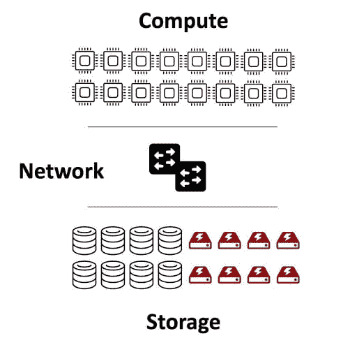

# 持久卷:分离计算和存储

> 原文：<https://thenewstack.io/persistent-volumes-separating-compute-and-storage/>

[KubeCon + CloudNativeCon](https://events19.linuxfoundation.org/events/kubecon-cloudnativecon-north-america-2019/) 赞助了这篇文章，期待 [KubeCon + CloudNativeCon EU](https://events.linuxfoundation.org/kubecon-cloudnativecon-europe/) 于 8 月 17 日至 20 日发布。

 [布莱恩·鲍洛夫斯基

Brian 在全球科技公司的高增长环境中拥有多年构建技术和领导团队的经验。他目前是 DriveScale 的首席技术官。此前，Brian 曾在 Pure Storage 担任副总裁兼首席架构师。在此之前，作为存储先驱 NetApp 的首席技术官，Brian 领导了第一个 SAN 产品，并创建了 NetApp 实验室。](https://www.linkedin.com/in/brianpawlowski/) 

Kubernetes 文档指出“管理存储与管理计算实例是截然不同的问题。”这概括了现代数据中心设计的一个基本原则，即最好从规划和部署的角度分别考虑计算和存储。通过容器存储接口(CSI)等子系统，计算和存储的逻辑分离在 Kubernetes 中变得越来越正式，在本文中，我认为计算和存储的物理分离可以提高经济性和运营效率；因此，这是与 Kubernetes 合作的一个强有力的策略。

计算机存储本身就是一种技术。我们应该考虑数据及其用途，而不是考虑存储。在一个完美的世界中，人们希望存储这样的数据:

*   正确的
*   一致的
*   有空的
*   快速访问
*   持久耐用
*   可恢复的

正确性通常是假定的，但是研究表明[正确性在现实世界的系统中不应该是理所当然的](https://www.usenix.org/legacy/event/fast10/tech/full_papers/schroeder.pdf)。一致性在某些应用中至关重要，但对于大多数数据中心的数据使用来说，一致性往往并不重要。可用性和性能——以足够快的速度访问和检索数据的能力——通常是存储系统要求的重点，其次是可恢复性。持久性通常包含在可恢复性中，假设现实世界中的系统最终会失败，必须实施一个方案来恢复丢失的数据。

如今，访问数据的性能通常与存储介质本身有关；硬盘用于纯顺序流访问，固态硬盘用于随机 I/O 工作负载。但这是一种过于简化的说法，因为固态存储的其他特性——如低功耗、低密度和抗物理冲击(耐用性)——加上更高的性能，使其在移动应用中无处不在。但是从数据中心的数据存储角度来看，硬盘和固态硬盘都在使用，当部署纯顺序工作负载时，硬盘通常更具成本效益。针对高性能数据分析(顺序 I/O 工作负载)和 NoSQL 数据库(随机 I/O 工作负载)的横向扩展应用的兴起，主要是为了让商用(行业标准)平台和介质表现良好。

传统的企业应用程序认为，如果您正在存储数据，那么它应该总是可用的。这导致了冗余、镜像和擦除编码技术，以防止常见的组件故障——风扇或机箱中的机械故障、[介质故障](https://www.backblaze.com/b2/hard-drive-test-data.html)等。

### 硬盘可靠性—年度硬盘故障率

虽然企业存储一直专注于设计更小的高度优化的平台(设备——想想 10 个控制器),这些平台侧重于对应用程序透明的数据可用性技术，但现代横向扩展数据密集型应用程序将存储堆栈直接集成到应用程序中，并通常使用三重副本配置来实现可用性。在考虑性能要求时，行业标准(即商用)存储介质和盘柜的经济性更倾向于三重副本方法，而不是采用擦除编码的工程存储系统。应用程序的[规模](https://static.googleusercontent.com/media/research.google.com/en//people/jeff/Stanford-DL-Nov-2010.pdf)存储部署(想想 1000 个控制器)导致了实施机架故障语义的策略，以及简单地通过添加更多计算和存储来提高性能或容量的能力。

但从某种意义上来说，这并不重要，因为当今企业中数据不可用的更常见原因是应用程序升级、网络和基础架构升级以及技术更新的计划内停机。

如今，数据中心架构师提高可用性的最大手段是将计算和存储分离到单独管理的层中，并通过无处不在的高速以太网连接起来。这种方法不仅解决了可用性问题，还提高了经济性和潜在的可操作性。

将计算和存储分离的好处有几个:

1.  通过消除服务器“故障”情况下的重建/恢复来减少停机时间—只需将存储重新连接到新节点。
2.  通过部署少量经过优化的瘦客户机计算节点优化配置，消除 SKU 激增。
3.  通过优化存储层的密度、外形和数量，降低每个插槽的介质开销成本。
4.  最后，通过分离生命周期，在计算和存储层更快地采用新技术。

Kubernetes 已经发展到支持称为[容器存储接口](https://kubernetes.io/blog/2018/01/introducing-container-storage-interface/) (CSI)的灵活存储接口，允许任何存储提供商通过定义良好的接口提供服务。CSI 摒弃了以前的树内存储提供商方法，并向 Kubernetes 开放了多种存储部署方法。

CSI 提供者接口为 Kubernetes 定义了一个动态存储模型。在许多方面，CSI 接口鼓励供应商定义现有存储解决方案的新接口，以便在 Kubernetes 的控制下按需动态分配持久存储卷。CSI 甚至将功能扩展到了传统的企业存储解决方案。CSI 抽象提供了必要且有益的计算和存储分离，支持上述物理分离方法。CSI 还允许较新的网络存储方法(侧重于“网络存储”的网络方面)为 Kubernetes 提供健壮的解决方案，这些解决方案更适合于 web 级数据应用程序的存储供应。

Kubernetes 对网络规模数据分析存储的部署要求是一个不断发展的领域。Kubernetes 提供了部署高性能数据分析应用程序的规模和协调能力。轻量级容器模型比更重的传统 VM 方法更适合高性能横向扩展数据分析应用程序。然而，这些应用程序中有许多是在假定直接访问本地 HDD 或 SSD 存储的情况下编写的，具体取决于特定的工作负载。有一些方法，如可组合的基础结构，可以为网络存储提供本地驱动器的性能和行为。可组合基础架构还支持由许多应用程序定义的应用程序中的存储堆栈模型，并且经过正确配置和自动化，支持机架故障语义。CSI 模型完全支持这样的部署，为 Kubernetes 上的这些应用程序提供了高性能的解决方案。

支持持久存储的 CSI 接口是 Kubernetes 生态系统的最新成员。它已经为 web 级应用程序的网络存储带来了许多解决方案。这将是未来一年值得关注的有趣空间。

*要了解更多关于集装箱化基础设施和云原生技术的信息，请考虑参加 8 月 17 日至 20 日在欧盟举办的 KubeCon + CloudNativeCon 虚拟大会。*

通过 Pixabay 的特征图像。

目前，新堆栈不允许直接在该网站上发表评论。我们邀请所有希望讨论某个故事的读者通过 [Twitter](https://twitter.com/thenewstack) 或[脸书](https://www.facebook.com/thenewstack/)访问我们。我们也欢迎您通过电子邮件发送新闻提示和反馈: [feedback@thenewstack.io](mailto:feedback@thenewstack.io) 。

<svg xmlns:xlink="http://www.w3.org/1999/xlink" viewBox="0 0 68 31" version="1.1"><title>Group</title> <desc>Created with Sketch.</desc></svg>