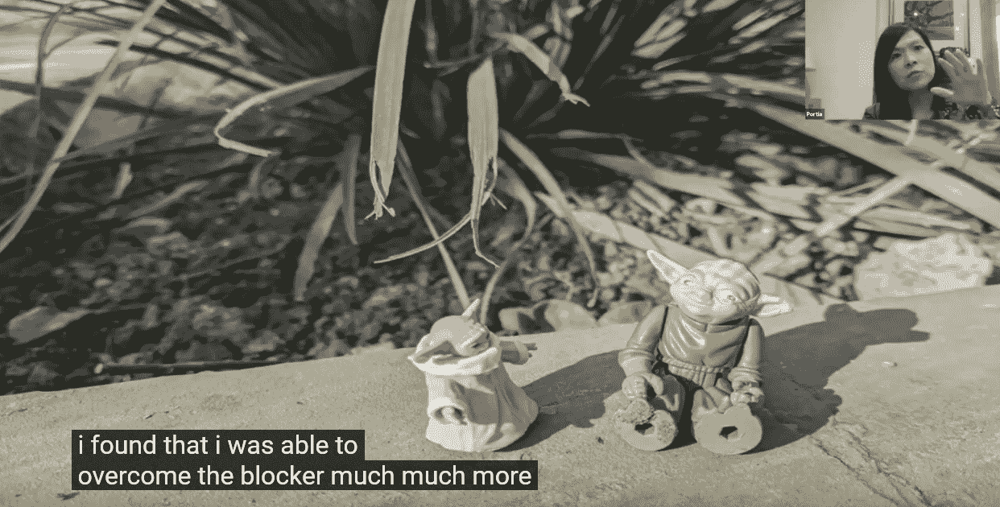
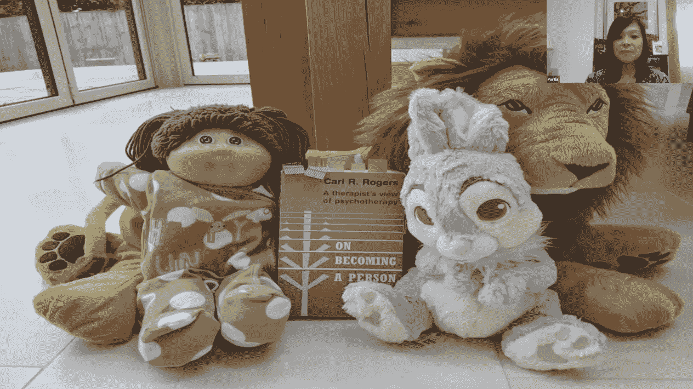
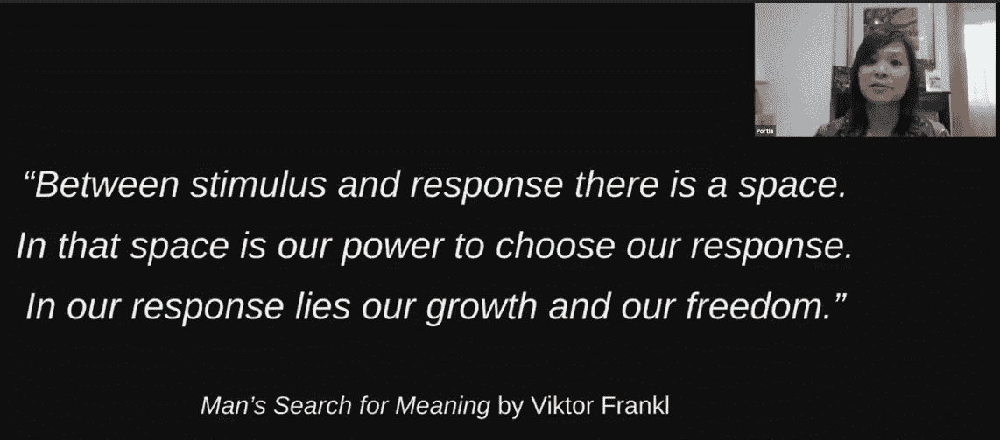

# 通过强有力的问题和游戏实现“个人工程”

> 原文：<https://thenewstack.io/personal-engineering-through-powerful-questions-and-play/>

 [大卫·卡塞尔

大卫·卡塞尔是旧金山湾区的骄傲居民，他已经在那里报道科技新闻超过二十年了。多年来，他的文章出现在各处，从 CNN、MSNBC、华尔街日报互动版到《沙龙》、《连线新闻》、《Suck.com 》,甚至最初的《连线》,以及 Gawker、Gizmodo、McSweeneys 和 Wonkette。他现在正在拓宽自己的职业技能，成为一名兼职电脑程序员，开发两个 Android 应用程序，为亚马逊 Kindle 合作制作两个文字游戏，并涉足互动小说。](https://twitter.com/DavidCasselTNS) 

在 Portia Tung 的 LinkedIn 个人资料上，最新的职位是一家名为 Adaptavis 的转型咨询公司的“首席游戏官”，该职位包括“基于系统教练和游戏科学”的企业/高管敏捷教练她还会举办提高你“玩耍智力”的研讨会

童的网上传记甚至详细说明了一种信念，即玩耍“对成年人的终身发展至关重要”

简而言之，Portia Tung 是一名专业教练，具体来说，是一名高管和商业敏捷教练，同时也是一名私人教练和“讲故事者和许愿者”这一切都基于对游戏变革力量的坚定信念。

这种独特的技能造就了一批令人印象深刻的客户。董的“游戏学校”网站夸口说，她给英国首相办公室和国民医疗服务体系，以及英国航空公司和全球金融机构带来了革命性的变化。

然而，董的职业生涯始于 20 多年前的一名软件开发人员和团队负责人(根据游戏学校网站)，这些经历仍然融入了她的哲学。

去年九月，在软件产业大会上，她对玩耍的力量进行了提炼，将个人的、组织的和系统的改变带入到一些有用的练习中。

她分享了在 IT 界 20 年学到的一个真理:“大多数真正棘手的*问题很少与技术或软件有关。”她承认，当然有解决方案/选择/漂亮的架构，“但我在与组织合作时遇到的更棘手的问题是:这不是软件的问题。这是人用品。对不对？”*

有效的领导，她告诉 YOW！观众，“开始并属于我们自己。”这有时会比解决技术难题困难得多，可能需要一些内部反思。

[https://www.youtube.com/embed/Go9VbQf5a2I?feature=oembed](https://www.youtube.com/embed/Go9VbQf5a2I?feature=oembed)

视频

## 一切都是数据

董的演讲当然很有趣。正如她告诉观众的那样，“我试图将所有这种可爱的游戏科学和创造力中的各种科学融入到我的工作中，帮助组织和组织中的人们尽可能做到最好。”

有些对话甚至用星球大战的小雕像来说明。

但她的演讲最终记录了一条她称之为“个人工程”的道路也就是说，自我提升的“工具和技术的精选集合”，“我已经不厌其烦地进行了测试，主要是在我自己身上，但也在我的职业生涯中与他人合作。”

董建华以三条黄金法则开始。

*   把一切都当成数据。
*   留在不知道的地方。(“让我们批判性的思维稍微休息一下——保持开放和好奇。”)
*   对过程的信任。董说，这可能是我们对未知的恐惧的解药，她承认这是一种与生俱来的人类本能，“是它让我们活了下来”。

就第三条规则而言，这意味着要相信思考和倾听的力量。董建华指出，谈话可能会暴露原有的信念和假设，然后敦促听众做好准备，诚实地探索它们。

她分享的主要工具是“强有力的问题”——这是一个专门针对“故意开放”的问题的术语，旨在引发对话、洞察力和反思。

董建华笑着补充说:“在礼貌的谈话中，我已经养成了这样的习惯，我已经被指责问了这样粗鲁或爱管闲事的问题。”“但幸运的是，在教练职业以及优秀的管理和领导职业中，这关乎好奇心和动力。”

这个想法是为了“点燃”与你交谈的人的思维:

*   你希望发生什么？
*   在你的生活中，你现在想迈出哪一步具有挑战性？
*   什么样的假设可能会阻止你采取下一步行动？
*   你还想说什么，感觉到什么，或者想说什么？

这项技术如此强大还有另一个原因:用声音大声描述事物，创造了一种特殊的距离——和视角。所以不管是什么问题，“突然间你会更清楚地看到它是什么，”她说。"通过从不同的角度看问题，你真的可以驾驭它。"

此外，她补充道，“这就是敏捷中的便利贴如此受欢迎的原因。”

董说，被问到这些问题创造了一个“安全和培养思考的环境”。她在之前的演讲中也提到了这一现象。

“直到我们听到自己在思考，并经常允许自己思考问题——我们*并不真正知道我们在想什么。”*

## 培养勇气和自我意识

像这样的问题可能也需要勇气——真正提出这个问题，以及回答者敢于站在他们个人代理人的立场上诚实地回答。(“不幸的是，被 *告知* 该做什么，仍然是许多组织的默认管理方式，”Tung 指出。)

但是作为这个过程的一部分，她说，你需要相信你的“工具”——你的感官、感觉和思想。

在这一点上，董谈到了培养和重视自我意识的重要性。(因为你将需要这个来应用从那些强有力的问题中得到的任何见解*。)*

她指出，总的来说，自我意识和自我管理“使我们能够与他人建立积极有效的关系，同时也与我们的团队和组织建立积极有效的关系。”

Portia Tung 在这里以“个人工程”为题发言，她认为玩耍是帮助成年人适应转变的一种方法。

## 伟大的经理都做些什么

但同样重要的是，提问时要从一个关键的假设开始:每个人都已经拥有了克服挑战所需的东西。“教练、伟大的管理者或领导者的目的是让思考者找到道路，”董建华说，并补充说，“不是引导他们或给他们一条道路。真的是让人自己去想。”

这也适用于问问题的人。听者需要假设*他们*也有他们需要的一切——不仅仅是他们正在交谈的人。

为了进一步说明强有力问题的影响，董描述了一个他最喜欢的练习:简单地问你*想让*考虑什么？(你有什么想法？).“倾听者承诺不会打断——但要在场，保持安静，陪他们走完这段旅程。

“通常这就像是一个五分钟的练习，会把人吓坏的。”

因此，为了延伸练习，董通常会给听者一个额外的问题:“你还有什么想说的、感觉到的或想说的？”至少 90%的情况下，他们会用额外的想法给自己惊喜。“我们内心深处知道我们的大脑想要思考，我们想要为自己思考。”

在演讲的最后，她分享了一个关于生活教练南希·克莱恩的不平凡的故事，她在俄罗斯演讲时邀请了一位女性上台。克莱恩接着问了同样的问题——你想思考什么，你的想法是什么？

董建华回忆说，这件事激起了热烈的反响。这个俄罗斯女人“说啊说……有眼泪，有转变。”当这个女人拉着克莱恩的手，感谢她给了她史诗般的经历，以及她认为克莱恩给了她所有的好建议时，故事就结束了。

克莱恩只能友好地笑着——并委婉地指出她什么也没说。"这都是你*的想法."*

董分享了这一事件的重要教训。“我们谈论组织中的授权。但是如果我们允许自己做最好的思考，我们就不需要授权。

“我们也足够尊重对方，允许对方尽自己最大的努力*。”*

* * *

# WebReduce

<svg viewBox="0 0 68 31" version="1.1" xmlns:xlink="http://www.w3.org/1999/xlink"><title>Group</title> <desc>Created with Sketch.</desc></svg>