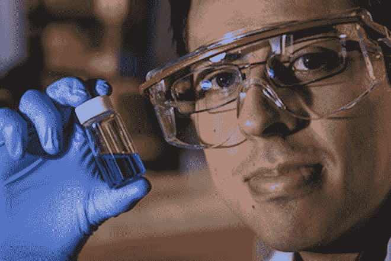
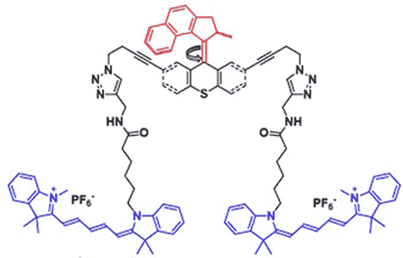

# 超高速光动力纳米潜艇如何运送你的药物

> 原文：<https://thenewstack.io/personalized-drugs-delivery-may-super-fast-light-powered-nanosubmarines-will-deliver-drugs-quickly/>

纳米技术可能会在未来的医学中发挥巨大的作用。但是目前还不清楚这些纳米尺寸的设备将如何在体内移动——毕竟，没有人想吞下一个电池和马达。到目前为止，科学家们已经提出了解决方案，如[磁铁](https://thenewstack.io/self-folding-mini-origami-robots-are-the-nanosurgeons-of-tomorrow/)，蛋白质马达的电化学反应作为可能的移动方法。

现在你可以将光动力分子马达添加到这个列表中，这要归功于莱斯大学的一个科学家团队，他们创造了一个由 244 个原子排列在单个分子中的[纳米潜艇](https://en.wikipedia.org/wiki/Nanosubmarine)，当暴露在紫外光下时，能够在液体中以极高的速度移动。

## 一百万分钟

但是这个分子“发动机”到底是如何工作的呢？这里的创新是该团队在单分子潜水纳米机器(USN)的一端开发了一个配备螺旋桨的“马达”，它由紫外线激活。虽然它被称为“马达”，但这种运动更受细菌鞭毛的启发，而不是机械马达本身。

当连接转子和纳米潜艇身体的双键暴露在紫外光下时，它会转化为单键，释放出足够的能量来旋转四分之一圈。因为马达自然地寻求回到较低能量的平衡状态，它跳到下一个原子，再转四分之一圈，然后下一个——如此继续旋转，直到光源消失。

研究生和这项研究的第一作者维克多·加西亚·洛佩斯展示了一个装有数百万纳米潜艇的小瓶

螺旋桨以每分钟 100 万转的速度旋转，每转一周，纳米潜艇就会向前移动 18 纳米，即每秒不到一英寸。虽然这看起来不算多，但这被认为是纳米级距离的光速。“这是溶液中有史以来移动最快的分子，”莱斯大学化学家、詹姆斯·图尔教授说，他负责监督该团队创造 10 纳米大小的潜水器。

更令人惊讶的是，这些马达推动这些纳米潜水器通过液体环境的效率，液体环境中有许多其他移动的分子，可能会阻碍它们的路径。根据该小组发表在美国化学学会杂志 [Nano Letters](http://pubs.acs.org/doi/abs/10.1021/acs.nanolett.5b03764) 上的报告，他们的光动力纳米潜艇的发动机足够强大，与其他悬浮在流体中的随机移动粒子相比，可以显示出惊人的 26%的“扩散增强”。为了客观地看待问题，图尔给出了类比:“这类似于一个人走过一个篮球场，1000 个人向他扔篮球。”

## 无毒纳米潜艇

该团队的分子马达设计使用了 [20 步化学合成过程](http://www.rug.nl/research/portal/files/2687263/10completethesis.pdf)，并且部分借鉴了格罗宁根[大学](http://www.rug.nl/research/portal/files/2687263/10completethesis.pdf)另一个团队之前的开发成果。这种分子马达与其他设计的区别在于，它不使用也不产生任何毒素——如果这种纳米机器被释放到人体内用于医疗目的，这是一个理想的特性。

为了测试这些纳米潜艇的性能，研究小组添加了一种荧光化合物，这种化合物可以让他们明显跟踪他们的进展，而不会妨碍他们的速度。如下图所示，显示了潜艇的化学结构，双键发动机显示为红色，两侧是两个蓝色的荧光“浮筒”状化学结构，当被激光激活时(令人困惑地)发出红色光芒。使用定制的[共焦荧光显微镜](https://en.wikipedia.org/wiki/Confocal_microscopy)，他们观察了纳米潜艇在两个湿载载玻片之间的运动，同时它同时发出紫外光(激活马达)和红色激光(使浮桥可见)。

虽然这些小型机器本身已经足够酷，但研究人员相信，他们无毒的单分子纳米 submers 有一天可以在体内进行靶向药物输送，或者在细胞水平上诊断疾病，或者消除癌细胞。除了医学，纳米潜艇有一天也可以帮助修复污染的环境。

“有一条前进的道路，”研究生和研究的主要作者维克多·加西亚·洛佩斯说。“这是第一步，我们已经证明了这个概念。现在我们需要探索机会和潜在的应用。”

在莱斯大学了解更多。

图片:莱斯大学

<svg xmlns:xlink="http://www.w3.org/1999/xlink" viewBox="0 0 68 31" version="1.1"><title>Group</title> <desc>Created with Sketch.</desc></svg>