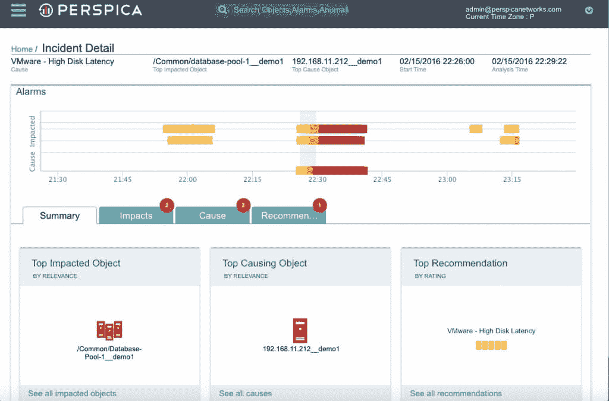

# Perspica 部署机器学习来融合应用和基础设施监控

> 原文：<https://thenewstack.io/perspica-deploys-machine-learning-fuse-application-infrastructure-monitoring/>

Perspica 旨在通过提供跨应用软件堆栈的端到端智能来解决过多 IT 运营分析孤岛的问题，该软件堆栈使用机器学习技术来连接不同的信息源。

该公司最近推出了事件回放，这是一个类似 DVR 的 SaaS 时间机器，允许用户返回并回放基础设施事件。它刚刚宣布与 Amazon Web Services 集成，以扩展其跨混合环境的运营智能产品。

“在当今的行业中，有一些应用性能管理工具只处理应用层。然后是过去的 CMDBs(配置管理数据库),保存数据库和配置，但现在这一切都是动态的，并且在不断变化。此外，还有日志管理工具、网络系统管理工具，甚至虚拟化管理工具。“就像他们每个人都有一块拼图。您希望将所有数据放在一个地方；你需要模型来把所有的东西放在一起，”

萨海说，该公司声称要组装一个程序，该程序使用一套“表征 IT 运营的最佳机器学习算法”。该软件分析环境中的所有对象，了解什么是正常的，什么是不正常的。

“每个物体都有一个随时间变化的行为。知道什么是真警报，什么是假警报非常重要，”萨海说。“你只需要知道什么时候真的有问题。你可以通过查看历史和行为变化来做到这一点。”

Sahai 说，它发布所谓的“智能警报”和关于如何处理问题的建议，他补充说，平均而言，它为客户减少了 96%的警报。

一个客户是联邦政府，它使用该软件监控超过 6，000 个数据中心元素。到今年年底，该项目将扩展到 600 万个对象。其主要优势之一是减少了员工花费在冗长的根本原因分析报告上的时间，过去这需要近一周的时间，但现在可以从 Perspica 自动生成。

该公司还引用了另一家未具名的拉斯维加斯游戏公司作为客户，该公司在那里监控超过 1，500 台虚拟机的性能，并将将其扩展到约 5，000 台。

这项技术关注过去、现在和未来的行为。

“根本原因分析很难，因为有数百万个对象。你从哪里开始寻找原因？”萨海说。它保持了对当前正在发展的事物的持续观察，并有助于在事情失去控制之前避免未来的问题。

一个附带的好处是提高了员工的生产力。

“员工厌倦了追逐假警报。这导致了大量的救火工作和被动管理，”萨海说。

## **转向混合环境** 

Perspica 成立于 2014 年，团队来自 SAP、惠普、思科、戴尔和初创企业 ventures 等公司。Sahai 说，去年 6 月，它在由 March Capital Partners 牵头的 A 轮融资中筹集了 400 万澳元，目前正在考虑 B 轮融资。

分析公司 Enterprise Management Associates 的副总裁[丹尼斯·德罗塞斯](https://twitter.com/dndrogseth)表示，随着公司越来越多地将基础设施分为公共云和私有云以及传统基础设施，分析供应商将其服务引入公共云至关重要。

“Perspica 针对服务依赖洞察的分析和拓扑的丰富组合非常适合在这个混合世界中帮助管理和优化关键业务应用程序及其支持基础设施，”他说。

五个分析“真的是我们的秘方，”萨海说。它会遍历虚拟层和物理层上的应用程序、应用程序基础架构，收集所有数据，然后在顶层进行文件分析。在混合环境中，您可以拥有联合的应用程序—一些运行在 VMware 上，一些运行在 Amazon 上—并在它们之间运行分析。

他这样解释了它采用的五种算法:

*   **拓扑** —传入的数据可能是关于应用程序、集群、虚拟机、主机、物理网络和服务器的信息。您需要协调所有这些信息，以了解集群的端到端拓扑。协调算法是在持续的基础上进行的。
*   **行为** —如今许多工具都专注于对单个指标的分析。Perspica 在对象级别运行多变量分析，结合指标来查看对象行为是否失控。然后，它会根据拓扑查看其他对象，以确定环境中是否存在可能导致重大事故的多个问题。
*   **异常** —它使用三种不同的算法来查看对象在一段时间内的历史行为，以确定什么是正常的，什么是不正常的。
*   **问题** —它将领域知识与对环境的持续了解相结合，告诉您正在发生什么，确切的原因是什么，受什么影响，警报是如何关联的，并以自动化的方式提出修复建议。
*   **预测性** —各种问题的关键程度可能不同，因此当事情处于准备报警的阶段时，您会提前察觉到。它还能让您深入了解环境中的长期问题，帮助您更好地规划容量、重新设计应用程序并处理失控的情况。

他说，这适用于开发环境和运营。

他说，该公司在其最新版本中添加了 Docker 支持，并计划在基于容器的环境中添加更多功能来支持开发者。它还希望添加其他云，如 Azure 和谷歌云。

[SIOS 科技](https://thenewstack.io/machine-learning-attacks-problems-database-performance/)之前宣布了针对 VMware 环境的高级机器学习分析。而机器学习厂商 [Numenta](http://numenta.com/) 和分析初创公司 [Avik Partners](http://www.avikpartners.com/) 宣布了针对 AWS 技术的 IT 分析 [Grok。](http://numenta.com/grok/)

*特征图片:* [潜望镜](https://www.flickr.com/photos/ognjenodobasic/4363112767/in/photolist-7Dy6qc-mRxTYN-eK1ToR-92nQQ9-mPBWFg-2MyBiK-7152xj-22AEqg-uiKzJB-9g21jT-pT1Vnr-aPr8Uv-CCahtV-5HLf7Y-4ZGqt3-wYSXT-cZiHNy-qvQpke-95dATp-4FaR1m-vRjbEC-ps3U25-7R4N1x-dTEFUo-dGHZ3q-GhJyt-e8ksW5-Miukm-aq4xUi-9632RX-t3NNx-mQFEF-yQNR3o-wftphp-nbSLuF-9afqg9-2BuWkF-2BzzUq-heRLR-9663js-c5TwT-2BuVqX-4uprx1-AjyBW7-xGctjH-w21myb-6retxA-zJ9Nck-uQZvQZ-wY7HyQ)*BY*[Ognjen odo basic](https://www.flickr.com/photos/ognjenodobasic/)，*许可下****[*CC BY-SA 2.0*](https://creativecommons.org/licenses/by/2.0/)**。*

<svg xmlns:xlink="http://www.w3.org/1999/xlink" viewBox="0 0 68 31" version="1.1"><title>Group</title> <desc>Created with Sketch.</desc></svg>